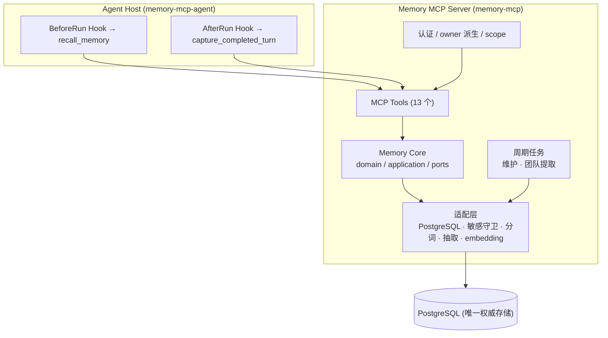

# Memory MCP

Memory MCP 是一个 owner-scoped 长期记忆服务。Agent 通过标准 MCP Streamable HTTP 接入；
身份隔离、候选抽取、准入、生命周期、召回和 PostgreSQL 持久化由服务端统一负责。

两个发行包：`memory-mcp`（Server，Python 3.14）和 `memory-mcp-agent`（轻量
BeforeRun/AfterRun Client，Python 3.11+）。Agent Host 不安装数据库、模型、队列或 Server。

> 当前状态：核心记忆、捕获/召回、关系、向量召回、团队提取、维护闭环均已实现；
> 公网 HTTPS、安全组、现场脚本与录屏属于最后部署交付阶段（见
> [核心 Tasks](openspec/changes/add-general-memory-core/tasks.md)）。

## 快速开始

```bash
uv sync --all-packages --frozen
cp server/.env.example .env && chmod 600 .env   # 编辑 DSN/Token/模型
.venv/bin/memory-mcp-db migrate
.venv/bin/memory-mcp-db health
.venv/bin/memory-mcp                          # http://127.0.0.1:8765/mcp
```

编辑 `.env` 至少替换：PostgreSQL DSN、`MEMORY_MCP_AUTH_TOKENS`（≥32 字符）、
`MEMORY_MCP_MODEL_*`（模型名/API Key/Base URL）。为 Agent Host 建独立配置：
`cp agent/.env.example examples/agent.env`，只填 `MEMORY_MCP_URL` 与 `MEMORY_MCP_TOKEN`
（Token 必须是服务端 Token 映射中的一枚 key）。

详细步骤见 [使用文档](docs/usage.md)；Agent 接入见 [Agent 主动记忆](docs/agents.md)。

## 架构概览



**分层铁律**：`core/{domain,application,ports}` 自包含，不依赖 MCP/HTTP/DB 驱动/Agent SDK/
运行时设置；场景差异通过 `MemoryProfile` 协议注入，通用 Core 不含业务词义。详见
[详细总设计](docs/design.md)。

十三个 MCP 工具：`capture_completed_turn`、`recall_memory`、`list_memories`、`get_memory`、
`search_memories`、`list_pending_reviews`、`confirm_pending_memory`、`reject_pending_memory`、
`batch_confirm_pending`、`revoke_memory`、`link_memories`、`revoke_memory_relation`、
`get_memory_stats`（见 [设计 §6.2](docs/design.md)）。

## 文档导航

| 我想… | 看这里 |
| --- | --- |
| 理解系统设计 | [design.md](docs/design.md) — 架构、流程图、约束、不变量 |
| 查配置项 | [config.md](docs/config.md) — 环境变量、默认值 |
| 接入 Agent | [agents.md](docs/agents.md) — Hook 合同、Codex/Claude Code |
| 本地跑通 | [usage.md](docs/usage.md) — 安装、启动、手工验证 |
| 跑测试 | [testing.md](docs/testing.md) — 分层、命令、DB 安全 |
| 看评测 | [evaluation.md](docs/evaluation.md) — 66 案例、三模式、指标、baseline |
| 查日志 | [logging.md](docs/logging.md) — 事件、字段、脱敏 |
| 生产部署 | [deploy.md](docs/deploy.md) — ECS/RDS 直接运行 |
| 在本仓库工作 | [CLAUDE.md](CLAUDE.md) — 架构铁律、模块速查、改动检查清单 |

OpenSpec 管变更历史与规范，不作为使用手册：[OpenSpec 导航](openspec/README.md)。

## 验证

```bash
uv run ruff check .
uv run pytest -q
uv run python -m evals.runner --mode deterministic
openspec-cn validate <change-name> --strict
```

真实 PostgreSQL 契约测试需显式设置 `MEMORY_MCP_TEST_DATABASE_URL`（库名必须含 `test`），
详见 [测试文档](docs/testing.md)。
