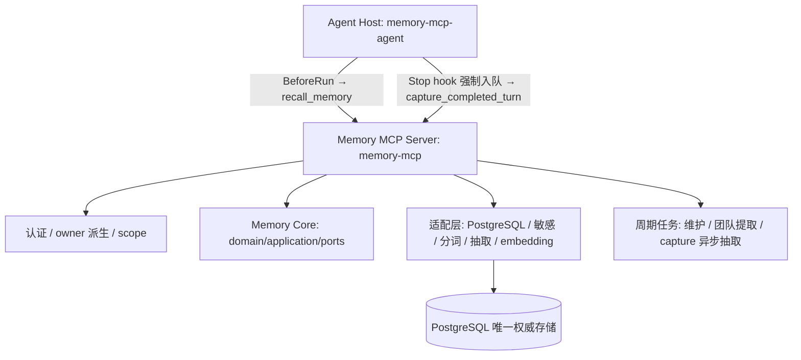

# Memory MCP 文档导航

系统设计见 [design.md](design.md)，本页只做导航与速览。

## 快速入口

| 我想… | 看这里 |
| --- | --- |
| 理解系统设计 | [design.md](design.md) — 架构、流程图、约束、不变量 |
| 查配置项 | [config.md](config.md) — 环境变量、默认值 |
| 接入 Agent | [agents.md](agents.md) — Hook 合同、Codex/Claude Code |
| 本地跑通 | [usage.md](usage.md) — 安装、启动、手工验证 |
| 跑测试 | [testing.md](testing.md) — 分层、命令、DB 安全 |
| 查日志 | [logging.md](logging.md) — 事件、字段、脱敏 |
| 生产部署 | [deploy.md](deploy.md) — ECS/RDS 直接运行 |
| 在本仓库工作 | [../CLAUDE.md](../CLAUDE.md) — 架构铁律、模块速查、改动检查清单 |

## 架构速览

两个发行包：`memory-mcp`（Server，Python 3.14）和 `memory-mcp-agent`（轻量 Client，
Python 3.11+）。生产独立安装，开发环境可同一仓库 `uv sync --all-packages`。

**分层铁律**：`core/{domain,application,ports}` 自包含，不依赖 MCP/HTTP/DB 驱动/Agent SDK/
运行时设置；场景差异通过 `MemoryProfile` 协议注入，通用 Core 不含业务词义。详见
[design.md §3](design.md)。

十三个 MCP 工具：`capture_completed_turn`、`recall_memory`、`list_memories`、`get_memory`、
`search_memories`、`list_pending_reviews`、`confirm_pending_memory`、`reject_pending_memory`、
`batch_confirm_pending`、`revoke_memory`、`link_memories`、`revoke_memory_relation`、
`get_memory_stats`（见 [design.md §6.2](design.md)）。

OpenSpec 管变更历史与规范，不作为使用手册：[OpenSpec 导航](../openspec/README.md)。
