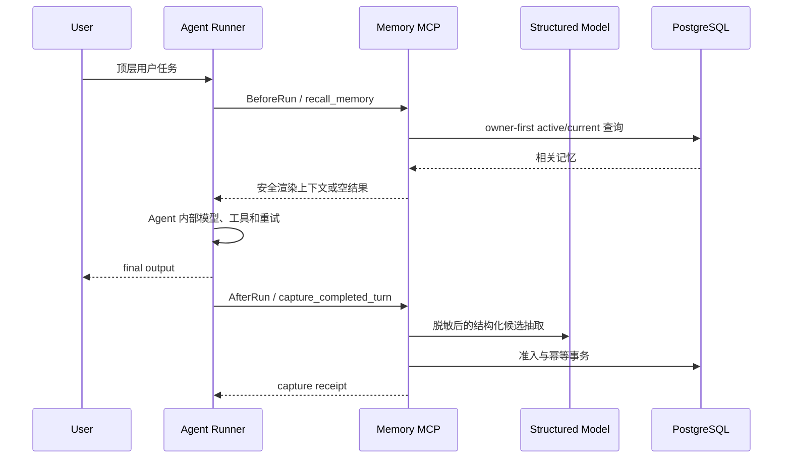

# Memory MCP 整体设计

## 1. 目标与边界

Memory MCP 是独立于 Agent 框架的长期记忆服务。Agent 只通过远程 MCP
读写记忆，不能直接访问 PostgreSQL，也不能在工具参数中声明 owner。服务端负责
可信身份、候选抽取、准入、版本、召回、幂等和用户隔离。

阶段五交付可运行的完整闭环：



这里的 AfterRun 是“一次顶层用户任务成功得到最终回复以后”，不是每次内部模型
调用结束，也不是整段会话关闭。失败、取消、尚未生成 final output 的任务不捕获。

## 2. 模块职责

| 模块 | 职责 | 禁止依赖 |
| --- | --- | --- |
| `core.domain` / `core.ports` | 通用领域对象和端口 | MCP、HTTP、LangChain、PostgreSQL |
| `core.application` | 捕获、准入、生命周期、召回用例 | Agent SDK |
| `core.adapters.postgresql` | 唯一运行时 Repository 和 migration | Agent |
| `extraction` | 模型配置、provider 工厂、固定/真实结构化 backend | owner 身份 |
| `server` | MCP transport、鉴权、严格 DTO、组合根 | Agent 框架 |
| `memory_hooks` | 远程 Client、Hook Bridge、Runner | Repository、服务端内部 DTO |
| `scenarios` | 场景类型、捕获说明和召回优先级 | transport |

依赖方向始终指向 Core 公开端口。`memory_hooks` 是服务的远程消费者，不是服务端
插件，因此同一 SDK 可以用于 Codex、LangChain 或自研 Runner。

## 3. 候选抽取

组合根始终配置一个 `CandidateExtractor`，正常运行不再出现
`capture_not_configured`：

- `fixed`：从 `MEMORY_MCP_FIXED_CANDIDATES_JSON` 读取严格候选；只有候选的
  `source_expression` 在本轮脱敏原文中精确出现时才返回。用于本地闭环和自动化。
- `openai-compatible`：使用 `CHAT_MODEL_*` 创建真实 LangChain 聊天模型，并以
  `CandidateBatch` 严格 schema 请求结构化输出。OpenAI、DeepSeek 或兼容
  `base_url` 均由现有模型工厂选择。

模型输入不包含 owner、Token 或数据库信息。服务先脱敏，模型输出回来后再次校验
来源表达、场景类型、敏感内容和准入规则。真实模型配置缺失或固定 JSON 非法会在
服务启动时失败，不会运行成半配置状态。

`extraction` 把同一模型能力收在一个语义包内，但按职责保留
`settings.py`、`chat_models.py`、`backends.py` 和 `factory.py`，避免形成同时处理
配置、供应商和业务 schema 的大文件。通用 `StructuredCandidateExtractor` 仍在
Core adapter，因为它只实现 Core port，不知道具体供应商。

## 4. Hook 时机与一致性

`HookContext` 的 `(scenario, conversation_id, turn_id)` 是顶层 run key。

- BeforeRun：同一 run key 至多发起一次召回；内部工具、子 Agent 和模型重试复用
  已召回上下文；空结果不注入“无相关记忆”等占位文本。
- Agent：收到 `user_input` 和可空的 `memory_context`，其内部实现完全由 Host
  决定。
- AfterRun：只有 Agent callable 正常返回 final output 后执行；同一 run key
  至多提交一次。
- 异步：两者都是 Python coroutine。BeforeRun 必须 await 后才能把召回上下文交给
  Agent；默认 Runner 也 await AfterRun receipt，因而能观察 capture summary 和
  failure code。
- 重试：event id 由 run key 通过 UUID5 稳定生成，每次有界重试提交相同 event
  和 payload，服务端幂等记录防止重复保存。
- 冲突：同一 run key 若被不同输入或输出复用，Bridge 立即抛出 typed conflict，
  不静默返回旧结果。
- 故障：默认 fail-open。召回失败时 Agent 仍运行，捕获最终失败时返回 warning；
  需要强一致的调用方可设置 `fail_open=false`。

当前去重状态是每个 BeforeRun/AfterRun 各自有上限的进程内 LRU 风格 receipt
cache；不会取消仍在执行的任务。`MemoryMcpClient` 跨调用复用 HTTP 连接池，并由
async context manager 或 `aclose()` 关闭。跨进程和进程重启后的最终幂等由服务端
PostgreSQL capture event 保证。每个真实顶层任务必须生成唯一 `turn_id`。

本期不需要 Redis/Kafka 等外部队列：一次捕获是短网络调用，服务端已有稳定 event
id 和事务幂等。Host 可以先向用户发出 final response，再在同一事件循环调度
AfterRun，但这只是非持久后台任务，进程退出时可能丢失。只有出现多进程统一削峰、
离线重放、进程崩溃后仍保证投递或明显吞吐瓶颈时，才引入 durable outbox/queue。

捕获内部也保持清晰边界：`CaptureService` 是兼容门面，
`CandidateProcessor` 负责候选校验/准入，`ReviewService` 负责 pending 协调；
PostgreSQL Repository 保留事务和 SQL 写入，row mapping 与 write validation
分别放在独立协作模块。公开契约和事务边界未改变。

## 5. 身份、隔离和存储

Bearer Token 只映射到服务端可信 Principal：

```text
(tenant_id, subject_id) -> owner_key
(client_id, agent_id)   -> 调用者审计
scopes                  -> read / write / review
```

用户 A 的 Agent A 与 Agent B 可以映射到同一 owner；用户 B 即使使用同一种
Agent，也必须映射到另一个 owner。Repository 所有查询都先限定 owner，再做匹配。
PostgreSQL 是唯一运行时权威存储；InMemory adapter 仅用于单元测试。

## 6. 运行和部署

本地与可信私网可以直接访问 `http://服务地址:8765/mcp`，不需要 Nginx。公网由
ALB/CLB 终止 HTTPS 并转发到 ECS 私网端口；公网 HTTPS、真实远端网络和生产认证
替换属于后续部署验收。

数据库 migration 是显式发布步骤，默认不随进程启动。日志只包含稳定引用、状态、
数量和耗时，不记录输入、输出、记忆正文、Token、DSN 或模型 API Key。

更细的需求与决策事实源仍是
[OpenSpec 设计](../openspec/changes/add-general-memory-core/design.md)。
