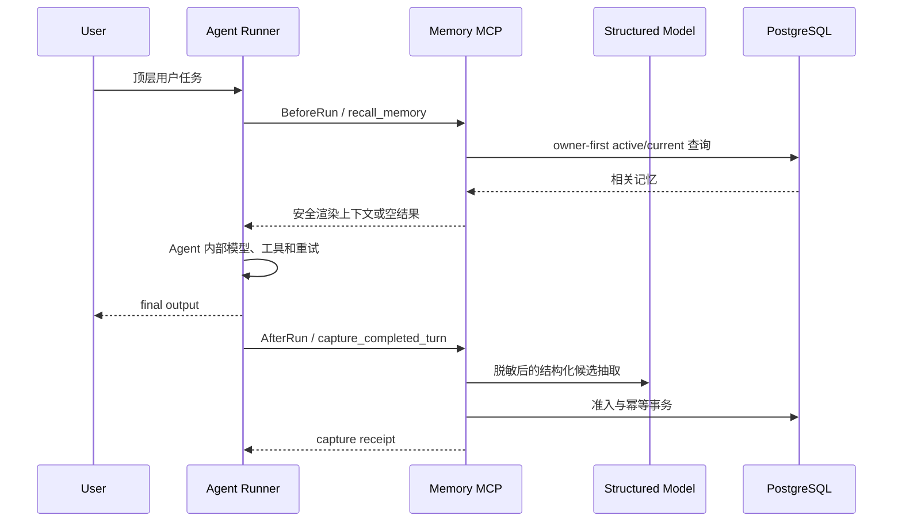

# Memory MCP 整体设计

## 1. 目标与边界

Memory MCP 是独立于 Agent 框架的长期记忆服务。Agent 只通过远程 MCP
读写记忆，不能直接访问 PostgreSQL，也不能在工具参数中声明 owner。服务端负责
可信身份、候选抽取、准入、版本、召回、幂等和用户隔离。

阶段五交付可运行的完整闭环：



这里的 AfterRun 是“一次顶层用户任务成功得到最终回复以后”，不是每次内部模型
调用结束，也不是整段会话关闭。失败、取消、尚未生成 final output 的任务不捕获。

## 2. 模块职责

| 模块 | 职责 | 禁止依赖 |
| --- | --- | --- |
| `core.domain` / `core.ports` | 通用领域对象和端口 | MCP、HTTP、LangChain、PostgreSQL |
| `core.application` | 捕获、准入、生命周期、召回用例 | Agent SDK |
| `core.adapters.postgresql` | 唯一运行时 Repository 和 migration | Agent |
| `extraction` | 模型配置、provider 工厂、固定/真实结构化 backend | owner 身份 |
| `server` | MCP transport、鉴权、严格 DTO、组合根 | Agent 框架 |
| `memory_hooks` | 远程 Client、Hook Bridge、Runner | Repository、服务端内部 DTO |
| `scenarios` | 场景类型、捕获说明和召回优先级 | transport |

依赖方向始终指向 Core 公开端口。`memory_hooks` 是服务的远程消费者，不是服务端
插件，因此同一 SDK 可以用于 Codex、LangChain 或自研 Runner。

### 2.1 当前项目结构

```text
memory-mcp/
├── src/memory_mcp/
│   ├── core/
│   │   ├── domain/                 # 纯领域对象：memory/revision/evidence/recall
│   │   ├── ports/                  # Repository、Extractor、Scenario 契约
│   │   ├── application/            # capture/review/lifecycle/recall 用例
│   │   ├── adapters/
│   │   │   ├── postgresql/         # Repository、mapping、validation、migration
│   │   │   ├── in_memory.py        # 仅单元测试使用
│   │   │   ├── sensitive.py        # 模型/存储前敏感预检
│   │   │   └── structured_model.py # Core CandidateExtractor 适配器
│   │   └── composition.py          # Core 组合，不读取环境变量
│   ├── extraction/                 # provider、真实/固定 backend、schema、settings
│   ├── scenarios/                  # GeneralWorkPolicy 正式场景
│   ├── server/
│   │   ├── tools/                  # capture/memory/recall/review MCP 工具
│   │   ├── app.py                  # HTTP/MCP 组合根与进程入口
│   │   ├── auth.py                 # 原型 TokenVerifier
│   │   ├── schemas.py              # 严格、版本化 transport DTO
│   │   └── settings.py             # Server 环境配置
│   ├── memory_hooks/               # 远程 Client、Bridge、Context、Runner
│   ├── database_cli.py             # migrate/health 独立入口
│   └── logging.py                  # 全项目结构化安全日志
├── examples/                       # MCP CLI 与三 profile Hook 演示
├── tests/                          # core/extraction/server/hooks 分层测试
├── docs/                           # 设计、配置、测试、使用和部署说明
└── openspec/changes/               # 需求、规范、设计和实施任务事实源
```

`server` 已按职责拆到 `tools/`，其余文件数量和体量仍小，不需要再增加
`transport/`、`config/`、`lifecycle/` 等空层级。`extraction` 保持模型相关能力在
同一语义包内，但 provider 构造、schema/backend 和 settings 分文件。PostgreSQL
目录按 Repository、row mapping、写前校验和 schema/migration 拆分，避免一个文件
同时承担 SQL 事务、序列化和发布维护。

### 2.2 入口与依赖注入

| 入口 | 组合内容 | 用途 |
| --- | --- | --- |
| `memory-mcp` | Settings → extractor → PostgreSQL → Core → MCP | 正式服务进程 |
| `memory-mcp-db` | Settings → schema manager | 显式 migrate/health |
| `create_app()` | 同正式组合根 | ASGI runner 或测试 |
| `create_memory_service()` | Repository + policies + extractor | Core/transport 测试与嵌入 |
| `MemoryHookSettings.from_profile()` | profile URL/Token/预算 | 每个 Agent 的远程客户端 |

只有最外层组合根读取 Secret 和环境变量。Core 构造函数只接收端口实现；测试可以
注入 InMemory Repository 和 Fake extractor，但部署入口不会自动退回测试实现。

## 3. 候选抽取

组合根始终配置一个 `CandidateExtractor`，正常运行不再出现
`capture_not_configured`：

- `fixed`：从 `MEMORY_MCP_FIXED_CANDIDATES_JSON` 读取严格候选；只有候选的
  `source_expression` 在本轮脱敏原文中精确出现时才返回。用于本地闭环和自动化。
- `openai-compatible`：使用 `CHAT_MODEL_*` 创建真实 LangChain 聊天模型，并以
  `CandidateBatch` 严格 schema 请求结构化输出。OpenAI、DeepSeek 或兼容
  `base_url` 均由现有模型工厂选择。

模型输入不包含 owner、Token 或数据库信息。服务先脱敏，模型输出回来后再次校验
来源表达、场景类型、敏感内容和准入规则。真实模型配置缺失或固定 JSON 非法会在
服务启动时失败，不会运行成半配置状态。

DeepSeek V4 默认 thinking 模式会拒绝 LangChain 结构化输出使用的 named
`tool_choice`。DeepSeek adapter 因此固定关闭 thinking，再使用同一严格 schema；
抽取任务不依赖 chain-of-thought。OpenAI provider 保持标准结构化输出参数。该兼容
规则位于 provider 工厂，不泄漏到 Core 或业务场景。

`extraction` 把同一模型能力收在一个语义包内，但按职责保留
`settings.py`、`chat_models.py`、`backends.py` 和 `factory.py`，避免形成同时处理
配置、供应商和业务 schema 的大文件。通用 `StructuredCandidateExtractor` 仍在
Core adapter，因为它只实现 Core port，不知道具体供应商。

## 4. Hook 时机与一致性

`HookContext` 的 `(scenario, conversation_id, turn_id)` 是顶层 run key。

- BeforeRun：同一 run key 至多发起一次召回；内部工具、子 Agent 和模型重试复用
  已召回上下文；空结果不注入“无相关记忆”等占位文本。
- Agent：收到 `user_input` 和可空的 `memory_context`，其内部实现完全由 Host
  决定。
- AfterRun：只有 Agent callable 正常返回 final output 后执行；同一 run key
  至多提交一次。
- 异步：两者都是 Python coroutine。BeforeRun 必须 await 后才能把召回上下文交给
  Agent；默认 Runner 也 await AfterRun receipt，因而能观察 capture summary 和
  failure code。
- 重试：event id 由 run key 通过 UUID5 稳定生成，每次有界重试提交相同 event
  和 payload，服务端幂等记录防止重复保存。
- 冲突：同一 run key 若被不同输入或输出复用，Bridge 立即抛出 typed conflict，
  不静默返回旧结果。
- 故障：默认 fail-open。召回失败时 Agent 仍运行，捕获最终失败时返回 warning；
  需要强一致的调用方可设置 `fail_open=false`。

当前去重状态是每个 BeforeRun/AfterRun 各自有上限的进程内 LRU 风格 receipt
cache；不会取消仍在执行的任务。`MemoryMcpClient` 跨调用复用 HTTP 连接池，并由
async context manager 或 `aclose()` 关闭。跨进程和进程重启后的最终幂等由服务端
PostgreSQL capture event 保证。每个真实顶层任务必须生成唯一 `turn_id`。

本期不需要 Redis/Kafka 等外部队列：一次捕获是短网络调用，服务端已有稳定 event
id 和事务幂等。Host 可以先向用户发出 final response，再在同一事件循环调度
AfterRun，但这只是非持久后台任务，进程退出时可能丢失。只有出现多进程统一削峰、
离线重放、进程崩溃后仍保证投递或明显吞吐瓶颈时，才引入 durable outbox/queue。

若未来引入队列，正确边界是 Host 或 Memory MCP 接收层先把完整、稳定的 capture
event 写入 durable outbox，再由 worker 调现有幂等 capture 用例；不能只把
`asyncio.create_task` 政名为队列，也不能让 worker 绕过 MCP 身份或 Repository
事务。

捕获内部也保持清晰边界：`CaptureService` 是兼容门面，
`CandidateProcessor` 负责候选校验/准入，`ReviewService` 负责 pending 协调；
PostgreSQL Repository 保留事务和 SQL 写入，row mapping 与 write validation
分别放在独立协作模块。公开契约和事务边界未改变。

## 5. 身份、隔离和存储

Bearer Token 只映射到服务端可信 Principal：

```text
(tenant_id, subject_id) -> owner_key
(client_id, agent_id)   -> 调用者审计
scopes                  -> read / write / review
```

用户 A 的 Agent A 与 Agent B 可以映射到同一 owner；用户 B 即使使用同一种
Agent，也必须映射到另一个 owner。Repository 所有查询都先限定 owner，再做匹配。
PostgreSQL 是唯一运行时权威存储；InMemory adapter 仅用于单元测试。

捕获事务以 `(owner_key, event_id)` 做幂等。相同 event 与相同 fingerprint 返回
已有 receipt；相同 event 与不同 payload 拒绝为冲突。MemoryItem 与 current
revision、Evidence、pending review、capture outcome 均保持 owner 一致约束。
召回只从 owner-scoped active/current 集合取候选，再在应用层确定性排序与预算
裁剪；未来即使引入向量索引，返回前仍必须回 PostgreSQL 复核 owner 和 lifecycle。

`subject` 是可选精确过滤器，不是模糊关键词。真实模型可根据正文归纳 subject，
因此 Host 无法保证规范化一致时应省略 subject，仅依赖 query/task intent；固定
backend 或有领域枚举的 Host 才适合稳定传入。

## 6. 运行和部署

本地与可信私网可以直接访问 `http://服务地址:8765/mcp`，不需要 Nginx。公网由
ALB/CLB 终止 HTTPS 并转发到 ECS 私网端口；公网 HTTPS、真实远端网络和生产认证
替换属于后续部署验收。

数据库 migration 是显式发布步骤，默认不随进程启动。日志只包含稳定引用、状态、
数量和耗时，不记录输入、输出、记忆正文、Token、DSN 或模型 API Key。

完整配置、默认值、Secret 分类以及 fixed/test/production 边界见
[配置参考](configuration.md)，可复现测试矩阵见[测试说明](testing.md)，人工接入
步骤见[端到端使用](usage.md)。

更细的需求与决策事实源仍是
[OpenSpec 设计](../openspec/changes/add-general-memory-core/design.md)。
