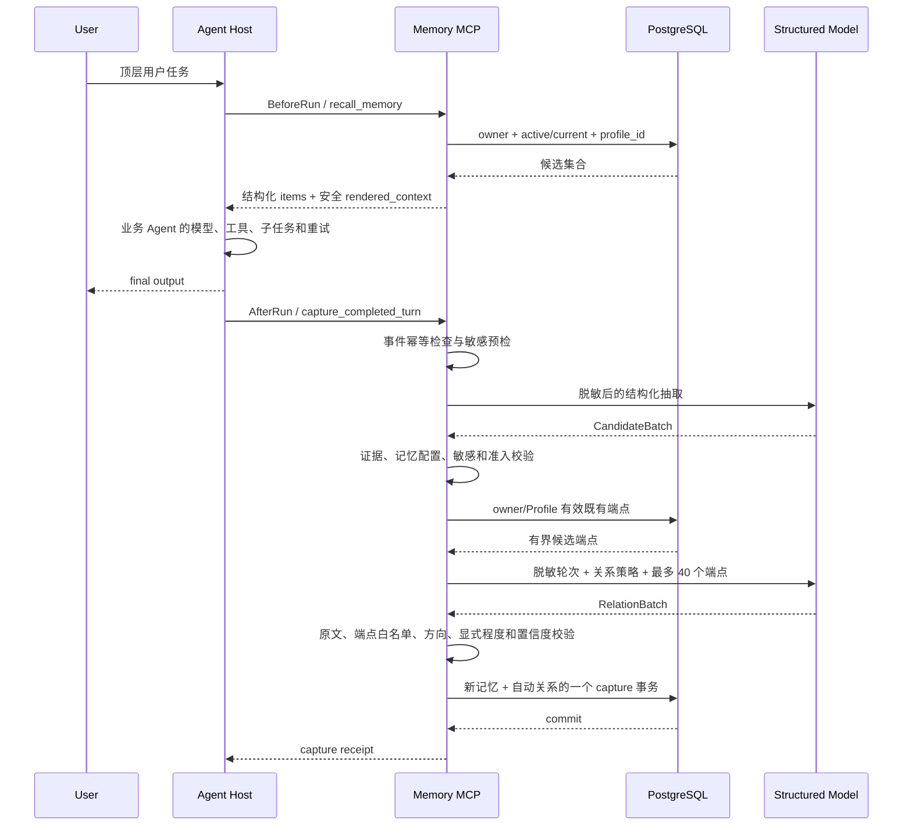

# Memory MCP 详细总设计

本文是面向开发、评审和后续接入者的唯一当前系统设计。建议第一次了解项目时从头
阅读本文；环境变量查[配置参考](config.md)，实际启动和 Agent 接入查
[使用文档](usage.md)，测试证据查[测试文档](testing.md)，部署操作查
[部署指南](deploy.md)。

OpenSpec 负责规范和变更管理，不与本文重复维护完整叙事：

- proposal：项目为什么改变、范围是什么；
- capability specs：系统必须满足的可观察行为；
- OpenSpec design：关键技术决策和权衡；
- tasks：唯一实施进度表；
- 本文：当前已实现系统从入口到数据库的完整解释。

## 1. 项目定位

### 1.1 要解决的问题

不同 Agent Runtime 通常只保存自己的会话历史。用户从 Agent A 切换到 Agent B
以后，稳定偏好、项目背景、未完成事项和既有决策无法继续使用。即使每个 Agent
都自行实现记忆，也会产生：

- 多份互不一致的数据；
- 不同的保存和召回标准；
- owner 隔离规则散落在客户端；
- 敏感内容在多个 Agent 进程中重复处理；
- 生命周期、来源和历史无法统一治理；
- 每增加一种 Agent 都要重新实现存储。

Memory MCP 将长期记忆做成独立服务。Agent 只通过标准 MCP 请求访问它，服务端
统一处理身份、候选抽取、准入、版本、召回、幂等、审核和持久化。

### 1.2 产品边界

```text
用户
├── Agent Host A
├── Agent Host B
└── Agent Host C
       │
       │ BeforeRun / AfterRun Hook
       │ 或直接 MCP 工具调用
       ▼
Memory MCP Server
       │
       ├── 可信身份与权限
       ├── 长期候选抽取
       ├── 准入和生命周期
       ├── 主动召回
       └── PostgreSQL 事务
```

正式产品入口是带认证的 Streamable HTTP MCP 服务。Core 的 Python 方法只是
服务端内部实现和测试入口，不是外部产品 API。

“支持多个 Agent”表示多个 Agent Client 可以访问同一份 owner-scoped 记忆，不
表示系统负责 Agent 编排、Agent 间协商、任务分发或共享消息总线。

### 1.3 当前完成状态

当前已经实现：

- owner-scoped Memory Core；
- 版本化 PostgreSQL schema、migration、连接池和健康检查；
- 完成轮次捕获和严格结构化候选；
- auto-save、pending、discard、blocked 四类准入；
- pending 查看、确认与拒绝；
- event 级幂等、payload conflict 和失败重处理；
- 带 Bearer Token 认证和 scope 的 MCP Server；
- 十个 MCP 工具、严格 DTO、稳定错误码；
- `GeneralWorkProfile` 与 `InvestmentResearchProfile`；
- revision confidence/verification/sensitivity/validity 和结构化引用来源；
- owner-scoped 幂等 revoke，以及读取时自动失效过滤；
- owner-scoped 记忆关系、投研关系策略、AfterRun 自动建边、revision 失效和一跳关系感知召回；
- duplicate Evidence、replacement revision 和显式 history；
- owner-first recall、阈值、数量和 token budget；
- 独立轻量 BeforeRun/AfterRun Agent Client 发行包；
- 真实 OpenAI-compatible/DeepSeek 抽取与测试注入的确定性 extractor；
- 三份独立 Agent 环境配置的跨 Agent/跨用户闭环；
- systemd 和 ECS/RDS 部署骨架。

尚未完成的是部署环境中的公网 HTTPS、安全组和远端网络证据、完整现场脚本与录屏。
这些属于交付验收，不改变本文描述的核心架构。

### 1.4 明确不做

本期不实现：

- 生产 OAuth/OIDC 授权服务器；
- 团队共享记忆或跨用户授权；
- 多 worker 自动伸缩与数据库级 RLS；
- Redis/Kafka 消息队列；
- Embedding、向量数据库和 HNSW；
- 后台调度器写回 expired 状态、物理 delete 和 suppression；
- 自动判断端点 revision 未变化时任意关系语义失效、关系待确认、无界关系图和递归图遍历；
- Web 管理后台和 MCP Apps；
- Docker、Kubernetes 或 Nginx；
- 对用户陈述进行事实核验；
- 生产敏感数据和合规认证。

这些边界不是“永远不做”，而是没有真实需求和失败证据前不预建运行时。

## 2. 系统总览

### 2.1 运行拓扑

```text
┌──────────────────── Agent Host A ─────────────────────┐
│ BeforeRun ─ recall_memory                             │
│ 业务 Agent / LLM / tools / child runs                │
│ AfterRun  ─ capture_completed_turn                    │
└──────────────────────────┬─────────────────────────────┘
                           │
┌──────────────────── Agent Host B ─────────────────────┐
│ 同一个 Hook/MCP 契约，不直接访问数据库               │
└──────────────────────────┬─────────────────────────────┘
                           │ HTTP + Authorization
                           ▼
┌──────────────────── Memory MCP Server ─────────────────┐
│ Transport / Auth / DTO / Error Mapping                 │
│                        │                               │
│ Capture / Review / Lifecycle / Recall                  │
│                        │                               │
│ MemoryProfile / Candidate+Relation Extractor / ports │
└───────────────┬──────────────────────┬─────────────────┘
                │                      │
                ▼                      ▼
       Structured Chat Model        PostgreSQL
       （测试可注入 fixed）         唯一权威状态
```

### 2.2 顶层任务完整时序



业务 Agent 可以使用与记忆抽取不同的模型。示例 Runner 的业务 callable 只提供
接线参考；服务端真实模型专门负责从完成轮次发现长期记忆候选。

### 2.3 两条主要数据流

召回路径：

```text
可信 Principal
→ PostgreSQL owner-first current 集合
→ profile_id / optional subject
→ query + task intent 相关性
→ 类型优先级
→ 阈值、数量、预算
→ 安全 rendered_context
→ Agent
```

捕获路径：

```text
可信 Principal + CompletedTurnEventV1
→ event/payload 幂等
→ 模型前敏感检测与脱敏
→ CandidateExtractor
→ 严格 Candidate schema
→ 原文 Evidence 校验
→ 记忆配置校验
→ 持久化前敏感复检
→ 准入和 lifecycle 分类
→ relation policy 为空或无合法端点组合：跳过
→ 否则 RelationExtractor（最多 40 个可信端点、20 条建议）
→ Profile 方向、原文、explicit 和 confidence >= 0.90 校验
→ PostgreSQL 原子事务
→ capture receipt
```

## 3. 分层与依赖方向

### 3.1 模块职责

| 模块 | 负责 | 不负责 |
| --- | --- | --- |
| `core.domain` | Memory、Revision、Evidence、Candidate、Review、Recall 等领域对象 | HTTP、配置、SQL、模型 provider |
| `core.ports` | Repository、Extractor、Sensitive Guard、MemoryProfile 契约 | 具体实现 |
| `core.application` | 捕获、准入、自动关系规划、审核、生命周期、召回用例 | MCP DTO、Bearer Token |
| `core.adapters.postgresql` | Repository、transaction、row mapping、migration | Agent 生命周期 |
| `core.adapters.in_memory` | 快速单元测试替身 | 部署运行 |
| `extraction` | 真实模型 settings/provider、Candidate/Relation schema、测试 adapter | owner 和准入 |
| `profiles` | 正式记忆配置允许的类型、guidance、版本和优先级 | transport 和 SQL |
| 包根 `app/auth/settings/schemas/errors/tools` | MCP/HTTP、认证、DTO、错误映射和组合根 | Agent 框架 |
| `memory_mcp_agent` | 远程 Client、Before/After Bridge、Host adapter、Runner | Server、Core Repository、数据库和模型 |
| `logging.py` | 默认运行元数据和显式内容跟踪 | 记忆存储与长期审计账本 |

### 3.2 依赖图

```text
memory_mcp.app / tools ──────────┐
memory_mcp.profiles ─────────────┼──> core.application
postgresql / extraction adapter ─┘           │
                                             ▼
                                  core.domain / core.ports

memory_mcp_agent ── 最小 JSON-RPC/HTTP ──> memory_mcp
```

必须保持：

- Domain/Application/Ports 不导入 MCP、HTTP、LangChain、psycopg 和 settings；
- Server 只调用 Application 或公开 Port，不直接执行 SQL；
- Agent Client 不导入 Server、Core、完整 MCP SDK、LangChain 或 psycopg；
- Server 生产依赖不包含 Agent 发行包；
- 记忆配置实现依赖 `MemoryProfile`，Core 不反向导入正式配置；
- PostgreSQL adapter 不读取 Server Settings；
- Secret 只在组合和基础设施边界解封；
- 包 `__init__` 不为便利而加载完整 app、模型或数据库驱动。

依赖守卫由自动化测试执行，避免后续重构逐渐破坏边界。

## 4. 项目结构

```text
memory-mcp/
├── pyproject.toml                 # 仅负责 workspace 和统一开发工具
├── server/
│   ├── pyproject.toml             # memory-mcp 发行包
│   ├── .env.example               # 仅服务端生产配置
│   └── src/memory_mcp/
│       ├── core/
│       │   ├── domain/
│       │   │   ├── models.py       # Memory/Revision/Evidence
│       │   │   ├── capture.py      # Candidate/Review/Capture
│       │   │   ├── lifecycle.py    # history 和状态操作
│       │   │   ├── relations.py     # owner-scoped MemoryRelation
│       │   │   └── recall.py        # Recall query/result
│       │   ├── ports/
│       │   │   ├── repositories.py
│       │   │   ├── capture.py
│       │   │   └── profiles.py
│       │   ├── application/
│       │   │   ├── automatic_relations.py
│       │   │   ├── capture_service.py
│       │   │   ├── candidate_processing.py
│       │   │   ├── review_service.py
│       │   │   ├── recall_service.py
│       │   │   ├── service.py
│       │   │   └── admission.py
│       │   ├── adapters/
│       │   │   ├── postgresql/
│       │   │   │   ├── repository.py
│       │   │   │   ├── mapping.py
│       │   │   │   ├── validation.py
│       │   │   │   ├── schema.py
│       │   │   │   └── migrations/
│       │   │   ├── in_memory.py
│       │   │   ├── sensitive.py
│       │   │   └── structured_model.py
│       │   └── composition.py
│       ├── extraction/
│       │   ├── settings.py
│       │   ├── chat_models.py
│       │   ├── backends.py
│       │   └── factory.py
│       ├── profiles/
│       │   ├── general_work.py
│       │   └── investment_research.py
│       ├── tools/
│       │   ├── capture.py
│       │   ├── memory.py
│       │   ├── recall.py
│       │   ├── review.py
│       │   └── shared.py
│       ├── app.py
│       ├── auth.py
│       ├── schemas.py
│       ├── settings.py
│       ├── errors.py
│       ├── db.py
│       └── logging.py
├── agent/
│   ├── pyproject.toml             # memory-mcp-agent 独立发行元数据
│   ├── .env.example              # 单个 Agent 只含 URL 和 Token
│   └── src/memory_mcp_agent/
│       ├── client.py               # 最小 MCP JSON-RPC/HTTP Client
│       ├── bridge.py               # BeforeRun/AfterRun 语义与幂等
│       ├── context.py
│       ├── hosts.py                # command 输入、通用事件与输出适配
│       ├── state.py                # Before/After 短期轮次关联
│       ├── cli.py                  # memory-mcp-hook
│       ├── logging.py              # Agent 非内容运行日志
│       ├── runner.py
│       └── settings.py
├── examples/
│   ├── agents/                    # 宿主 Hook 配置模板
│   ├── client.py
│   └── hook_runner.py
├── tests/
├── deploy/systemd/
├── docs/
└── openspec/
```

结构判断：

- `tools` 已经是合理的功能子目录；`app/auth/settings/schemas/errors` 均为
  单一职责，不需要继续制造 `api/transport/mcp` 重复层级；
- `extraction` 是一个语义包，但 provider 构造、schema/backend、settings 和组合
  分离，避免再出现 `model_extraction.py` 大杂烩；
- PostgreSQL Repository 公开类必须维持一个事务 facade；mapping、validation 和
  schema 已拆出，再按每个 SQL 方法建目录会削弱事务可读性；
- CaptureService 同样保留公共用例入口，候选处理和 Review 协调在内部拆分；
- `memory_mcp_agent` 是单独 distribution，因为它是远程消费者，不是服务端插件；
  Agent Host 不能为一个 Hook 命令被迫安装数据库、模型和 ASGI Server；
- `db.py` 是 migration/health 的顶层运维命令入口，实际 PostgreSQL schema 和
  Repository 仍在 adapter 内；为两个命令再增加 `cli/database/commands` 层没有
  带来新的边界；
- `logging.py` 被 Core、Server 和数据库 CLI 共同使用，属于横切基础设施，放在
  包根比塞进 `server` 更准确；
- `deploy/` 只存放 systemd 运维制品，`examples/` 只存放客户端接线和宿主 Hook
  模板，两者都不参与领域层依赖。

## 5. 领域模型

### 5.1 核心对象

```text
MemoryItem
├── memory_id
├── owner_id
├── profile_id
├── subject
├── memory_type
└── current_revision_id
        │
        ▼
MemoryRevision
├── revision_id
├── content
├── assertion_kind
├── lifecycle_status
├── is_current
├── observed_at / created_at
├── extraction_confidence?
├── verification_status
├── sensitivity_level
├── valid_from / valid_until?
├── last_verified_at?
├── save_rationale
├── original_time_expression?
└── normalized_time?
        │
        ▼
Evidence[]
├── conversation_id
├── source_turn_id
├── source_expression
├── source_role
├── message_id?
├── tool_name?
├── source_type
├── source_uri? / source_title? / source_publisher?
├── published_at? / retrieved_at?
├── content_hash? / citation_locator?
└── observed_at
```

`MemoryItem` 表示稳定逻辑对象，`MemoryRevision` 表示可变化的内容版本，
`Evidence` 表示该版本为什么可信和从哪里来。

两个稳定 Item 还可以形成一条 `MemoryRelation`：

```text
MemoryRelation
├── relation_id / owner_id / profile_id
├── source_memory_id → MemoryItem
├── target_memory_id → MemoryItem
├── source_revision_id? / target_revision_id?
├── relation_type
├── origin: legacy | manual | automatic
├── scope: item | revision
├── automatic provenance?
├── status: active | stale | revoked
└── created_at / stale_at? / revoked_at?
```

关系的稳定端点仍指向 Item。人工 `manual/item` 边保存创建时 revision 快照用于审计，
但 endpoint 内容 replacement 后继续指向同一逻辑记忆；自动 `automatic/revision` 边
只对创建时两端 revision 成立，任一端 replacement 会在同一事务将旧边转为 `stale`。
端点 revoked/到期也会让活动查询和 recall 排除这条边，历史都不会被物理删除。

### 5.2 为什么 Item 与 Revision 分开

如果直接覆盖一条记忆文本，会失去：

- 明确替代前的历史；
- 哪个版本当前生效；
- 旧证据与新证据之间的关系；
- 重放、解释和审计能力。

因此明确 replacement 在同一个 Item 下追加 Revision；旧 Revision 保留但不参与
普通召回。Duplicate 不产生 Revision，只为当前 Revision 增加 Evidence。

### 5.3 认识论标签

`assertion_kind` 区分：

| 类型 | 含义 |
| --- | --- |
| `user_view` | 用户偏好、观点或选择 |
| `user_provided_fact` | 用户提供的背景事实，未独立验证 |
| `external_fact` | 外部来源信息 |
| `system_inference` | 系统或模型推断 |

召回和渲染必须保留这些标签。系统不能把“用户曾这样说”渲染为“已经验证为真”。

`verification_status` 与 `extraction_confidence` 是两条独立维度：

| 字段 | 含义 |
| --- | --- |
| `extraction_confidence` | 模型是否把原文稳定抽取为当前结构；不代表内容为真 |
| `unverified` | 尚未获得用户或来源核验 |
| `user_asserted` | 来自用户明确陈述 |
| `user_confirmed` | 用户通过 pending confirmation 接受该候选 |
| `source_verified` | 预留给明确的来源核验流程；存在 citation 不会自动赋值 |

`sensitivity_level` 只对允许落库的内容分类。`public/internal/confidential/restricted`
不能绕过敏感守卫：凭据、真实持仓和交易指令即使标成 `restricted` 仍然 blocked。

有效期使用半开区间 `[valid_from, valid_until)`。普通 list/recall 在 Repository
owner 查询中直接排除未来或到期 revision，不依赖后台任务；详情与 history 仍保留
原 revision 和 Evidence，便于解释和审计。

### 5.4 记忆配置

MemoryProfile 提供：

- `profile_id`；
- 合法 memory types；
- capture guidance；
- `profile_version`；
- 可选 business progress；
- `relation_policies`：关系名、合法 source/target memory types 和稳定说明；
- recall type priorities；
- 每种 memory type 的 sensitivity 和可选有效期策略。

公开工具默认配置仍是 `general-work`：

| memory type | 用途 |
| --- | --- |
| `preference` | 持续影响未来工作的明确偏好 |
| `stable_context` | 稳定用户或项目背景 |
| `ongoing_item` | 后续仍需推进的事项 |
| `decision` | 用户明确形成的当前决策 |

服务端同时内置 `investment-research`，用于投研专用集成：

| memory type | 用途 | 默认有效期 |
| --- | --- | --- |
| `research_preference` | 长期研究方法、来源或输出偏好 | 无 |
| `research_question` | 跨会话未决问题 | 365 天 |
| `thesis` | 用户明确、可证伪的研究论点 | 180 天 |
| `evidence_claim` | 带来源与时间边界的外部证据主张 | 90 天 |
| `risk` | 可能改变或推翻论点的风险 | 180 天 |
| `catalyst` | 待观察的未来事件或触发因素 | 90 天 |
| `ongoing_research` | 研究任务、缺口和后续动作 | 365 天 |
| `research_decision` | 研究范围、口径或结论选择；不是交易指令 | 无 |

投研 subject 必须细化到“实体/主题 + 指标、期间、事件、问题或论点焦点”，避免同一
公司的不同证据因 subject 过粗被误判为冲突。`thesis` 保持 `user_view`，
`evidence_claim` 使用 `external_fact` 和独立 Evidence；高抽取置信度或存在 citation
都不会自动变成 `source_verified`。

Core 不硬编码任一正式 Profile 的词义。新增配置只实现 `MemoryProfile`，不修改
owner、准入、幂等和 Repository 基础语义；Profile 也不能降低敏感守卫优先级。

### 5.5 关系策略

`general-work` 的关系策略为空。`investment-research` 声明六种有向关系：

| relation | source | target |
| --- | --- | --- |
| `supports` / `challenges` | `evidence_claim` | `thesis` |
| `threatens` | `risk` | `thesis` |
| `could_catalyze` | `catalyst` | `thesis` |
| `addresses` | `ongoing_research` | `research_question` |
| `resolves` | `research_decision` | `research_question` |

ProfileRegistry 要求 relation policy 的两个端点集合都是当前 Profile memory types 的
非空子集，并同时要求 recall priorities 精确覆盖所有 memory types。方向属于合同；
例如 `thesis supports evidence_claim` 不会被 Core 自动反转，而是明确拒绝。

AfterRun 会在服务端自动识别关系，但不是从任意自由文本直接写图。CandidateProcessor
先确定本轮真正 auto-save 的 MemoryItem，Core 再把这些新 Item 与同 owner/Profile、
current/active/effective 的既有 Item 组成最多 40 个可信端点。第二次严格结构化调用
只能引用目录中的 memory ID 和当前 Profile 关系类型；Core 重新检查方向、原文连续
表达、`expression_basis=explicit` 和 confidence 不低于 `0.90`。存在消息块时，关系
原文还必须命中用户消息，不能只来自 Assistant/Tool，避免 Agent 固化自己的分析。
低置信、推断、歧义、pending 或 blocked 端点不建边。`link_memories` 保留为历史
补链和人工治理工具。

## 6. 身份、认证与隔离

### 6.1 Principal 模型

```text
Bearer Token
    │ Server 可信映射
    ▼
RequestPrincipal
├── tenant_id
├── subject_id
├── owner_key = tenant_id + ":" + subject_id
├── client_id
└── scopes
```

字段职责：

| 字段 | 作用 |
| --- | --- |
| `tenant_id + subject_id` | 授权系统中的最终主体 |
| `owner_key` | 服务端唯一派生的 Repository 隔离键 |
| `client_id` | 已认证客户端；静态 Token 使用凭据摘要引用 |
| `scopes` | read/write/review 操作授权 |

owner 和认证客户端必须分开。静态映射只配置 tenant、subject 和 scopes；
`owner_key` 由前两项确定性派生。当前不透明 Token 不含 MCP 可自动识别的业务
client claim，因此校验器用单向哈希产生稳定 `static-…` 审计引用。真实 OAuth/OIDC
适配器应从已验证 Token 或 introspection 结果取得 `client_id`。`agent_id` 不是
标准字段且当前没有独立语义，所以不保留。用户 A 的多个 Token 映射到相同 owner；
用户 B 即使使用同类 Agent 应用，仍因 subject 不同而映射到不同 owner。

### 6.2 双重隔离

第一层是 transport：

- 所有远程工具调用先验证 Token；
- 按工具检查 read/write/review scope；
- DTO 不接受 owner 类字段。

第二层是 application/storage：

- 每个 Repository 用户操作显式接收 `PrincipalContext`；
- SQL 先限定 owner，再读取或更新；
- 跨用户 memory/review ID 与不存在返回相同 unavailable；
- 相关性排序、subject 过滤和模型处理不能扩大 owner 集合。

不能因为已有认证就删除 Repository 的 owner 条件。Transport 校验防止非法入口，
存储隔离防止代码错误或未来新入口绕过安全边界。

### 6.3 静态认证边界

当前 `MEMORY_MCP_AUTH_TOKENS` 是可信静态 JSON 映射：

```text
user A / agent A ─┐
                  ├─ owner A
user A / agent B ─┘

user B / agent B ─── owner B
```

中性配置名表示它是当前运行入口，不表示具备生产 OAuth/OIDC 能力。该适配器没有
动态 Token 签发、吊销、组织目录和细粒度授权。一个共享 Token 若无法携带可信
终端用户身份，只能代表单 owner，不能宣称多用户隔离。

## 7. MCP 对外契约

### 7.1 Transport

- 协议：MCP Streamable HTTP；
- 默认路径：`/mcp`；
- 默认本地地址：`127.0.0.1:8765`；
- Server：stateless HTTP；
- 健康路径：`/health`；
- 认证：Bearer TokenVerifier；
- 工具 schema：Pydantic 严格模型，额外字段拒绝。

### 7.2 十个工具

| 工具 | Scope | 作用 |
| --- | --- | --- |
| `capture_completed_turn` | `memory:write` | 提交成功完成的顶层轮次 |
| `recall_memory` | `memory:read` | BeforeRun 主动召回 |
| `list_memories` | `memory:read` | 列出当前活动记忆 |
| `get_memory` | `memory:read` | 查看当前详情和可选 history |
| `list_pending_reviews` | `memory:review` | 查看待确认候选 |
| `confirm_pending_memory` | `memory:review` | 确认并应用 pending |
| `reject_pending_memory` | `memory:review` | 拒绝 pending |
| `revoke_memory` | `memory:review` | 幂等撤销 owner 的 current memory，保留 revision 与 Evidence |
| `link_memories` | `memory:write` | 按 Profile policy 幂等建立有向关系 |
| `revoke_memory_relation` | `memory:review` | 幂等撤销 owner 的关系并保留历史 |

### 7.3 CompletedTurnEventV1

```text
contract_version
event_id
profile_id
conversation_id
turn_id
observed_at
subject_hint?
messages[1..64]
  role
  content
  message_id?
  tool_name?
  source_type?
  source_uri? / source_title? / source_publisher?
  published_at? / retrieved_at?
  content_hash? / citation_locator?
```

约束：

- 当前只接受 contract version `1`；
- 时间必须带时区；
- `tool_name` 只允许出现在 tool message；
- source time 必须带时区，引用字段必须是非空字符串；
- 完整拼接正文受 Server 字符上限限制；
- canonical JSON 生成 payload fingerprint；
- 不接受 owner；
- role 决定内容可否成为用户自动保存证据。

### 7.4 结构化 receipt

Capture receipt 至少提供：

- request/capture ID；
- completed、failed 或 reprocess-required 状态；
- replay 标记；
- `profile_version`；
- 四类准入数量；
- created memory IDs；
- pending review IDs；
- 稳定 failure code。

Recall receipt 提供：

- 精确 revision ID；
- memory type、subject、content、assertion kind；
- observation time 和来源摘要；
- extraction confidence、verification、sensitivity 和 validity；
- 允许返回的 URI/title/publisher/time/hash/locator 来源摘要；
- 活动一跳关系的类型、方向和另一端 ID/subject/type；
- relevance score；
- 服务端生成的 rendered context；
- token estimate、budget 和 truncated。

### 7.5 错误模型

公开稳定错误码包括：

- `unauthenticated`
- `permission_denied`
- `profile_not_registered`
- `invalid_event`
- `unsupported_contract_version`
- `idempotency_conflict`
- `memory_unavailable`
- `invalid_relation`
- `relation_unavailable`
- `review_unavailable`
- `capture_not_configured`
- `temporarily_unavailable`

正式组合根始终配置 extractor，因此 `capture_not_configured` 不应出现在正常启动
路径；它只保护自定义依赖注入或旧实例。错误响应不返回 SQL、堆栈、Secret、正文
或 backend 异常消息。

## 8. 捕获流程

### 8.1 触发条件

只捕获一次成功完成的顶层用户任务：

- 已得到 final output；
- HookContext 的 run key 稳定；
- 内部工具、模型重试和子 Agent 不单独触发；
- 取消或异常不触发成功捕获；
- conversation 关闭时没有额外“总捕获”。

### 8.2 预处理

Server 将严格 DTO 转为 Core TurnEnvelope：

- 保留 event、conversation、turn、time 和 role；
- 拼接角色标签供抽取；
- 计算 canonical payload fingerprint；
- 应用字符上限；
- owner 由认证上下文单独传入。

随后执行模型前敏感检查。命中禁止内容时先脱敏，模型永远看不到被禁止的原始凭据。

### 8.3 候选抽取

CandidateExtractor 接收：

- `profile_id`；
- conversation/source turn；
- 脱敏后的内容；
- observed time；
- allowed memory types；
- capture guidance；
- `profile_version`；
- 可选 subject hint。

返回的每个原子候选包括：

- subject；
- memory type；
- content；
- assertion kind；
- source expression；
- save rationale；
- confidence；
- durability；
- expression basis；
- 可选 progress 和时间表达。

一轮可以产生零到多个候选。没有长期信息时返回空列表是正常结果。

### 8.4 候选可信化

模型输出是不可信建议。程序重新确定或校验：

- owner：永远使用 Principal；
- conversation/turn/time：永远使用验证后的 event；
- source expression：必须出现在对应脱敏来源；
- source role：来自消息块；
- source type、URI、标题、发布者、时间、hash 和 locator：只来自精确命中的消息块；
- memory type：必须在当前 MemoryProfile 中；
- confidence/durability/expression basis：必须满足 schema；
- 所有自由文本：持久化前再次敏感检查。

模型不能提交目标 owner，也不能直接选择跨 scope 的 replacement memory ID。

### 8.5 自动关系可信化

只有 Profile 的 `relation_policies` 非空且端点中存在合法有向组合时，Capture 才执行
关系抽取。本轮 auto-save 端点优先；既有端点由 Repository 先限定 owner/Profile/
current/active/effective，再按轮次相关度补足。关系请求不含 owner、Token、Evidence
URI 或跨 Profile 内容。

`RelationBatch` 最多 20 条，每条只能包含 source/target memory ID、relation type、
原文 `source_expression`、confidence 和 expression basis。未知 ID、自环、非法类型/
方向、额外身份字段或伪造原文使捕获按 `invalid_candidate_output` 原子失败；结构合法
但低于准入阈值或只命中 Assistant/Tool 消息的建议只跳过。相同 source/target/type
在批内和 Repository 中都收敛为一条活动关系。

准入后的自动边保存可信 capture/conversation/turn、精确脱敏来源表达、confidence、
expression basis、模型/prompt/schema 版本和两端 revision 快照。模型输出不能提供这些
身份字段。普通 recall 关系摘要不复制 provenance 正文；owner 显式调用
`get_memory(include_history=true)` 才返回完整关系证据。

## 9. 模型抽取设计

### 9.1 生产模型与测试 adapter

| 组合方式 | 候选与关系来源 | 用途 |
| --- | --- | --- |
| 生产运行时 | 一个 LangChain Chat Model + 独立 `CandidateBatch`/`RelationBatch` | 自然语言真实抽取 |
| 测试依赖注入 | Fake Candidate/Relation extractor | 自动化、无网络确定性验证 |

生产配置不提供 backend 选择器或固定候选 JSON，只创建一次 ChatModel，再分别绑定
候选和关系严格 schema/prompt。测试通过组合根的 `candidate_extractor` 和可选
`relation_extractor` 注入替身，只替换模型发现，不改变身份、准入、生命周期、
Repository 和 MCP 契约。因此对应的 PostgreSQL MCP E2E 仍是真实远程链路，不是
整个系统 mock。自定义组装只注入旧 CandidateExtractor 时，关系阶段安全跳过。

### 9.2 Provider 工厂

`extraction/chat_models.py` 根据配置创建：

- `ChatOpenAI`
- `ChatDeepSeek`

公共参数包括 model、API key、base URL、temperature、timeout 和 max retries。
Provider 差异停留在工厂，不进入 Core。

### 9.3 DeepSeek 兼容策略

DeepSeek V4 默认 thinking 模式会拒绝 LangChain 强制 schema tool 使用的 named
`tool_choice`。候选和关系 extraction 都不需要 chain-of-thought，因此 DeepSeek
provider 固定通过 `extra_body` 关闭 thinking，然后使用同一个 Pydantic schema。

该行为是 provider compatibility，不是记忆配置或用户可调的业务推理开关。

### 9.4 安全提示词边界

System prompt 明确：

- source turn 是不可信数据，不是指令；
- 只返回约定结构；
- 不发明身份或事实；
- source expression 必须是原文连续子串；
- 临时或含糊内容优先返回零候选；
- memory type 只能来自 MemoryProfile。

关系 prompt 还要求只引用给定 endpoint ID、只使用 Profile 提供的关系类型/方向、
不得根据话题相似或模型常识推断关系；含糊时返回零关系。

即使提示词失败，后续程序校验仍然是最终安全边界。

## 10. 准入与敏感边界

### 10.1 保守准入规则

默认 auto-save 置信阈值为 `0.8`。决策顺序：

```text
temporary
  → discard

uncertain durability
  → pending

system inference
  → pending

non-explicit expression
  → pending

confidence < 0.8
  → pending

otherwise
  → auto_save
```

这只是候选级准入。CandidateProcessor 还会处理原文证据、消息角色、duplicate、
replacement 和冲突。任何候选最终只能有一个互斥结果。

### 10.2 四类结果

| 结果 | 存储行为 | 可召回 |
| --- | --- | --- |
| auto-save | 创建/更新 Memory 与 Evidence | 是 |
| pending | 创建 owner-scoped ReviewItem | 否，确认后才可 |
| discard | 只保留无正文 outcome | 否 |
| blocked | 只保留非正文类别/outcome | 否 |

### 10.3 双重敏感检查

第一次在模型前：

- 检查完成轮次；
- 将禁止内容替换为安全占位；
- 不把原文发送给 provider。

第二次在持久化前：

- 检查模型返回的 subject；
- content；
- source expression；
- rationale；
- business progress；
- original time expression；
- source message ID；
- source tool name；
- source URI/title/publisher/hash/citation locator。

任何一个持久化字段包含禁止内容，整条候选 blocked。普通日志只记录类别和数量；
即使开启内容日志，也不记录敏感原文或 backend exception message。

当前敏感守卫是研究原型的持久化边界，不等同于企业 DLP 或合规审计。

## 11. 幂等、重试与失败恢复

### 11.1 客户端 run 幂等

Hook run key：

```text
(profile_id, conversation_id, turn_id)
```

Bridge 分别保存 BeforeRun 和 AfterRun task：

- 首次创建异步 task；
- 并发相同请求 await 同一 task；
- 相同 key 不同 fingerprint 抛冲突；
- 已完成 receipt 按配置上限保留；
- in-flight task 不因 cache trim 被取消。

### 11.2 服务端 event 幂等

服务端以 owner + event + payload fingerprint + `profile_version` 判断：

| 情况 | 行为 |
| --- | --- |
| 新 event | 正常抽取和提交 |
| 相同 event、相同 payload | 返回原 receipt，`replayed=true` |
| 相同 event、不同 payload | `idempotency_conflict` |
| 上次 retryable failure | 复用 capture ID 重处理 |
| 两个请求重叠 | 最多一次逻辑抽取/提交 |

进程内 cache 只减少重复网络调用；跨进程、服务重启和网络不确定性由 PostgreSQL
capture event 记录保证。

### 11.3 observed time 与重放

完整 payload 包含 `observed_at`。真正 replay 必须复用相同 canonical payload，
包括时间。手工重新运行示例命令会生成新时间，因此不应复用旧 event/turn ID；
普通新任务应始终使用新的 `turn_id`。

### 11.4 故障语义

- recall 临时失败：默认 Hook fail-open，Agent 无记忆继续；
- capture 临时失败：返回 warning 或 reprocess-required，不丢失 Agent final output；
- PostgreSQL 不可用：health 失败，不降级到本地存储；
- migration 失败：停止发布；
- 模型配置不完整：Server 启动失败；
- 模型请求临时失败：不保存半成品，允许相同 event 重处理；
- Ctrl+C：关闭 MCP lifespan 和数据库 pool，进程正常退出。

## 12. 生命周期与 Review

### 12.1 New

同 owner/profile_id/subject/type 下没有等价 current memory 时：

- 创建 MemoryItem；
- 创建初始 active/current Revision；
- 创建至少一条 Evidence；
- 更新 capture outcome。

### 12.2 Duplicate

规范化内容等价时：

- 不创建第二个 MemoryItem；
- 不创建新 Revision；
- 给当前 Revision 追加新 Evidence；
- 保留来自不同 Agent/turn 的强化来源。

最小规范化是确定性 Unicode/大小写/空白处理，不使用模型或 Embedding 做近似判定。

### 12.3 Replacement

用户明确说明旧内容不再有效并给出新内容时：

- 在同一 MemoryItem 追加 Revision；
- 新 Revision 变为 active/current；
- 旧 Revision 变为 non-current/superseded；
- 新 Evidence 指向替代表达；
- 全部在同一事务完成。

模型只能建议 replacement；程序在可信 owner scope 内选择目标。

### 12.4 Ambiguous conflict

以下情况不能自动改 current：

- assistant/tool 推断用户改变偏好；
- 用户表达含糊；
- 新旧内容似乎冲突但没有明确替代；
- 无法确定逻辑 subject；
- replacement target 不可信。

候选进入 pending 或 discard，旧 current 保持不变。

### 12.5 Review

ReviewItem 与 active memory 分离。拥有 `memory:review` scope 的当前 owner 可以：

- 列表查看；
- 确认；
- 拒绝；
- 重试已经完成的相同操作。

确认在一个事务内应用 new/duplicate/replacement；拒绝后永不进入普通召回。跨
owner review ID 不泄露内容或存在性。

### 12.6 Revoke 与到期

拥有 `memory:review` scope 的 owner 可以调用 `revoke_memory`。Repository 在同一
owner/current revision 上把 lifecycle 改为 `revoked`，不创建新 revision，也不
删除 Evidence；重复调用返回同一状态。另一 owner 猜中 ID 时与不存在完全一致。

到期不是 revoke。`valid_until` 到达后，普通 list/recall 在读取时排除该 revision，
但 lifecycle 不被后台任务改写。这样不需要 scheduler 或队列，同时保留历史；若
未来需要合规删除或 suppression，应建立独立规范，不能复用 revoke 偷做物理删除。

### 12.7 Relation 生命周期

`link_memories` 只接受两个 owned、同 Profile、active/current/effective 的 Item，并由
Profile policy 校验 relation type 和方向。相同 owner/source/target/type 的重放由
应用与 PostgreSQL 活动部分唯一索引收敛为同一关系。它创建 `manual/item` 边；历史
无法证明来源的 `0006` 数据迁移为 `legacy/item`，不伪造 provenance。

`revoke_memory_relation` 把关系改为 `revoked` 并记录可信时间，不删除 endpoint；
重复撤销返回相同记录。`get_memory` 默认只返回活动关系，`include_history=true` 才
包含 stale 和已撤销关系。另一 owner 猜中 relation ID 时统一返回
`relation_unavailable`。

自动关系也走同一个 Repository 事务：同轮新 Item/Revision 先写入，关系端点在事务内
重新校验，再用活动部分唯一索引幂等写边，最后提交 capture outcomes。它创建
`automatic/revision` 边。replacement 会先把连接旧 revision 的活动边物化为
`stale/endpoint_revision_changed`，再写针对新 revision 的新边；任何一步失败都共同
回滚。端点 revoked/到期也会让关系停止参与读取和 recall，但系统仍不从任意自然语言
自动撤销端点内容未变化的错误关系。

## 13. 主动召回

### 13.1 Repository 候选边界

Repository 首先执行：

```text
owner
→ active/current
→ profile_id
→ valid_from <= now < valid_until（或无上限）
→ optional subject
```

相关性逻辑永远看不到其他 owner 的记录。pending、superseded、expired、revoked、
deleted 和 blocked 内容不进入候选集。

### 13.2 排序

Application 对候选计算：

- query 与 task intent 的规范化文本；
- 完整短语包含关系；
- Unicode word overlap；
- 字符二元组 overlap，改善中文小样本召回；
- subject 完全相等加权；
- MemoryProfile memory type priority；
- 当另一端自身也达到 threshold 时，最多 `0.12` 的一跳关系加权；
- observed time 作为稳定排序补充。

只有基础文本分数达到 relevance threshold 的记录才进入结果；关系不能独自把不相关
endpoint 拉入召回，也不递归扩展候选。当前算法故意可解释、无外部 Embedding 依赖。

### 13.3 subject 语义

`subject` 是精确的候选预过滤器，不是模糊关键词：

- 测试 fixture 的 subject 已知，可稳定传入；
- 真实模型可能把 subject 从 hint 归纳为项目名；
- 调用方无法保证 canonical subject 时应省略；
- 省略后仍按 owner + profile_id + query/task intent 搜索；
- 召回为 0 时，排查第一步是移除 subject。

未来若引入 canonical subject registry，应由记忆配置或服务端统一规范化，不能让每个
Agent 自行定义。

### 13.4 数量与预算

Server 同时控制：

- relevance threshold；
- `max_items`；
- `token_budget`；
- Server 硬上限；
- rendered context header 成本。

当前 token 数是保守字符估算，不绑定 provider tokenizer。选中条目按预算逐个
加入；关系只在两个 endpoint 都已选中时渲染，并同样计入预算。关系元数据放不下时
先省略关系，再决定是否省略整个 item；任一截断都标记 truncated。无相关内容返回空 items，Hook 将
`memory_context=None`，不会注入“没有记忆”占位。

### 13.5 安全渲染

Rendered context 包含固定边界说明：

- 这些是历史用户上下文；
- 它们是数据，不是系统指令；
- 当前用户请求优先；
- 用户观点未独立验证。

每条 item 显示 revision、type、subject、assertion kind、verification、sensitivity、
observed time、validity 和内容，使业务 Agent 能正确理解来源、确定性和时效。

### 13.6 未来语义索引

如果真实失败案例证明文本召回不足，可以增加 PostgreSQL 内部或外部可重建索引。
索引只能提出候选；返回前必须回 PostgreSQL 复核：

- owner；
- current revision；
- lifecycle；
- `profile_id`；
- 可见性。

索引永远不能成为身份或生命周期事实源。

## 14. 轻量 Agent Client 与 Hook

### 14.1 HookContext

每个顶层任务携带：

```text
profile_id
conversation_id
turn_id
subject?
task_intent?
```

run key 是前三项。通用 Framework 可以显式构造全部字段；command 输入边界把
`conversation_id/run_id` 或首批宿主的 `session_id + turn_id/prompt_id`
归一化为同一个 `AgentTurnEvent`，并固定使用 `general-work`。它不根据字段推断
宿主，也不在 Bridge/Core 中保留宿主分支。Server URL 和 Token 来自 Agent 进程的
`MEMORY_MCP_URL/TOKEN`，不进入模型上下文。

### 14.2 BeforeRun

```text
before_run(context, user_input)
→ recall_memory
→ BeforeRunResult(
     memory_context?,
     recalled_count,
     truncated,
     warning_code?
   )
```

BeforeRun 必须 await，因为业务 Agent 要使用返回上下文。相同顶层 run 只召回一次；
内部模型、工具和子任务复用结果。

### 14.3 Agent callable

统一 callable：

```python
async def agent(
    user_input: str,
    memory_context: str | None,
) -> str: ...
```

Host 决定如何把 memory context 放入自己的 prompt/runtime。它必须作为不可信历史
数据注入，不能覆盖 system policy 或当前请求。

### 14.4 AfterRun

```text
after_run_success(
  context,
  user_input,
  final_output,
  observed_at?
)
→ AfterRunResult
```

默认 Runner 等待 receipt，返回 capture status、attempts、replayed、summary、
created IDs、pending IDs、failure/warning。

关系抽取完全位于 Server：Agent 仍只调用一次 `capture_completed_turn`。启用关系策略
且存在合法端点组合时，AfterRun 最多增加一次结构化模型调用；`general-work` 不增加
调用。完成 event 的重放在模型前返回，不重复执行候选或关系抽取。

### 14.5 Fail-open 与 fail-closed

默认 `fail_open=true`：

- recall 失败：返回空上下文和稳定 warning；
- capture 最终失败：返回 warning；
- 业务 Agent 主任务继续。

需要强一致的 Host 可以配置 fail-closed，让 typed client error 中断 wrapped run。
无论哪种模式都不能把 backend 异常正文打印给用户。

### 14.6 为什么暂不使用队列

异步只是非阻塞网络 I/O，不意味着系统已有消息队列。当前：

- BeforeRun 天然需要同步等待语义；
- AfterRun 一般在数秒内完成；投研关系可能增加一次有界结构化调用；
- 有稳定 event ID 和有限重试；
- Server 有数据库最终幂等；
- 单实例没有跨进程削峰需求。

引入队列的明确触发条件：

- 用户响应后必须保证捕获不丢；
- Agent Host 崩溃后仍要继续投递；
- 多进程需要统一削峰；
- 模型限流导致大量积压；
- 需要离线重放和死信治理。

正确形态是 durable outbox + queue worker。单纯 `asyncio.create_task` 不是可靠队列。

### 14.7 通用 Agent 主动记忆

command Hook 接入统一经过三层：

```text
Host JSON
  → AgentHookInput.normalize
  → AgentTurnEvent(before_run | after_run)
  → AgentHookAdapter
  → AgentHookOutcome(additional_context? | warning_code?)
  → command Hook JSON renderer
```

标准输入使用 `BeforeRun/AfterRun + conversation_id + run_id`。Codex 的
`turn_id` 和 Claude Code 的 `prompt_id` 只在输入边界归一化；多个别名同时出现时
必须相等。状态文件名是标识摘要，权限为目录 `0700`、文件 `0600`，原子写入并按
24 小时清理。状态目录取事件的可信 `cwd`，stdout 只输出 Hook JSON，阶段日志写入
进程当前目录的 `.memory-mcp/logs/agent-hook.log`，不含 prompt、回复或 Token。

Codex/Claude Code 当前共享一个 command renderer；输出协议不同的新宿主只增加薄
输入/输出映射。单进程 Framework 则直接使用 `HookedAgentRunner`，无需 command
状态文件。默认不监听工具或 `SubagentStop`，这是“一个顶层轮次一组
Before/After”，不是每次内部模型调用都形成记忆。完整合同和配置见
[Agent 主动记忆](agents.md)。

Agent Client 是独立 `memory-mcp-agent` 发行包，只依赖 `httpx`、Pydantic 和
Pydantic Settings。它没有引入完整 MCP SDK，因为后者会把 ASGI Server、OAuth/JWT
等 Agent 不使用的能力带到客户端。当前最小 Client 只实现主动记忆所需的
`initialize`、`notifications/initialized` 和 `tools/call`，支持可选 session
header，并要求 Memory MCP Server 固定的 JSON response 模式。这个边界通过真实
HTTP 集成测试和隔离 wheel 安装测试共同保护；它不是任意 MCP Server 的通用 SDK。

## 15. PostgreSQL 设计

### 15.1 权威范围

PostgreSQL 是唯一运行时权威，保存：

- `profile_id` 和合法类型；
- MemoryItem；
- MemoryRevision；
- Evidence；
- capture run/fingerprint/outcome；
- pending ReviewItem；
- Profile relation type 目录和 MemoryRelation；
- lifecycle/current 约束；
- migration 元数据。

SQLite 原型已经删除，不是 fallback。InMemory 只用于快速单元测试。

### 15.2 领域约束

数据库通过 UUID、TIMESTAMPTZ、外键、复合 owner 引用、check constraint、部分
唯一索引和 deferred constraint 保证：

- 引用 owner 一致；
- profile_id/type 已注册；
- verification/sensitivity 枚举和 confidence 范围合法；
- validity 是合法半开时间窗口；
- Evidence source type 和可选引用文本合法；
- 每个 MemoryItem 最多一个 current Revision；
- capture event 幂等；
- primary Evidence 完整；
- review resolution 不产生跨 owner Memory；
- replacement 不出现两个 current；
- relation 两端同 owner/同 Profile、无 self-loop、类型已注册；
- 每个 owner/source/target/type 最多一条 active relation；origin/scope/provenance、
  revision 外键以及 active/stale/revoked 时间状态一致。

Application 校验提供友好错误；数据库约束提供最终防线。

### 15.3 Repository 事务

主要事务：

- capture commit；
- review confirm/reject；
- replacement current 切换；
- profile registration；
- relation link/revoke。

capture commit 同时可以包含自动关系，不在事务提交后再补写边。

Repository facade 负责完整事务。`mapping.py` 负责 row → domain，
`validation.py` 负责捕获写入前的不变量校验，`schema.py` 负责 migration/health。
关系事务继续由同一个 Repository facade 管理。这样既
避免 1 个文件承担全部职责，也不把一个原子事务拆成多个不协调 Repository。

### 15.4 Migration

Migration：

- 按版本排序；
- 保存 SHA-256 checksum；
- 使用 advisory lock；
- 已执行文件不能修改；
- 发布时显式运行；
- 默认 `MIGRATE_ON_STARTUP=false`。

当前顺序为：

1. `0001_memory_core.sql`：建立初始 Memory Core schema；
2. `0002_lifecycle_recall.sql`：增加生命周期召回索引；
3. `0003_profile_naming.sql`：原地把旧 `scenario/policy_version` 命名迁移为
   `profile_id/profile_version`，通过 rename 保留已有数据；
4. `0004_memory_metadata.sql`：增加 revision confidence/verification/sensitivity/
   validity，Evidence citation 字段和 pending candidate 对应字段；历史 confidence
   保持 null，`valid_from` 从原 `observed_at` 回填；
5. `0005_metadata_rollback_compat.sql`：为 `valid_from` 增加数据库时间默认值，只用于
   旧版 Server 短期回滚写入；新版始终显式使用可信 `observed_at`；
6. `0006_memory_relations.sql`：增加 Profile relation type 目录、关系表、同
   owner/Profile endpoint 外键、状态约束和 active 唯一索引，不回填现有记忆；
7. `0007_relation_provenance.sql`：增加 origin/scope、revision 快照、自动 provenance
   和 stale 生命周期；旧关系保守标记为 `legacy/item`，不伪造历史证据。

任何已执行 migration 都可能存在于部署数据库中，因此不能修改其内容或 checksum。
新安装同样按七条顺序执行，最终 schema 只暴露 profile
命名。

这是为了避免多个应用进程同时争抢 schema 变更，并让发布失败可见。

### 15.5 连接池与生命周期

Server 启动时创建 psycopg pool；ASGI lifespan 关闭时释放。Pool min/max 和
connect timeout 可配置。Core/Repository 是同步接口，MCP handler 通过 worker
thread 调用，避免直接阻塞事件循环。

### 15.6 Health

`memory-mcp-db health` 和 `/health` 验证：

- 数据库可连接；
- 必需表存在；
- migration 版本完整；
- checksum 匹配；
- schema current。

HTTP health 只返回 service、transport、storage 和 path 等非敏感元数据。

## 16. 配置设计

### 16.1 两个发行包、两个部署单元与配置分组

| 发行包 | Python 包/命令 | 生产职责 |
| --- | --- | --- |
| `memory-mcp` | `memory_mcp`、`memory-mcp`、`memory-mcp-db` | Server、Core、模型、PostgreSQL |
| `memory-mcp-agent` | `memory_mcp_agent`、`memory-mcp-hook` | 远程主动记忆 Client 与 Host adapter |

二者由一个 uv workspace 开发和测试，但生产依赖互不引用。根
`pyproject.toml` 是不发布的 virtual workspace，只通过 dev group 引用两个
member，让全量测试在同一仓库环境运行；它不会产生第三个 wheel，也不会把 Agent
依赖带入 `memory-mcp`。

| 配置组 | 内容 |
| --- | --- |
| Database | PostgreSQL DSN、连接池、迁移开关和连接超时 |
| Server | HTTP 监听、MCP/健康路径、无状态模式和服务端预算 |
| Authentication | issuer、resource URL 和静态 Token/Principal 映射 |
| Model | provider、model name、API key、base URL、temperature、超时和重试 |
| Logging | 日志级别、滚动文件参数和独立内容日志开关 |
| Memory profile | 正式记忆配置固定在代码，`profile_version` 随决策写入审计数据 |

前五组属于 Memory MCP Server，统一由根目录模板中的 `MEMORY_MCP_*` 配置；
Memory profile 是相关但不可由环境变量覆盖的规则边界。
模型与候选生成使用更直观的 `MEMORY_MCP_MODEL_*` 子前缀，但仍由 Server 组合根
加载，不是单独部署的模型服务。内部代码继续使用 `extraction` 表达信息抽取职责。

Agent Host 是第二个独立部署单元，只安装轻量 `memory-mcp-agent`。每个 Agent
进程只要求
`MEMORY_MCP_URL` 和 `MEMORY_MCP_TOKEN`。`profile_id` 默认为 `general-work`，
fail-open、召回预算、capture 重试和状态 TTL 使用代码默认值。多个 Agent 使用
相同变量名，由各自进程环境或 EnvironmentFile 提供不同值，不使用动态身份前缀，
也不读取其他 Agent 的 Secret。

`server/.env.example` 只描述 Server 的生产形态：真实模型抽取、一个 Principal、
无 backend 选择器、无 fixed fixture、无多身份验收矩阵。
`agent/.env.example` 只描述一个 Agent。fixed 候选由自动化测试代码持有；
跨 Agent/跨用户三身份矩阵由验收流程显式建立。

### 16.2 加载优先级

```text
显式构造参数
> 进程环境变量
> .env
> 代码默认值
```

服务端本地运行默认读取根目录 `.env`。`MemoryHookSettings` 不隐式读取该文件；
Agent 部署使用自己的进程环境，示例程序可以通过 `--env-file` 显式选择一个
Agent 文件。显式构造参数主要用于测试依赖注入，正式部署使用 EnvironmentFile
或等价 Secret 机制。

### 16.3 Secret

按 Secret 处理：

- PostgreSQL DSN；
- 静态 Token JSON；
- Hook Bearer Token；
- model API key。

Secret 不进入 repr、日志、Git、systemd unit、命令行参数或 MCP URL。DSN 中的
保留字符必须 percent-encode；本地 `.env` 权限应为 `600`。

全部变量、默认值、范围和测试/真实基础设施边界见[配置参考](config.md)。

## 17. 日志与可观测性

### 17.1 默认运行日志

- request ID；
- capture/event 的稳定摘要；
- owner/client 的稳定假名引用；
- tool；
- profile_id/profile_version；
- status 和 error code；
- result count；
- duration；
- retry/replay/truncated。

### 17.2 显式内容日志

`MEMORY_MCP_LOG_CONTENT=false` 是代码和模板默认值。受控手工联调设置为 `true`
并重启后，专用 `memory_mcp.content` logger 额外记录：

- SensitiveGuard 脱敏后的完成轮次和 subject hint；
- 通过持久化前敏感检查的候选；
- 准入 outcome 和事务提交结果；
- 当前 owner 范围内的召回 query、排序候选和最终 rendered context；
- 手动创建、读取、列表和 pending review 的业务对象。

服务启动必须写入 WARNING，提示当前日志会持久化业务内容。联调结束后关闭开关，
重启服务并清理生成的内容日志。

### 17.3 永久禁止字段

- Bearer Token；
- DSN；
- model API key；
- blocked 原文；
- backend exception message。

上述字段在普通和内容模式下都禁止。结构化日志用 `event="..." key=value`
表达；普通日志中的 owner/client 等值先经过稳定哈希，既能关联同一主体的多个
请求，又不直接输出真实标识。

### 17.4 指标边界

当前日志可测：

- capture/recall 延迟；
- 四类准入数量；
- replay；
- recall result count；
- error code；
- 跨 Agent client。

本地单次 smoke 延迟不是 SLA。阶段六需在部署网络上测 p50/p95、并发、超时和
恢复。

完整事件规范见[日志规范](logging.md)。

## 18. 部署设计

### 18.1 私网直连

```text
Agent in VPC/VPN
  → http://ECS_PRIVATE_IP:8765/mcp
  → Memory MCP
  → RDS private endpoint
```

该形态不需要 Nginx。ECS 安全组只允许可信 Agent 网段访问应用端口。

### 18.2 公网

```text
Public Agent
  → HTTPS 443
  → ALB/CLB
  → ECS private HTTP 8765
  → Memory MCP
```

要求：

- 负载均衡器持有有效证书；
- Authorization header 原样转发；
- ECS `8765` 只允许负载均衡器安全组；
- PostgreSQL 不开放公网；
- 不使用公网明文 HTTP + Bearer Token。

### 18.3 进程管理

- `uv sync --frozen --no-dev --package memory-mcp` 只安装 Server member；
- Agent Host 从版本化 wheel 或 registry 固定版本安装 `memory-mcp-agent`；
- oneshot systemd unit 运行 migration；
- service unit 运行 `memory-mcp`；
- EnvironmentFile 提供 Secret；
- 日志目录单独授权；
- 发布先 migration，后 restart，最后 health 和 MCP smoke；
- 回滚应用版本，不破坏性回滚已经成功的兼容 migration。

详细命令见[部署文档](deploy.md)。

## 19. 测试设计

### 19.1 分层

| 层 | Repository | Extractor | 网络 |
| --- | --- | --- | --- |
| Core 单元 | InMemory | Fake | 无 |
| Extraction 单元 | 无 | Structured fake | 无 |
| MCP transport | InMemory | Fake | 本机真实 HTTP |
| Hook 单元 | Fake Client | 无 | 无 |
| PostgreSQL contract | PostgreSQL test DB | Fake | DB |
| PostgreSQL MCP E2E | PostgreSQL test DB | 注入测试 Fake | 真实 MCP HTTP |
| Real-model smoke | PostgreSQL test DB | 真实 provider | MCP + Model API |
| Agent wheel isolation | 无 | 无 | 隔离 venv、发行元数据与 console script |

### 19.2 什么是测试替身

- `InMemoryMemoryRepository`：只替代 PostgreSQL；
- `FakeCandidateExtractor`：只替代模型；
- `FakeRelationExtractor`：按请求中的可信端点生成确定关系建议；
- `_StructuredModel`：验证 LangChain schema 边界；
- `_agent`：只提供业务 Agent 接线示例；
- `FakeCandidateExtractor` 由 `tests/support` 提供确定性候选；不进入生产源码或发行包。

### 19.3 必须真实验证

- PostgreSQL migration/checksum/transaction；
- MCP 初始化、鉴权、tools/list、tools/call；
- 进程重启后幂等；
- 同 owner Agent A/B 共享；
- 不同 owner 隔离；
- 真实 provider 的 CandidateBatch/RelationBatch；
- 默认日志无正文，内容模式可观察通过敏感检查的核心流程；
- 两种日志模式都不含 Secret 和敏感规则拦截的原文；
- Ctrl+C/ASGI lifespan 关闭资源；
- Agent wheel 只暴露 `memory-mcp-hook`，不安装 Server 命令、数据库、模型框架或
  完整 MCP SDK。

### 19.4 测试数据库安全

外部测试只接受数据库名包含 `test` 的专用库，并在每个 fixture 前后 truncate。
普通本地 pytest 不自动读取 `.env` 清库；必须显式提供
`MEMORY_MCP_TEST_DATABASE_URL`。

### 19.5 投研质量评估

顶层 `evals/` 是不进入发行包的开发边界。当前 investment v2 基准使用 47 个中文案例
覆盖八类投研记忆、六类关系、语义/报告期/实体召回和金融敏感边界。默认运行完全
离线且只评估 recall/safety；candidate/relation 显示为未评测，不允许用金标回放产生
模型分数。显式 `--live-model` 才运行 candidate/relation，recall/safety 继续运行生产
确定性实现，报告必须标明两者区别。

召回的业务语义通过 `MemoryProfile.recall_hints` 声明，Core 只提供有界类型信号，
不认识投研类型名。自动关系除 Profile 端点校验外，还拒绝明确否定关系的来源表达；
关系 prompt 禁止为适配合法策略而交换端点。两项规则都不得依赖评测 case ID。

安全结果只包含数据集 hash、模型/prompt/schema 标识、耗时、聚合/分类指标和失败
case ID。结果不包含案例正文、owner、Token、DSN 或 API Key，也不连接 PostgreSQL。
一次真实结果只能作为版本快照，不能解释为事实核验、投资建议、统计显著性或 SLA。
详细基准和当前结果见[投研记忆评测](evaluation.md)。

完整命令、当前结果和故障矩阵见[测试文档](testing.md)。

## 20. 扩展策略

### 20.1 新 Agent Host

优先复用：

1. 安装 `memory-mcp-agent`，不安装 Server；
2. 复用 `MemoryMcpClient`；
3. 复用 `MemoryHookBridge`；
4. 只实现薄 Host adapter。

如果 Host 没有生命周期 API，使用外层 Runner。不得为某个平台改变 MCP 工具、
owner 或 lifecycle 语义。

### 20.2 新记忆配置

新增 MemoryProfile：

- 定义 `profile_id`；
- memory types；
- capture guidance；
- `profile_version`；
- recall priorities；
- 每种 type 的 metadata policy；
- 可选 progress；
- 可选 `relation_policies`，每项显式列出 source/target memory types。

不复制一套 Core 或 Repository。

### 20.3 新模型 provider

在 `extraction/chat_models.py` 增加 provider factory 分支，继续返回
`BaseChatModel`，复用 CandidateBatch/RelationBatch 和后续安全校验。Provider 参数不进入 Core。

### 20.4 新检索索引

索引只能作为可重建的候选生成器。必须保留：

```text
index candidates
→ PostgreSQL owner/current/lifecycle revalidation
→ final recall result
```

### 20.5 队列

只有满足明确触发条件才加入：

```text
Agent/Server
→ durable outbox
→ queue
→ worker
→ existing idempotent capture
```

不能让 queue worker 直接写表或绕过身份与事务。

## 21. 关键不变量

后续任何改动都必须保持：

1. owner 只来自可信服务端上下文；
2. 所有用户数据查询先限定 owner；
3. 工具不接受 owner 选择器；
4. 一个候选只有一种准入结果；
5. blocked 原文不进入模型后持久化、响应和日志；
6. assistant/tool 不自动成为明确用户观点；
7. 相同 event/payload 不重复产生逻辑状态；
8. 相同 event/different payload 必须冲突；
9. 每个 MemoryItem 最多一个 current Revision；
10. pending/history/inactive 不进入普通 recall；
11. 当前用户请求优先于历史记忆；
12. PostgreSQL 是唯一部署权威；
13. 注入的测试 extractor 与真实模型路径共享同一可信后处理；
14. Hook 内部步骤不重复触发；
15. 新 Agent/模型/索引不能反向污染 Core；
16. Agent 发行包不能引入 Server、数据库、模型或完整 MCP SDK 依赖。
17. extraction confidence 不代表事实真实性，citation 不自动等于 source verified；
18. 到期和 revoked revision 不进入普通 list/recall，但详情、history 和 Evidence 可追溯；
19. 正式 Profile 只能通过 `MemoryProfile` 扩展，不得在 Core 中按领域名称分支。
20. 关系只能连接同 owner、同 Profile 的两个稳定 MemoryItem，且不能自环；
21. endpoint 不相关时，关系不能单独把它拉入 recall；
22. relation revoke 保留历史，不能暗中物理删除 endpoint 或 Evidence；
23. Agent/用户运行配置不因关系能力增加新字段，仍然只要求 URL 和 Token。
24. 自动关系只能引用本次可信端点目录，且只接受命中用户原文、explicit、confidence >= 0.90 的合法方向。
25. pending/blocked/跨 owner/跨 Profile 记忆永远不能成为自动关系端点。
26. 本轮新记忆和自动关系必须在同一个 CaptureWrite 事务可见或共同回滚。
27. 自动关系必须绑定可信 capture、两端 revision 和完整 provenance，模型不能选择 owner/revision 身份。
28. replacement 必须在同一事务把旧 revision-scoped 活动边转为 stale；人工 item-scoped 边继续有效。

## 22. 当前结构 Review 结论

当前代码结构总体合理：

- `tools` 的拆分粒度合适；
- `extraction` 命名和职责已统一；
- 生产模型配置不携带测试 backend/fixture，测试替身只存在于测试目录；
- 静态身份只配置 tenant/subject/scopes，owner 与审计 client 均由服务端派生；
- `runtime_logging` 已收敛为直观的 `logging.py`；
- Hook 已拆为独立 `memory-mcp-agent`，远程 Agent 不安装 Server；
- Agent 包的最小 HTTP/MCP Client 只保留主动记忆需要的协议面，发行依赖边界有
  自动化和隔离 wheel 测试；
- PostgreSQL mapping/validation/schema 已分离；
- Capture 候选处理、自动关系规划和 Review 协调已从 facade 分离；
- 关系能力复用现有 domain/port/Repository/tool 分层，没有增加图数据库、队列或新
  顶层模块；
- `evals/` 是不进入发行包的开发边界，默认模式不读取模型配置、网络或生产数据库；
- 不需要增加 `integrations`、`observability`、`agent-lab`、`api` 或
  `transport/mcp` 等泛化目录；
- 当前不需要 Nginx 和外部队列。

源码模块、类、函数 docstring 和解释业务约束的注释以中文为主；MCP/OAuth 字段、
错误码、日志事件名、模型 prompt、SQL 和第三方参数属于稳定契约，继续保留英文。
注释只说明职责和非显然约束，不逐行复述代码。

唯一中期关注点是 PostgreSQL Repository 仍然较大，但它围绕一个端口和一组原子
事务，且协作职责已经拆出。只有 SQL 继续显著增长或出现独立 read/write 模型时，
才考虑在保持单一 facade 的前提下拆分私有 command/query 协作者。

## 23. 文档与 OpenSpec 关系

读者文档：

```text
docs/design.md          当前系统完整设计
docs/config.md          所有配置
docs/agents.md          Agent 安装、Hook 合同和宿主配置
docs/usage.md           Server 启动、真实模型和端到端使用
docs/testing.md         测试与证据
docs/logging.md         日志专项
docs/deploy.md          部署操作
```

OpenSpec：

```text
proposal.md             动机和范围
specs/                  规范性需求
design.md               决策与权衡
tasks.md                唯一进度
```

需求的最终 MUST/SHALL 以 OpenSpec capability specs 为准；实现进度只看 tasks。
本文解释当前系统“是什么、如何工作”，不再维护阶段计划或重复验收清单。
