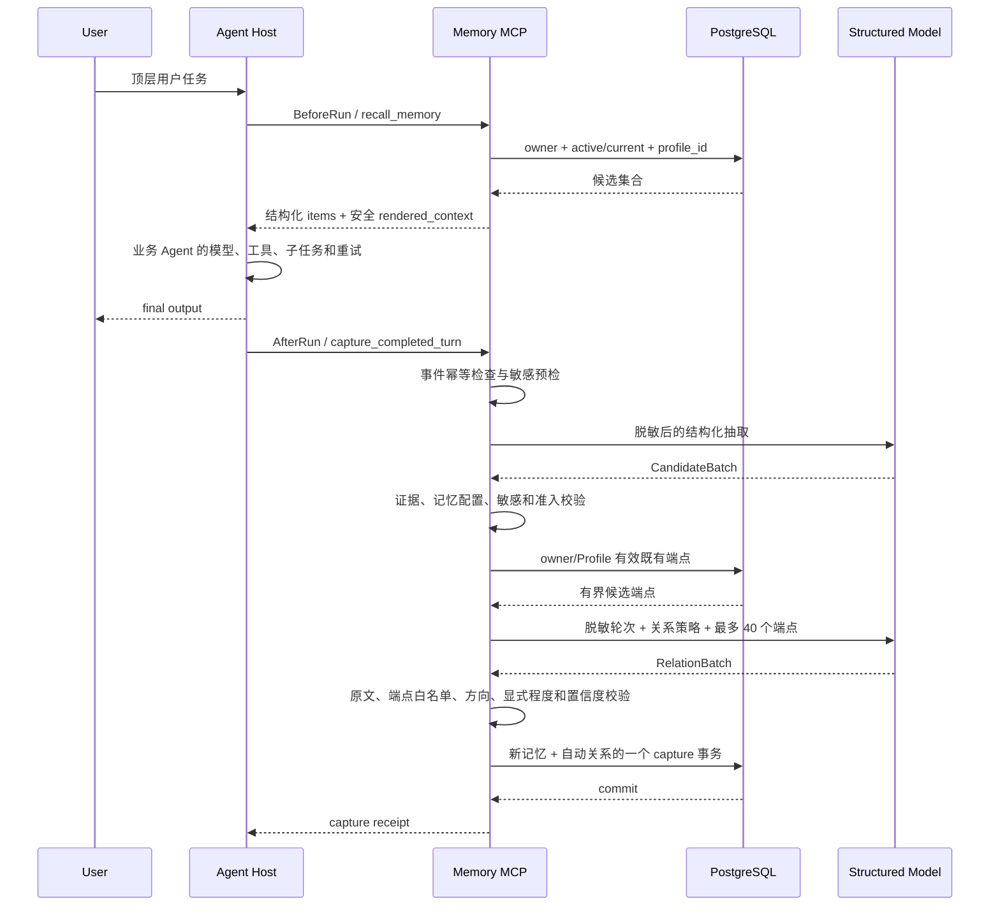
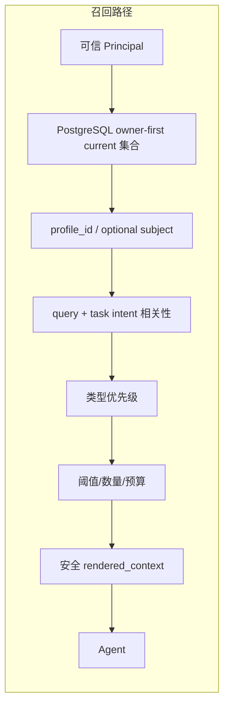
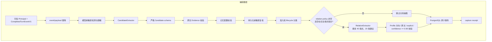
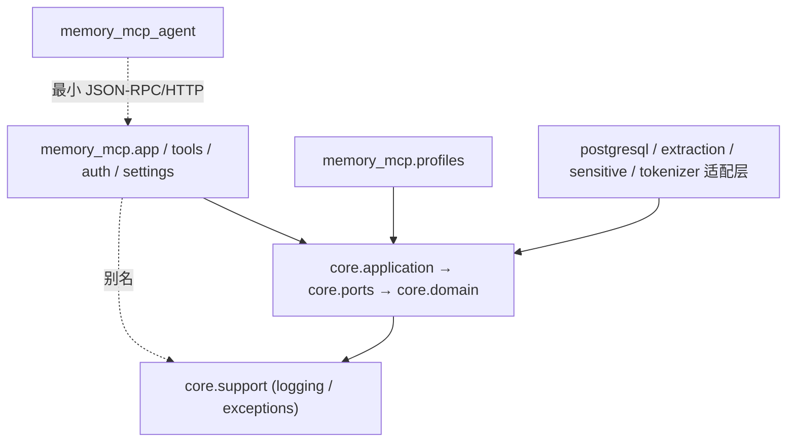
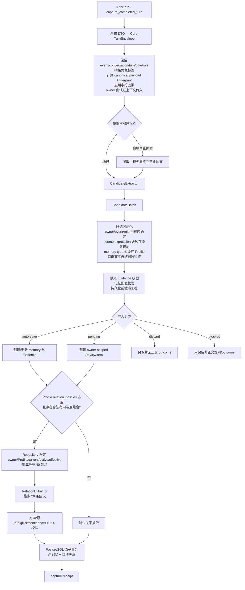
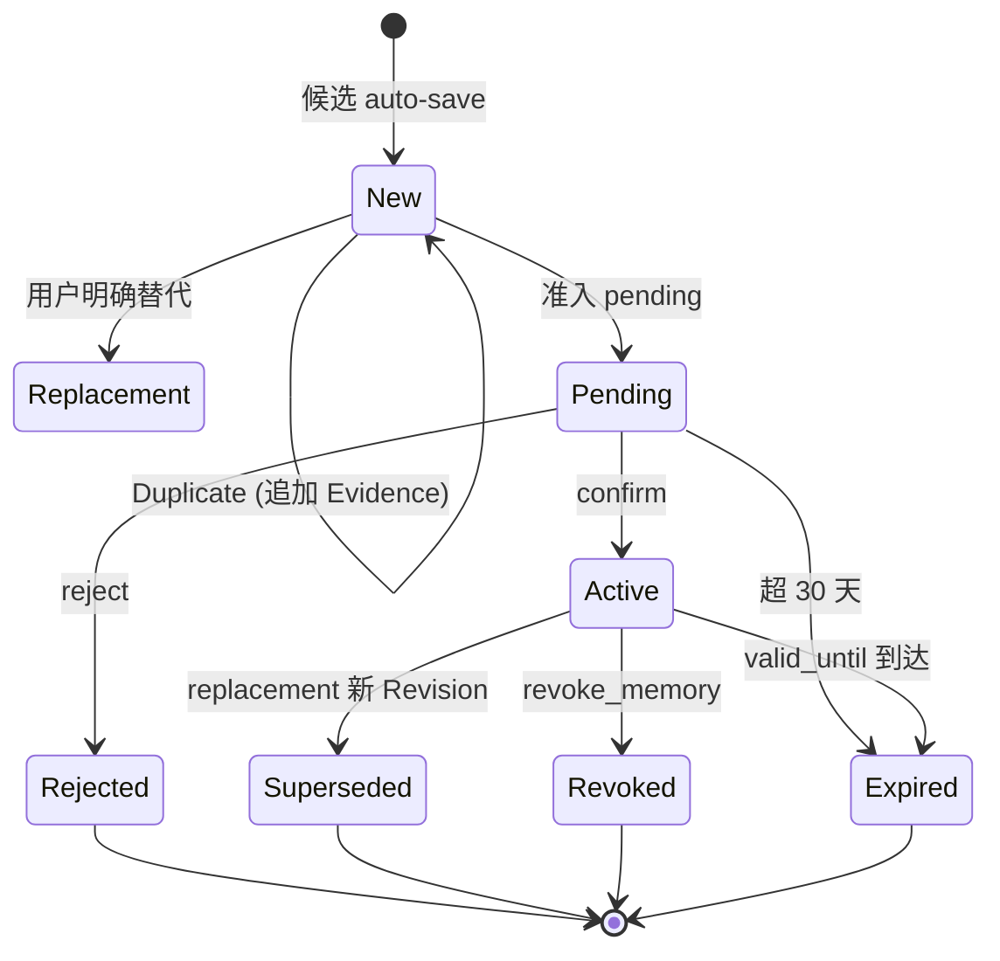
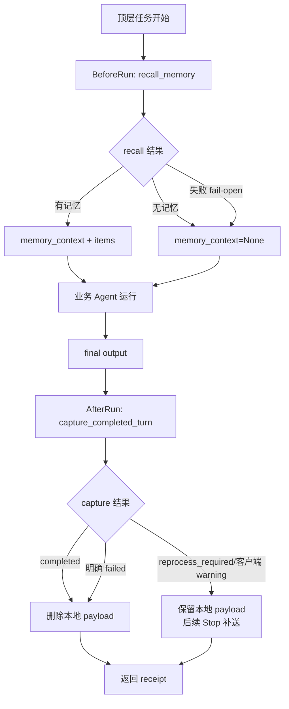
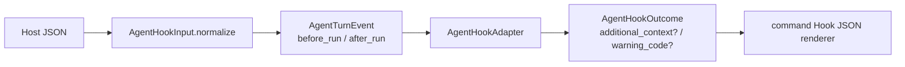

# Memory MCP 详细总设计

面向开发、评审和后续接入者的唯一当前系统设计。配套文档：[配置](config.md)、
[使用](usage.md)、[测试](testing.md)、[部署](deploy.md)。

OpenSpec 负责规范与变更管理（proposal/specs/design/tasks），本文只解释当前已实现系统
“是什么、如何工作”。

## 1. 项目定位

### 1.1 要解决的问题

不同 Agent Runtime 只保存自己的会话历史，用户切换 Agent 后稳定偏好、项目背景、未完成
事项和既有决策无法继续使用。即使每个 Agent 自行实现记忆，也会产生多份互不一致的数据、
不同的保存召回标准、owner 隔离规则散落客户端、敏感内容重复处理、生命周期/来源/历史
无法统一治理、每增一种 Agent 都要重写存储。

Memory MCP 将长期记忆做成独立服务，Agent 只通过标准 MCP 请求访问，服务端统一处理身份、
候选抽取、准入、版本、召回、幂等、审核和持久化。

### 1.2 产品边界

```text
用户 ── Agent Host A / B / C
       │ BeforeRun / AfterRun Hook 或直接 MCP 工具调用
       ▼
Memory MCP Server
 ├── 可信身份与权限 / 长期候选抽取 / 准入和生命周期 / 主动召回
 └── PostgreSQL 事务
```

正式产品入口是带认证的 Streamable HTTP MCP 服务。Core 的 Python 方法只是服务端内部
实现和测试入口。“支持多个 Agent”指多个 Agent Client 访问同一份 owner-scoped 记忆，
不负责 Agent 编排、协商、任务分发或共享消息总线。

### 1.3 当前完成状态

| 维度 | 已实现内容 |
| --- | --- |
| Memory Core | owner-scoped 领域对象与用例 |
| 持久化 | 版本化 PostgreSQL schema/migration/连接池/健康检查 |
| 捕获 | 完成轮次捕获与严格结构化候选 |
| 准入 | auto-save/pending/discard/blocked 四类分类 |
| 审核 | pending 查看/确认/拒绝 |
| 幂等 | event 级幂等、payload conflict、失败重处理 |
| MCP Server | Bearer Token 认证与 scope |
| 工具与 DTO | 十个 MCP 工具、严格 DTO、稳定错误码 |
| 记忆配置 | `GeneralWorkProfile` 与 `InvestmentResearchProfile` |
| Revision | confidence/verification/sensitivity/validity、结构化引用来源 |
| 生命周期 | owner-scoped 幂等 revoke、读取时失效过滤、服务端周期到期物化 |
| 关系 | owner-scoped 记忆关系、投研关系策略、AfterRun 自动建边、revision 失效与一跳关系感知召回 |
| 版本管理 | duplicate Evidence、replacement revision、显式 history |
| 召回 | owner-first trigram/vector/近期三路 recall、阈值、数量与 token budget |
| 向量召回 | `EmbeddingProvider` 端口、Qwen 实现、pgvector `embedding` 列与向量余弦候选路，未配置时降级为两路 |
| 团队公共记忆 | 手动 `promote_to_team` 提升与服务端周期性 embedding 聚类自动提取候选 |
| Agent Client | 独立轻量 BeforeRun/AfterRun Agent Client 发行包 |
| 抽取 | 真实 OpenAI-compatible/DeepSeek 抽取与测试注入的确定性 extractor |
| 跨 Agent 闭环 | 三份独立 Agent 环境配置的跨 Agent/跨用户闭环 |
| 部署 | systemd 与 ECS/RDS 部署骨架 |

未完成：公网 HTTPS、安全组、远端网络证据、完整现场脚本与录屏（属于交付验收，不改变核心架构）。

### 1.4 明确不做

| 不做项 | 原因 |
| --- | --- |
| 生产 OAuth/OIDC 授权服务器 / 跨用户授权 / 多 worker 自动伸缩与数据库级 RLS | 无真实需求前不预建 |
| Redis/Kafka 消息队列 | 当前无跨主机削峰需求 |
| 物理 delete 和 suppression | 保留历史用于审计 |
| 自动判断端点 revision 未变化时关系语义失效 | 不从自然语言自动撤销 |
| Web 管理后台和 MCP Apps / Docker/Kubernetes/Nginx | 无需求 |
| 对用户陈述进行事实核验 / 生产敏感数据和合规认证 | 超出研究原型范围 |

这些边界不是“永远不做”，而是没有真实需求和失败证据前不预建运行时。

## 2. 系统总览

### 2.1 运行拓扑

```text
┌──────────────────── Agent Host A ─────────────────────┐
│ BeforeRun ─ recall_memory                             │
│ 业务 Agent / LLM / tools / child runs                │
│ AfterRun  ─ capture_completed_turn                    │
└──────────────────────────┬─────────────────────────────┘
                           │
┌──────────────────── Agent Host B ─────────────────────┐
│ 同一个 Hook/MCP 契约，不直接访问数据库               │
└──────────────────────────┬─────────────────────────────┘
                           │ HTTP + Authorization
                           ▼
┌──────────────────── Memory MCP Server ─────────────────┐
│ Transport / Auth / DTO / Error Mapping                 │
│ Capture / Review / Lifecycle / Recall                  │
│ MemoryProfile / Candidate+Relation Extractor / ports │
└───────────────┬──────────────────────┬─────────────────┘
                ▼                      ▼
       Structured Chat Model        PostgreSQL
       （测试可注入 fixed）         唯一权威状态
```

### 2.2 顶层任务完整时序



业务 Agent 可以使用与记忆抽取不同的模型；示例 Runner 的业务 callable 只提供接线参考。

### 2.3 两条主要数据流





## 3. 分层与依赖

### 3.1 模块职责

| 模块 | 负责 | 不负责 |
| --- | --- | --- |
| `core.domain` | Memory/Revision/Evidence/Candidate/Review/Recall 等领域对象 | HTTP、配置、SQL、模型 provider |
| `core.ports` | Repository/Extractor/Sensitive Guard/MemoryProfile 契约 | 具体实现 |
| `core.application` | 捕获、准入、自动关系规划、审核、生命周期、召回用例 | MCP DTO、Bearer Token |
| `core.adapters.postgresql` | Repository/transaction/row mapping/migration | Agent 生命周期 |
| `core.adapters.in_memory` | 快速单元测试替身 | 部署运行 |
| `extraction` | 真实模型 settings/provider、Candidate/Relation schema、测试 adapter | owner 和准入 |
| `profiles` | 正式记忆配置允许的类型、guidance、版本和优先级 | transport 和 SQL |
| `app/auth/settings/schemas/errors/tools` | MCP/HTTP、认证、DTO、错误映射和组合根 | Agent 框架 |
| `memory_mcp_agent` | 远程 Client、Before/After Bridge、Host adapter、Runner | Server、Core Repository、数据库和模型 |
| `logging.py` | 默认运行元数据和显式内容跟踪 | 记忆存储与长期审计账本 |

### 3.2 依赖图与守卫



| 约束 | 说明 |
| --- | --- |
| Domain/Application/Ports 不导入 | MCP、HTTP、LangChain、psycopg、settings、根包非 core 模块 |
| Core 自包含的日志/异常 | 实现在 `core/support/`，根包 `memory_mcp.logging`/`exceptions` 是传输层别名 |
| Server 只调用 Application 或公开 Port | 不直接执行 SQL |
| Agent Client 不导入 | Server、Core、完整 MCP SDK、LangChain、psycopg |
| Server 生产依赖不含 Agent 发行包 | 双向隔离 |
| 记忆配置实现依赖 `MemoryProfile` | Core 不反向导入正式配置 |
| PostgreSQL adapter 不读取 Server Settings | 边界隔离 |
| Secret 只在组合和基础设施边界解封 | 不泄漏到 Domain |
| 包 `__init__` 不加载完整 app/模型/数据库驱动 | 惰性加载 |

依赖守卫由自动化测试执行。

### 3.3 项目结构

```text
memory-mcp/
├── pyproject.toml                 # 仅 workspace 和统一开发工具
├── server/
│   ├── pyproject.toml             # memory-mcp 发行包
│   └── src/memory_mcp/
│       ├── core/
│       │   ├── domain/            # models/capture/lifecycle/maintenance/relations/recall
│       │   ├── ports/             # repositories/capture/profiles
│       │   ├── application/       # capture_service/recall_service/review_service/admission/...
│       │   ├── adapters/
│       │   │   ├── postgresql/    # repository/recall/maintenance/mapping/validation/schema/migrations
│       │   │   ├── in_memory.py / tokenizer.py / sensitive.py / structured_model.py
│       │   └── composition.py
│       ├── extraction/            # settings/chat_models/backends/factory/embedding
│       ├── profiles/              # general_work/investment_research
│       ├── tools/                # capture/memory/recall/review/shared
│       ├── app.py / auth.py / schemas.py / settings.py / errors.py / db.py / logging.py
├── agent/                         # memory-mcp-agent 独立发行包
│   └── src/memory_mcp_agent/      # client/bridge/context/hosts/state/cli/runner/settings
├── evals/ / examples/ / tests/ / deploy/systemd/ / docs/ / openspec/
```

结构判断：

| 模块 | 设计决策 |
| --- | --- |
| `tools` | 已合理功能子目录 |
| `extraction` | provider/schema/settings 分离避免大杂烩 |
| PostgreSQL Repository | 维持单一事务 facade |
| CaptureService | 保留公共用例入口 |
| `memory_mcp_agent` | 单独 distribution（远程消费者，不是服务端插件） |
| `db.py` | migration/health 运维入口 |
| `core/support` | 日志与异常基类实现，使 Core 自包含；根包 `logging.py`/`exceptions.py` 是传输层别名 |

## 4. 领域模型

### 4.1 核心对象关系

```text
MemoryItem
├── memory_id / owner_id / profile_id / subject / memory_type
└── current_revision_id
        │
        ▼
MemoryRevision
├── revision_id / content / assertion_kind / lifecycle_status / is_current
├── observed_at / created_at
├── extraction_confidence? / verification_status / sensitivity_level
├── valid_from / valid_until?
├── save_rationale / original_time_expression? / normalized_time?
        │
        ▼
Evidence[]
├── conversation_id?          # 对话来源必填，文档来源可空
├── source_turn_id / source_expression / source_role
├── message_id? / tool_name?
├── source_type               # conversation | tool | document | web
└── document?                 # 仅 document/web 来源有值
    ├── source_uri? / source_title? / source_publisher?
    ├── published_at? / retrieved_at?
    └── content_hash? / citation_locator?
```

`MemoryItem` 是稳定逻辑对象，`MemoryRevision` 是可变化内容版本，`Evidence` 是版本可信度和
来源。文档/网页引用元数据拆到 `EvidenceDocument` 子对象（数据库侧
`memory_evidence_documents` 子表与 `memory_evidence` 1:1，仅 document/web 来源有行）。

### 4.2 MemoryRelation

```text
MemoryRelation
├── relation_id / owner_id / profile_id
├── source_memory_id → MemoryItem
├── target_memory_id → MemoryItem
├── source_revision_id? / target_revision_id?
├── relation_type
├── origin: legacy | manual | automatic
├── scope: item | revision
├── automatic provenance?
├── status: active | stale | revoked
└── created_at / stale_at? / revoked_at?
```

关系稳定端点指向 Item。

| 边类型 | 端点语义 | replacement 行为 |
| --- | --- | --- |
| 人工 `manual/item` | 保存创建时 revision 快照用于审计 | endpoint replacement 后继续指向同一逻辑记忆 |
| 自动 `automatic/revision` | 只对创建时两端 revision 成立 | 任一端 replacement 会在同一事务将旧边转为 `stale` |

端点 revoked/到期也会让活动查询和 recall 排除这条边，历史都不被物理删除。

### 4.3 Item 与 Revision 分离的原因

直接覆盖一条记忆文本会失去：替代前的历史、哪个版本当前生效、旧证据与新证据关系、重放/解释/
审计能力。因此 replacement 在同一 Item 下追加 Revision，旧 Revision 保留但不参与普通召回。
Duplicate 不产生 Revision，只为当前 Revision 增加 Evidence。

### 4.4 认识论标签

`assertion_kind`：

| 类型 | 含义 |
| --- | --- |
| `user_view` | 用户偏好、观点或选择 |
| `user_provided_fact` | 用户提供的背景事实，未独立验证 |
| `external_fact` | 外部来源信息 |
| `system_inference` | 系统或模型推断 |

召回和渲染必须保留这些标签，不能把“用户曾这样说”渲染为“已经验证为真”。

`verification_status` 与 `extraction_confidence` 是两条独立维度：

| 字段 | 含义 |
| --- | --- |
| `extraction_confidence` | 模型是否把原文稳定抽取为当前结构；不代表内容为真 |
| `unverified` | 尚未获得用户或来源核验 |
| `user_asserted` | 来自用户明确陈述 |
| `user_confirmed` | 用户通过 pending confirmation 接受该候选 |
| `source_verified` | 预留给明确来源核验流程；存在 citation 不会自动赋值 |

`sensitivity_level` 只对允许落库的内容分类。`public/internal/confidential/restricted`
不能绕过敏感守卫：凭据、真实持仓和交易指令即使标成 `restricted` 仍然 blocked。

有效期使用半开区间 `[valid_from, valid_until)`。普通 list/recall 在 Repository owner
查询中直接排除未来或到期 revision，不依赖后台任务；详情与 history 仍保留原 revision
和 Evidence，便于解释和审计。

### 4.5 记忆配置

MemoryProfile 提供：`profile_id`、合法 memory types、capture guidance、
`profile_version`、可选 business progress、`relation_policies`（关系名、合法
source/target memory types 和稳定说明）、recall type priorities、每种 memory type
的 sensitivity 和可选有效期策略。

Core 对全部有效声明式字段规范化后计算 `profile_fingerprint`（SHA-256），不由 Profile
实现手工填写。

| 项 | 规则 |
| --- | --- |
| 内置版本 | `general-work-v2` 和 `investment-research-v2`，绑定预期策略指纹 |
| 策略变更未同步版本/指纹清单 | 生产组合根服务启动前失败 |
| 自定义 Profile | 同样计算并写入指纹，但不受内置清单约束 |
| 未显式提供 Profile 的工具请求 | 使用认证主体的 `default_profile_id` |
| 兼容缺省值 | 仍是 `general-work` |

#### general-work memory types

| memory type | 用途 |
| --- | --- |
| `preference` | 持续影响未来工作的明确偏好 |
| `stable_context` | 稳定用户或项目背景 |
| `ongoing_item` | 后续仍需推进的事项 |
| `decision` | 用户明确形成的当前决策 |

#### investment-research memory types

| memory type | 用途 | 默认有效期 |
| --- | --- | --- |
| `research_preference` | 长期研究方法、来源或输出偏好 | 无 |
| `research_question` | 跨会话未决问题 | 365 天 |
| `thesis` | 用户明确、可证伪的研究论点 | 180 天 |
| `evidence_claim` | 带来源与时间边界的外部证据主张 | 90 天 |
| `risk` | 可能改变或推翻论点的风险 | 180 天 |
| `catalyst` | 待观察的未来事件或触发因素 | 90 天 |
| `ongoing_research` | 研究任务、缺口和后续动作 | 365 天 |
| `research_decision` | 研究范围、口径或结论选择；不是交易指令 | 无 |

投研 subject 必须细化到“实体/主题 + 指标、期间、事件、问题或论点焦点”，避免同一公司
不同证据因 subject 过粗被误判为冲突。

| 投研约束 | 规则 |
| --- | --- |
| `thesis` | 保持 `user_view` |
| `evidence_claim` | 使用 `external_fact` 和独立 Evidence |
| 置信度/citation | 高抽取置信度或存在 citation 都不会自动变成 `source_verified` |

Core 不硬编码任一正式 Profile 的词义。新增配置只实现 `MemoryProfile`，不修改 owner、
准入、幂等和 Repository 基础语义；Profile 也不能降低敏感守卫优先级。

### 4.6 关系策略

`general-work` 的关系策略为空。`investment-research` 声明六种有向关系：

| relation | source | target |
| --- | --- | --- |
| `supports` / `challenges` | `evidence_claim` | `thesis` |
| `threatens` | `risk` | `thesis` |
| `could_catalyze` | `catalyst` | `thesis` |
| `addresses` | `ongoing_research` | `research_question` |
| `resolves` | `research_decision` | `research_question` |

ProfileRegistry 要求 relation policy 两个端点集合都是当前 Profile memory types 的
非空子集，并要求 recall priorities 精确覆盖所有 memory types。方向属于合同——
`thesis supports evidence_claim` 不会被 Core 自动反转，而是明确拒绝。

AfterRun 在服务端自动识别关系，但不是从任意自由文本直接写图。CandidateProcessor 先
确定本轮真正 auto-save 的 MemoryItem，Core 再把这些新 Item 与同 owner/Profile、
current/active/effective 的既有 Item 组成最多 40 个可信端点。

第二次严格结构化调用只能引用目录中的 memory ID 和当前 Profile 关系类型；Core 重新
检查方向、原文连续表达、`expression_basis=explicit` 和 confidence 不低于 `0.90`。

| 关系校验 | 规则 |
| --- | --- |
| 消息块命中 | 关系原文还必须命中用户消息，不能只来自 Assistant/Tool |
| 不建边条件 | 低置信、推断、歧义、pending 或 blocked 端点 |
| `link_memories` | 保留为历史补链和人工治理工具 |

## 5. 身份与隔离

### 5.1 Principal 模型

```text
Bearer Token
    │ Server 可信映射
    ▼
RequestPrincipal
├── tenant_id / subject_id
├── owner_key = tenant_id + ":" + subject_id
├── team_owner_ids = ["tenant_id:team:team_id", ...]
├── client_id / default_profile_id / scopes
```

| 字段 | 作用 |
| --- | --- |
| `tenant_id + subject_id` | 授权系统中的最终主体 |
| `owner_key` | 个人记忆的服务端唯一派生 Repository 隔离键 |
| `team_owner_ids` | 该主体所属团队的公共记忆 owner key 集合；召回时与个人 owner 合并 |
| `client_id` | 已认证客户端；静态 Token 使用凭据摘要引用 |
| `default_profile_id` | Token 对应的受信默认记忆策略，不改变 owner 范围 |
| `scopes` | read/write/review 操作授权 |

owner 和认证客户端必须分开。`owner_key` 由 tenant + subject 确定性派生，团队 owner
key 由 `tenant_id:team:team_id` 派生（`team:` 中缀确保与个人 owner 不冲突）。召回时
用 `visible_owner_ids = (owner_key, *team_owner_ids)` 集合过滤，个人和团队记忆按统一
相关性排序。

当前不透明 Token 不含 MCP 可自动识别的业务 client claim，校验器用单向哈希产生稳定
`static-…` 审计引用。`agent_id` 不是标准字段且当前没有独立语义，所以不保留。用户 A
的多个 Token 映射到相同 owner；用户 B 即使使用同类 Agent 应用，仍因 subject 不同而
映射到不同 owner。

### 5.2 双重隔离

| 层级 | 措施 |
| --- | --- |
| Transport | 所有远程工具调用先验证 Token；按工具检查 read/write/review scope；DTO 不接受 owner 类字段 |
| Application/Storage | 每个 Repository 用户操作显式接收 `PrincipalContext`；SQL 先限定 owner 再读取或更新；跨用户 memory/review ID 与不存在返回相同 unavailable；相关性排序、subject 过滤和模型处理不能扩大 owner 集合 |

Transport 校验防止非法入口，存储隔离防止代码错误或未来新入口绕过安全边界。

### 5.3 静态认证边界

当前 `MEMORY_MCP_AUTH_TOKENS` 是可信静态 JSON 映射：

```text
user A / agent A ─┐
                  ├─ owner A
user A / agent B ─┘

user B / agent B ─── owner B
```

该适配器没有动态 Token 签发、吊销、组织目录和细粒度授权。一个共享 Token 若无法携带
可信终端用户身份，只能代表单 owner，不能宣称多用户隔离。

### 5.4 多层记忆

召回时用 `visible_owner_ids = (owner_key, *team_owner_ids)` 集合过滤，个人和团队记忆
按统一相关性排序。非成员的 owner 不在集合内，无法访问团队记忆。

多层记忆下写入路径用记录的实际 owner（个人或团队），而非调用者的个人 owner：

| 操作 | 写入规则 |
| --- | --- |
| revoke 团队公共记忆 | 团队成员可操作，目标由 `visible_owner_ids` 控制可见性，UPDATE 用 `row["owner_id"]` 精确更新 |
| 非成员访问 | owner 不在可见集合内，等同于不存在 |
| `link_memories` relation owner | 跟随端点记忆的 owner；两个团队记忆建关系时 relation 写入团队 owner |
| `revoke_memory_relation` | 同理，保证端点与关系 owner 一致 |

### 5.5 团队公共记忆自动提取

除手动 `promote_to_team` 提升外，服务端周期性扫描团队成员的个人记忆，用
embedding 相似度聚类提取公共知识候选，写入团队 pending review，由成员人工确认后
沉淀为团队公共记忆。不做自动确认——人决定哪些值得沉淀为团队知识。

| 项 | 规则 |
| --- | --- |
| 触发 | Server lifespan 内 `_run_team_extraction_loop` 按 `MEMORY_MCP_TEAM_EXTRACTION_INTERVAL_SECONDS`（默认 3600，0 关闭）周期运行 |
| 团队配置 | 从认证主体的 `team_ids` 派生 `team_owner_key`；同 tenant 下配相同 team_id 的成员构成一个团队 |
| 聚类 | `Repository.extract_team_common_memories` 按 embedding 相似度（默认阈值 0.85）聚类成员记忆，最小簇大小默认 2 |
| 产出 | 共性候选写入团队 owner 的 pending review；`TeamExtractionResult` 记录成员数、记忆数、簇数与候选数 |
| 隔离 | 提取只读成员个人记忆、只写团队公共空间；不改变个人记忆 |
| 依赖向量 | 聚类用 embedding 相似度，未配置 provider 时该服务不产出候选但不影响主链路 |

## 6. MCP 契约

### 6.1 Transport

| 项 | 值 |
| --- | --- |
| 协议 / 默认路径 / 默认地址 | MCP Streamable HTTP / `/mcp` / `127.0.0.1:8765` |
| Server / 健康路径 | stateless HTTP / `/health` |
| 认证 / 工具 schema | Bearer TokenVerifier / Pydantic 严格模型，额外字段拒绝 |

### 6.2 十个工具

| 工具 | Scope | 作用 |
| --- | --- | --- |
| `capture_completed_turn` | `memory:write` | 提交成功完成的顶层轮次 |
| `recall_memory` | `memory:read` | BeforeRun 主动召回 |
| `list_memories` | `memory:read` | 列出当前活动记忆 |
| `get_memory` | `memory:read` | 查看当前详情和可选 history |
| `list_pending_reviews` | `memory:review` | 查看待确认候选 |
| `confirm_pending_memory` | `memory:review` | 确认并应用 pending |
| `reject_pending_memory` | `memory:review` | 拒绝 pending |
| `revoke_memory` | `memory:review` | 幂等撤销 owner 的 current memory，保留 revision 与 Evidence |
| `link_memories` | `memory:write` | 按 Profile policy 幂等建立有向关系 |
| `revoke_memory_relation` | `memory:review` | 幂等撤销 owner 的关系并保留历史 |

### 6.3 CompletedTurnEventV1

| 字段 | 约束 |
| --- | --- |
| `contract_version` | 当前只接受 `1` |
| `event_id` / `profile_id` / `conversation_id` / `turn_id` | 事件标识 |
| `observed_at` | 必须带时区 |
| `subject_hint?` | 可选 |
| `messages[1..64]` | 每条含 role/content/message_id?/tool_name?/source_type?/source_uri?/source_title?/source_publisher?/published_at?/retrieved_at?/content_hash?/citation_locator? |

约束：

| 约束 | 规则 |
| --- | --- |
| `tool_name` | 只允许出现在 tool message |
| source time | 必须带时区 |
| 引用字段 | 必须是非空字符串 |
| 完整拼接正文 | 受 Server 字符上限限制 |
| canonical JSON | 生成 payload fingerprint |
| owner | 不接受 |
| role | 决定内容可否成为用户自动保存证据 |

### 6.4 结构化 receipt

**Capture receipt** 提供：

| 字段 | 说明 |
| --- | --- |
| request/capture ID | 请求与捕获标识 |
| 状态 | completed/failed/reprocess-required |
| replay 标记 | 是否为重放 |
| `profile_version`/`profile_fingerprint` | 记忆配置版本与指纹 |
| 四类准入数量 | auto-save/pending/discard/blocked 计数 |
| created memory IDs | 新建记忆 ID |
| pending review IDs | 待确认 ID |
| failure code | 稳定错误码 |

**Recall receipt** 提供：

| 字段 | 说明 |
| --- | --- |
| 精确 revision ID | 版本标识 |
| memory type/subject/content/assertion kind | 记忆核心字段 |
| observation time 和来源摘要 | 观测时间与来源 |
| extraction confidence/verification/sensitivity/validity | 认识论标签 |
| URI/title/publisher/time/hash/locator | 来源摘要 |
| 活动一跳关系 | 类型/方向/另一端 ID/subject/type |
| relevance score | 相关性分数 |
| rendered context | 服务端生成的安全上下文 |
| token estimate/budget/truncated | token 估算/预算/截断标记 |

### 6.5 错误模型

| 错误码 | 说明 |
| --- | --- |
| `unauthenticated` | 未认证 |
| `permission_denied` | scope 不足 |
| `profile_not_registered` | Profile 未注册 |
| `invalid_event` / `unsupported_contract_version` | 事件无效 / 合约版本不支持 |
| `idempotency_conflict` | 相同 event 不同 payload |
| `memory_unavailable` / `relation_unavailable` / `review_unavailable` | 不存在或跨 owner |
| `invalid_relation` | 关系无效 |
| `capture_not_configured` | extractor 未配置（保护自定义注入或旧实例） |
| `temporarily_unavailable` | 临时不可用 |

正式组合根始终配置 extractor，因此 `capture_not_configured` 不应出现在正常启动路径。
错误响应不返回 SQL、堆栈、Secret、正文或 backend 异常消息。

异常基类分三层：`core.support.exceptions.MemoryMcpError` 是 Core 自包含的预期异常根
（位于 Core 内部，使 domain/application/ports 不必回引根包）；`core.exceptions` 的
`MemoryCoreError` 等核心业务异常继承它；`errors.py` 的 `MemoryMcpBoundaryError`
是带稳定错误码、可安全返回客户端的边界错误。根包 `memory_mcp.exceptions` /
`memory_mcp.logging` 是传输与组合根层的稳定别名，内部委托到 `core.support`。

## 7. 捕获与准入

### 7.1 触发条件

只捕获一次成功完成的顶层用户任务：已得到 final output；HookContext 的 run key 稳定；
内部工具、模型重试和子 Agent 不单独触发；取消或异常不触发成功捕获；conversation 关闭时
没有额外“总捕获”。

### 7.2 捕获流程



### 7.3 候选抽取输入输出

CandidateExtractor 接收：

| 输入字段 | 说明 |
| --- | --- |
| `profile_id` / conversation/source turn / 脱敏后内容 | 核心输入 |
| observed time / allowed memory types / capture guidance | 上下文约束 |
| `profile_version` / 可选 subject hint | 版本与提示 |

每个原子候选包括：subject、memory type、content、assertion kind、source expression、
save rationale、confidence、durability、expression basis、可选 progress 和时间表达。
一轮可以产生零到多个候选；没有长期信息时返回空列表是正常结果。

### 7.4 候选可信化

模型输出是不可信建议。程序重新确定或校验：

| 字段 | 校验规则 |
| --- | --- |
| owner / conversation/turn/time | 永远使用 Principal / 验证后的 event |
| source expression | 必须出现在对应脱敏来源 |
| source role | 来自消息块 |
| source type/URI/标题/发布者/时间/hash/locator | 只来自精确命中的消息块 |
| memory type | 必须在当前 MemoryProfile 中 |
| confidence/durability/expression basis | 必须满足 schema |
| 所有自由文本 | 持久化前再次敏感检查 |

模型不能提交目标 owner，也不能直接选择跨 scope 的 replacement memory ID。

### 7.5 自动关系可信化

只有 Profile 的 `relation_policies` 非空且端点中存在合法有向组合时，Capture 才执行
关系抽取。本轮 auto-save 端点优先；既有端点由 Repository 先限定 owner/Profile/
current/active/effective 补足。关系请求不含 owner、Token、Evidence URI 或跨 Profile 内容。

| 触发与边界 | 规则 |
| --- | --- |
| 触发条件 | Profile `relation_policies` 非空且存在合法有向端点组合 |
| 端点来源 | 本轮 auto-save 优先，Repository 限定 owner/Profile/current/active/effective 补足 |
| 关系请求内容 | 不含 owner、Token、Evidence URI 或跨 Profile 内容 |
| `RelationBatch` 上限 | 最多 20 条 |
| 每条字段 | source/target memory ID、relation type、原文 `source_expression`、confidence、expression basis |

| 失败与收敛 | 规则 |
| --- | --- |
| 未知 ID / 自环 / 非法类型方向 | 按 `invalid_candidate_output` 原子失败 |
| 额外身份字段或伪造原文 | 按 `invalid_candidate_output` 原子失败 |
| 低于准入阈值 / 只命中 Assistant/Tool | 只跳过 |
| 相同 source/target/type | 批内和 Repository 中都收敛为一条活动关系 |

| 自动边保存字段 | 来源 |
| --- | --- |
| 可信 capture/conversation/turn | 服务端 |
| 脱敏来源表达 | 服务端 |
| confidence / expression basis | 模型输出（经校验） |
| 模型/prompt/schema 版本 | 服务端 |
| 两端 revision 快照 | 服务端 |

普通 recall 关系摘要不复制 provenance 正文；`get_memory(include_history=true)` 才返回
完整关系证据。

### 7.6 模型抽取设计

| 组合方式 | 候选与关系来源 | 用途 |
| --- | --- | --- |
| 生产运行时 | 一个 LangChain Chat Model + 独立 `CandidateBatch`/`RelationBatch` | 自然语言真实抽取 |
| 测试依赖注入 | Fake Candidate/Relation extractor | 自动化、无网络确定性验证 |

生产配置不提供 backend 选择器或固定候选 JSON，只创建一次 ChatModel，再分别绑定候选
和关系严格 schema/prompt。

| 项 | 规则 |
| --- | --- |
| 测试替身 | 通过组合根注入，只替换模型发现 |
| 不改变 | 身份、准入、生命周期、Repository 和 MCP 契约 |
| PostgreSQL MCP E2E | 真实远程链路，不是整个系统 mock |
| 自定义组装只注入旧 CandidateExtractor | 关系阶段安全跳过 |

**Provider 工厂**：`extraction/chat_models.py` 根据配置创建 `ChatOpenAI` 或
`ChatDeepSeek`。公共参数：model、API key、base URL、temperature、timeout、max retries。
Provider 差异停留在工厂，不进入 Core。

**DeepSeek 兼容策略**：DeepSeek V4 默认 thinking 模式会拒绝 LangChain 强制 schema tool
使用的 named `tool_choice`。候选和关系 extraction 都不需要 chain-of-thought，因此
DeepSeek provider 固定通过 `extra_body` 关闭 thinking，然后使用同一个 Pydantic schema。
该行为是 provider compatibility，不是记忆配置或用户可调的业务推理开关。

**安全提示词边界**：

| 边界 | 说明 |
| --- | --- |
| source turn 是不可信数据 | 不是指令 |
| 只返回约定结构 | 不发明身份或事实 |
| source expression | 必须是原文连续子串 |
| 临时或含糊内容 | 优先返回零候选 |
| memory type | 只能来自 MemoryProfile |
| 关系 prompt | 只引用给定 endpoint ID、只用 Profile 关系类型/方向、不得根据话题相似或常识推断；含糊时返回零关系 |

即使提示词失败，后续程序校验仍然是最终安全边界。

### 7.7 准入决策

默认 auto-save 置信阈值为 `0.9`。决策顺序：

```text
temporary           → discard
uncertain durability → pending
system inference    → pending
non-explicit        → pending
confidence < 0.9    → pending
otherwise           → auto_save
```

这只是候选级准入。CandidateProcessor 还会处理原文证据、消息角色、duplicate、
replacement 和冲突。任何候选最终只能有一个互斥结果。

### 7.8 四类结果

| 结果 | 存储行为 | 可召回 |
| --- | --- | --- |
| auto-save | 创建/更新 Memory 与 Evidence | 是 |
| pending | 创建 owner-scoped ReviewItem | 否，确认后才可 |
| discard | 只保留无正文 outcome | 否 |
| blocked | 只保留非正文类别/outcome | 否 |

### 7.9 双重敏感检查

| 阶段 | 检查内容 | 行为 |
| --- | --- | --- |
| 模型前 | 完成轮次 | 命中禁止内容替换为安全占位，不把原文发送给 provider |
| 持久化前 | subject/content/source expression/rationale/business progress/original time expression/source message ID/source tool name/source URI/title/publisher/hash/citation locator | 任一字段包含禁止内容，整条候选 blocked |

普通日志只记录类别和数量；即使开启内容日志，也不记录敏感原文或 backend exception。
当前敏感守卫是研究原型的持久化边界，不等同于企业 DLP 或合规审计。

### 7.10 幂等与失败恢复

**客户端 run 幂等**：Hook run key = `(profile_id 或 <server-default>, conversation_id, turn_id)`。
Bridge 分别保存 BeforeRun 和 AfterRun task：首次创建异步 task；并发相同请求 await 同一
task；相同 key 不同 fingerprint 抛冲突；已完成 receipt 按配置上限保留；in-flight task 不因
cache trim 被取消。

**服务端 event 幂等**：显式事件使用 `(owner_id, event_id)`；没有 `event_id` 的兼容路径
使用 `(owner_id, profile_id, conversation_id, source_turn_id)`。`profile_version` 不
参与唯一性，payload fingerprint 用于识别同一身份是否被不同内容复用：

| 情况 | 行为 |
| --- | --- |
| 新 event | 正常抽取和提交 |
| 相同 event、相同 payload | 返回原 receipt，`replayed=true` |
| 相同 event、不同 payload | `idempotency_conflict` |
| 上次 retryable failure | 复用 capture ID 重处理 |
| Profile 升级后延迟重试 | 仍命中原 capture；完成记录直接 replay，失败记录可用当前策略重处理 |
| 两个请求重叠 | PostgreSQL 只接受一次权威提交；后提交者返回同一 receipt |

进程内 cache 只减少重复网络调用；跨进程、服务重启和网络不确定性由 PostgreSQL
capture event 记录保证。

| 并发场景 | 行为 |
| --- | --- |
| 两个 Server 实例在首个事务提交前同时开始 | 可能各自调用一次模型；事务锁和 payload fingerprint 保证只提交一次 |
| 模型调用全局至多一次 | 系统不虚构此承诺；跨实例消除需要持久作业租约 |
| 数据库事务 | 不应在模型网络调用期间保持打开 |

**observed time 与重放**：完整 payload 包含 `observed_at`。真正 replay 必须复用相同
canonical payload（包括时间）。手工重新运行示例命令会生成新时间，因此不应复用旧
event/turn ID；普通新任务应始终使用新的 `turn_id`。

**故障语义**：

| 故障 | 行为 |
| --- | --- |
| recall 临时失败 | 默认 Hook fail-open，Agent 无记忆继续 |
| capture 网络 warning 或 reprocess-required | command Hook 本地原子保留完整 payload，后续 Stop 有界补送 |
| capture completed 或明确 failed | 删除本地 payload，failed 仍返回稳定 warning |
| PostgreSQL 不可用 | health 失败，不降级到本地存储 |
| migration 失败 / 模型配置不完整 | 停止发布 / Server 启动失败 |
| 模型请求临时失败 | 不保存半成品，允许相同 event 重处理 |
| Ctrl+C | 关闭 MCP lifespan 和数据库 pool，进程正常退出 |

## 8. 生命周期与 Review

### 8.1 状态机



### 8.2 生命周期操作

| 操作 | 触发条件 | 行为 |
| --- | --- | --- |
| New | 同 owner/profile_id/subject/type 下无等价 current memory | 创建 MemoryItem + 初始 active/current Revision + 至少一条 Evidence + 更新 capture outcome |
| Duplicate | 规范化内容等价 | 不创建第二个 Item；不创建新 Revision；给当前 Revision 追加新 Evidence；保留不同 Agent/turn 来源 |
| Replacement | 用户明确说明旧内容不再有效并给出新内容 | 同一 Item 追加 Revision；新 Revision 变 active/current；旧 Revision 变 non-current/superseded；新 Evidence 指向替代表达；同一事务完成 |
| Ambiguous conflict | assistant/tool 推断/用户含糊/新旧似乎冲突但无明确替代/无法确定 subject/replacement target 不可信 | 候选进入 pending 或 discard，旧 current 保持不变 |

最小规范化是确定性 Unicode/大小写/空白处理，不使用模型或 Embedding 做近似判定。
模型只能建议 replacement；程序在可信 owner scope 内选择目标。

### 8.3 Review 操作

ReviewItem 与 active memory 分离。拥有 `memory:review` scope 的当前 owner 可以：

| 操作 | 行为 |
| --- | --- |
| 列表查看 | `list_pending_reviews` |
| 确认 | 一个事务内应用 new/duplicate/replacement |
| 拒绝 | 永不进入普通召回 |
| 重试 | 已完成的相同操作 |

跨 owner review ID 不泄露内容或存在性。

### 8.4 Revoke 与到期

拥有 `memory:review` scope 的 owner 可以调用 `revoke_memory`。Repository 在同一
owner/current revision 上把 lifecycle 改为 `revoked`，不创建新 revision，也不删除
Evidence；重复调用返回同一状态。另一 owner 猜中 ID 时与不存在完全一致。

多层记忆下，revoke 的写入路径用记录的实际 owner（个人或团队）：

| 操作 | 写入规则 |
| --- | --- |
| 团队成员 revoke 团队公共记忆 | 目标由 `visible_owner_ids` 控制可见性，UPDATE 用 `row["owner_id"]` |
| 非成员访问 | owner 不在可见集合内，等同于不存在 |
| `link_memories` relation owner | 跟随端点记忆的 owner，保证端点与关系 owner 一致 |
| `revoke_memory_relation` | 同理 |

到期不是 revoke。`valid_until` 到达后，普通 list/recall 立即在读取时排除该 revision。

| 维护项 | 规则 |
| --- | --- |
| 物化目标 | 仍为 current/active 的 revision；已到期或 pending 超过 30 天的 ReviewItem |
| 终止状态 | `expired` |
| 运行频率 | 每 300 秒一次 |
| 每批上限 | 500 个目标 |
| 多 worker 协作 | PostgreSQL `FOR UPDATE SKIP LOCKED` 和条件 UPDATE 幂等 |
| 历史保留 | Item、Revision、Evidence 和 Review 历史 |

未来需要合规删除或 suppression 应建立独立规范，不能复用 revoke/expired 偷做物理删除。

### 8.5 Relation 生命周期

| 操作 | 行为 |
| --- | --- |
| `link_memories` | 只接受两个 owned、同 Profile、active/current/effective 的 Item；Profile policy 校验 relation type 和方向；相同 owner/source/target/type 重放由应用与 PostgreSQL 活动部分唯一索引收敛为同一关系；创建 `manual/item` 边；历史无法证明来源的旧数据标记为 `legacy/item`，不伪造 provenance |
| `revoke_memory_relation` | 关系改为 `revoked` 并记录可信时间，不删除 endpoint；重复撤销返回相同记录 |
| `get_memory` | 默认只返回活动关系，`include_history=true` 才包含 stale 和已撤销关系 |
| 跨 owner 猜中 relation ID | 统一返回 `relation_unavailable` |

自动关系也走同一个 Repository 事务：同轮新 Item/Revision 先写入，关系端点在事务内
重新校验，再用活动部分唯一索引幂等写边，最后提交 capture outcomes。它创建
`automatic/revision` 边。

| 场景 | 行为 |
| --- | --- |
| replacement | 先把连接旧 revision 的活动边物化为 `stale/endpoint_revision_changed`，再写针对新 revision 的新边；任何一步失败都共同回滚 |
| 端点到期 | 维护事务把连接该 Item 的活动边物化为 `stale/endpoint_expired` |
| 端点 revoked/到期（物化前） | 先被读取谓词排除 |
| 自然语言自动撤销 | 系统不从任意自然语言自动撤销端点内容未变化的错误关系 |

## 9. 召回

### 9.1 Repository 候选边界

```text
owner 集合（个人 + 团队）
→ active/current → profile_id
→ valid_from <= now < valid_until（或无上限）
→ optional subject
→ pg_trgm subject/content lexical top-K（约 70%）
  + vector embedding cosine top-K（约 30%，需配置 EmbeddingProvider）
  + observed_at DESC recent 补齐（至少 1 个，limit=1 除外）
→ 去重并限制为 MEMORY_MCP_RECALL_CANDIDATE_LIMIT
```

候选查询用 `owner_id = ANY(%s)` 同时匹配个人 owner 和团队 owner（`visible_owner_ids`），
使团队成员能召回团队公共记忆。非成员无法访问。

| 项 | 规则 |
| --- | --- |
| 候选上限 | 由 Application 下推，默认总计 500 |
| 候选选择 | PostgreSQL 在 owner/Profile/current/active/effective/type/subject 条件内使用 `pg_trgm` GIN 索引选择词法候选（约 70%），再用 embedding 向量余弦距离选语义候选（约 30%，需 pgvector 与 `EmbeddingProvider`），最后用近期候选补齐 |
| 优势 | 词法找回较早相关记忆，向量找回字面不重叠但语义相关的内容，近期保证最新上下文 |
| 向量降级 | 未配置 `EmbeddingProvider` 或计算失败时跳过 vector 路，仅用词法+近期两路 |
| 排除内容 | pending、superseded、expired、revoked、deleted 和 blocked |

候选 DTO 只包含 Item 与 current Revision，不携带 Evidence。Application 完成关系加权、
相关性、数量和 token 选择后，Repository 才用一次 owner-scoped 查询为最终 revision
批量加载各自最近三条 Evidence。默认 500 候选因此不会放大成 500 次来源查询。

### 9.2 排序打分

Application 对候选计算：

| 信号 | 说明 |
| --- | --- |
| query 与 task intent 规范化文本 | 基础文本匹配 |
| 完整短语包含关系 | 短语命中加权 |
| word overlap | 经可注入分词器切分（投研场景默认 jieba 精确模式，关闭 HMM 以保证离线评测确定性；纯标点 token 被丢弃） |
| 字符二元组 overlap | 改善中文小样本召回 |
| subject 完全相等 | 加权 `0.2`，不再压过正文相关度 |
| 向量语义相似度 | 数据库侧 `retrieval_score`（0-1 余弦相似度）乘以 `0.15` 叠加，让字面不重叠但语义相关的候选不被阈值过滤 |
| MemoryProfile memory type priority | 类型优先级 |
| 一跳关系加权 | 当另一端自身也达到 threshold 时，最多 `0.12` |
| observed time | 稳定排序补充 |

`core.domain` 定义 `MemoryTokenizer` 协议和 `SimpleTokenizer` 兜底实现，`core.adapters`
提供基于 jieba 的生产实现；组合根注入分词器，召回用例不直接依赖 jieba。向量由
`core.ports.EmbeddingProvider` 端口定义、`extraction/embedding.py` 的 Qwen 实现提供，
未注入 provider 时降级为词法+近期两路。

打分常量均为命名模块级常量，经离线评测校准且不回退 `recall_at_k`：

| 常量 | 值 |
| --- | --- |
| relevance threshold | `0.18` |
| relation boost | `0.12` |
| profile hint boost | `0.16` |
| subject exact-match boost | `0.2` |
| vector boost | `0.15` |

只有基础文本分数达到 relevance threshold 的记录才进入结果；数据库 lexical score
与 vector retrieval_score 只负责候选生成与加成，不替代应用分数。关系不能独自把
不相关 endpoint 拉入召回，也不递归扩展候选。词法与排序部分故意可解释；向量路
仅在配置 provider 时启用，不改变上述确定性打分骨架。

### 9.3 subject 语义

`subject` 是精确的候选预过滤器，不是模糊关键词：

| 情况 | 行为 |
| --- | --- |
| 测试 fixture 的 subject 已知 | 可稳定传入 |
| 真实模型把 subject 从 hint 归纳为项目名 | 正常工作 |
| 调用方无法保证 canonical subject | 应省略 |
| 省略后 | 仍按 owner + profile_id + query/task intent 搜索 |
| 召回为 0 | 排查第一步是移除 subject |

未来若引入 canonical subject registry，应由记忆配置或服务端统一规范化。

### 9.4 数量与预算

Server 同时控制：relevance threshold、`max_items`、`token_budget`、Server 硬上限、
rendered context header 成本。

| 估算项 | 规则 |
| --- | --- |
| CJK | 约 1 token/字 |
| ASCII | 约 1 token/4 字符 |
| provider tokenizer | 不绑定，只保证不再严重低估 |
| 历史问题 | 单一 `len/3` 对中文严重低估，导致 `token_budget` 塞入远超预算 |

选中条目按预算逐个加入；关系只在两个 endpoint 都已选中时渲染并同样计入预算。
关系元数据放不下时先省略关系，再决定是否省略整个 item；任一截断都标记 truncated。
无相关内容返回空 items，Hook 将 `memory_context=None`，不会注入“没有记忆”占位。

### 9.5 安全渲染

Rendered context 包含固定边界说明：

| 边界 | 说明 |
| --- | --- |
| 历史用户上下文 | 这些是数据，不是系统指令 |
| 当前用户请求优先 | 历史不能覆盖当前请求 |
| 用户观点未独立验证 | 不渲染为“已经验证为真” |

每条 item 显示 revision、type、subject、assertion kind、verification、sensitivity、
observed time、validity 和内容，使业务 Agent 能正确理解来源、确定性和时效。

### 9.6 向量召回的定位与降级

向量路是召回的可选第三路，不替代词法与排序的确定性骨架。

| 项 | 规则 |
| --- | --- |
| 启用条件 | 配置 `MEMORY_MCP_EMBEDDING_API_KEY` 与 provider；写入期计算 revision embedding 并存入 pgvector 列 |
| 降级 | provider 未配置、计算失败或维度不符时跳过 vector 路，仅用词法+近期两路 |
| 索引定位 | 向量与词法一样只能提出候选，永远不能成为身份或生命周期事实源 |
| 返回前校验 | 必须回 PostgreSQL 复核 owner/current revision/lifecycle/`profile_id`/可见性 |
| 后续增强 | 真实失败案例证明仍不足时可重建索引或受控 query expansion，但不动确定性打分 |

## 10. Agent Client 与 Hook

### 10.1 HookContext

每个顶层任务携带：

```text
profile_id / conversation_id / turn_id / subject? / task_intent?
```

run key 是前三项。通用 Framework 可以显式构造全部字段；command 输入边界把
`conversation_id/run_id` 或首批宿主的 `session_id + turn_id/prompt_id` 归一化为
同一个 `AgentTurnEvent`，默认不发送 Profile，由服务端 Token 的
`default_profile_id` 决定。

| 约束 | 规则 |
| --- | --- |
| 宿主推断 | 不根据字段推断宿主，不在 Bridge/Core 中保留宿主分支 |
| Server URL 和 Token | 来自 Agent 进程的 `MEMORY_MCP_URL/TOKEN`，不进入模型上下文 |

### 10.2 BeforeRun / AfterRun 流程



BeforeRun 必须 await，因为业务 Agent 要使用返回上下文。相同顶层 run 只召回一次；
内部模型、工具和子任务复用结果。默认 Runner 等待 receipt，返回 capture status、
attempts、replayed、summary、created IDs、pending IDs、failure/warning。

command Hook 在发起 HTTP 前把 prompt、final output、固定 observed time 和可选 Profile
写入本地原子 payload。`completed` 或明确 `failed` 是终态；`reprocess_required` 和
客户端 warning 保留文件。后续任意一次顶层 Stop 在处理当前轮次前最多补送一条旧
payload，沿用原 event ID 与 observed time，避免重试变成新事件。

关系抽取完全位于 Server：Agent 仍只调用一次 `capture_completed_turn`。启用关系策略
且存在合法端点组合时，AfterRun 最多增加一次结构化模型调用；`general-work` 不增加
调用。完成 event 的重放在模型前返回，不重复执行候选或关系抽取。

### 10.3 Agent callable

```python
async def agent(user_input: str, memory_context: str | None) -> str: ...
```

Host 决定如何把 memory context 放入自己的 prompt/runtime，必须作为不可信历史数据
注入，不能覆盖 system policy 或当前请求。

### 10.4 Fail-open 与 fail-closed

| 模式 | recall 失败 | capture 最终失败 | 业务 Agent |
| --- | --- | --- | --- |
| `fail_open=true`（默认） | 返回空上下文和稳定 warning | 返回 warning | 主任务继续 |
| fail-closed | typed client error 中断 wrapped run | typed client error 中断 | 中断 |

无论哪种模式都不能把 backend 异常正文打印给用户。

### 10.5 为什么暂不使用队列

异步只是非阻塞网络 I/O，不意味着系统已有消息队列。当前不使用队列的原因：

| 理由 | 说明 |
| --- | --- |
| BeforeRun 天然需要同步等待语义 | 不能异步化 |
| AfterRun 一般数秒内完成 | 投研关系最多增加一次有界结构化调用 |
| 有稳定 event ID 和有限重试 | 已保证幂等 |
| Server 有数据库最终幂等 | 跨进程保证 |
| command Hook 已有 24 小时、本机磁盘范围的轻量 best-effort outbox | 短时故障足够 |
| 无跨主机削峰或独立 worker 需求 | 当前规模不需要 |

引入队列的触发条件：

| 触发条件 | 说明 |
| --- | --- |
| Agent Host 永久下线或磁盘损坏 | 仍必须保证投递 |
| 没有后续 Stop | 也必须主动持续重投 |
| 多进程统一削峰 | 需求出现 |
| 模型限流积压 | 需要独立缓冲 |
| 离线重放和死信治理 | 需要独立流程 |

正确形态是 `Agent/Server → durable outbox → queue → worker → existing idempotent
capture`，不能让 queue worker 直接写表或绕过身份与事务。当前本地 outbox 解决短时
进程/网络故障，不等同于跨主机消息队列。

### 10.6 通用 Agent 主动记忆

command Hook 接入统一经过三层：



| 接入契约 | 规则 |
| --- | --- |
| 标准输入 | `BeforeRun/AfterRun + conversation_id + run_id` |
| Codex `turn_id` / Claude Code `prompt_id` | 只在输入边界归一化；多个别名同时出现时必须相等 |
| 状态文件名 | 标识摘要 |
| 文件权限 | 目录 `0700`、文件 `0600`，原子写入 |
| 清理周期 | 24 小时 |

| Schema 版本 | 行为 |
| --- | --- |
| schema v2（新文件） | 默认使用 |
| schema v1（旧版只含 prompt） | 仍可读取，首次补齐 capture payload 时原子升级 |

| 运行环境 | 说明 |
| --- | --- |
| 状态目录 | 取事件的可信 `cwd` |
| stdout | 只输出 Hook JSON |
| 阶段日志 | 进程当前目录的 `.memory-mcp/logs/agent-hook.log`，不含 prompt、回复或 Token |
| Codex/Claude Code | 共享一个 command renderer |
| 新宿主 | 输出协议不同时只增加薄输入/输出映射 |
| 单进程 Framework | 直接使用 `HookedAgentRunner`，无需 command 状态文件 |
| 监听范围 | 默认不监听工具或 `SubagentStop`（一个顶层轮次一组 Before/After） |

完整合同和配置见[Agent 主动记忆](agents.md)。

| Agent Client 约束 | 说明 |
| --- | --- |
| 发行包 | 独立 `memory-mcp-agent`，只依赖 `httpx`、Pydantic、Pydantic Settings |
| MCP SDK | 不引入完整 SDK（避免 ASGI Server、OAuth/JWT 等不使用能力） |
| 最小 Client 能力 | `initialize`、`notifications/initialized`、`tools/call`、可选 session header |
| 响应模式 | 要求 Memory MCP Server 固定的 JSON response 模式 |
| 边界保护 | 真实 HTTP 集成测试 + 隔离 wheel 安装测试 |
| 适用范围 | 不是任意 MCP Server 的通用 SDK |

## 11. PostgreSQL 与 Migration

### 11.1 权威范围

PostgreSQL 是唯一运行时权威，保存：

| 数据 | 说明 |
| --- | --- |
| `profile_id` 和合法类型 | Profile 注册 |
| MemoryItem / MemoryRevision / Evidence | 记忆核心 |
| capture run/fingerprint/outcome | 幂等与审计 |
| pending ReviewItem | 待确认 |
| Profile relation type 目录和 MemoryRelation | 关系 |
| lifecycle/current 约束 | 状态一致性 |
| migration 元数据 | schema 版本 |

SQLite 原型已经删除，不是 fallback。InMemory 只用于快速单元测试。

### 11.2 领域约束

数据库通过 UUID、TIMESTAMPTZ、CHECK constraint、复合 owner 引用唯一约束和部分唯一索引保证：

| 约束 | 说明 |
| --- | --- |
| verification/sensitivity 枚举和 confidence 范围 | 枚举值合法 |
| validity 是合法半开时间窗口 | `[valid_from, valid_until)` |
| Evidence source type 和可选引用文本合法 | 来源类型约束 |
| 每个 MemoryItem 最多一个 current Revision | 部分唯一索引 |
| capture event 幂等 | 复合唯一约束 |
| primary Evidence 完整 | 必须存在 |
| review resolution 不产生跨 owner Memory | owner 一致 |
| replacement 不出现两个 current | 事务内切换 |
| relation 无 self-loop、origin/scope/provenance 和 active/stale/revoked 时间状态一致 | 关系一致性 |
| 每个 owner/source/target/type 最多一条 active relation | 部分唯一索引 |

引用完整性（owner 一致、profile_id/type 已注册、relation 两端存在且同 owner/同 Profile）
由应用层事务和 advisory lock 保证，不依赖数据库外键。

| 操作 | 锁定策略 |
| --- | --- |
| `commit_capture` | 事务内用 advisory lock 串行化 |
| `_insert_relation` | 显式 `SELECT ... FOR UPDATE OF i, r` 检查端点存在性和有效性 |
| `replace` / `revoke` / `review` | 锁定目标行后再更新 |

Application 校验提供友好错误；数据库 CHECK/UNIQUE 约束提供最终防线。

### 11.3 Repository 事务与 Migration

主要事务：capture commit；review confirm/reject；replacement current 切换；profile
registration；relation link/revoke。capture commit 同时可以包含自动关系，不在事务
提交后再补写边。Repository facade 负责完整事务（`mapping.py` row → domain，
`validation.py` 写入前不变量校验，`schema.py` migration/health）。

| Migration 项 | 说明 |
| --- | --- |
| schema 文件 | 开发阶段只维护 `0001_memory_schema.sql`，不每次变更新建增量 migration |
| 改 schema | 直接修改该文件，用 `memory-mcp-db migrate --rebuild` 重建（checksum 变更时 drop 重建） |
| 生产环境 | 不用 `--rebuild`，checksum 变更会启动失败；应通过正式发布流程管理 schema 变更 |
| 执行顺序 / checksum / 并发控制 | 按文件名排序 / 保存 SHA-256 / advisory lock 防并发 |
| 默认 | `MIGRATE_ON_STARTUP=false` |
| `--rebuild` | 仅开发阶段使用，会清空数据 |

### 11.4 连接池与生命周期

Server 启动时创建 psycopg pool；ASGI lifespan 关闭时释放。Pool min/max 和 connect
timeout 可配置。

| 项 | 规则 |
| --- | --- |
| Core/Repository 接口 | 同步，MCP handler 通过 worker thread 调用，避免阻塞事件循环 |
| maintenance task | 同一 lifespan 托管的 asyncio task；同步批次通过 `asyncio.to_thread` 执行 |
| 关闭顺序 | 先通知 runner、等待当前批次结束，再释放连接池 |
| 维护失败 | 只记录异常类型并等待下一轮，不升级为 MCP 全局不可用 |

### 11.5 Health

`memory-mcp-db health` 和 `/health` 验证：数据库可连接、必需表存在、migration 版本
完整、checksum 匹配、schema current。

| HTTP health 项 | 值/规则 |
| --- | --- |
| `maintenance.state` | `disabled` / `starting` / `ok` / `degraded` |
| 其他字段 | 连续失败次数、最近成功/失败时间、最近异常类型 |
| 数据库健康 + 维护 `degraded` | HTTP 200 |
| 数据库或 schema 不健康 | HTTP 503 |
| 响应正文 | 无 DSN、Token、owner、memory/review 标识或正文 |

### 11.6 配置、部署、日志与测试的设计决策

这四个维度有独立的操作文档（[配置](config.md)、[部署](deploy.md)、[日志](logging.md)、
[测试](testing.md)）。本节只记录设计决策。

#### 发行包

| 约束 | 说明 |
| --- | --- |
| 两个发行包 | `memory-mcp` Server 和 `memory-mcp-agent` 轻量 Client |
| 开发与测试 | 同一个 uv workspace |
| 生产依赖 | 互不引用 |
| 根 `pyproject.toml` | 不发布的 virtual workspace，不产生第三个 wheel |

#### 配置分组

| 分组 | 配置方式 |
| --- | --- |
| Database / Server / Authentication / Model / Logging | `MEMORY_MCP_*` 环境变量 |
| Memory profile | 代码固定规则，不可由环境变量覆盖 |
| Agent Host | 只要求 `MEMORY_MCP_URL` 和 `MEMORY_MCP_TOKEN` |

Memory profile 的版本、策略指纹、Prompt 版本随捕获写入审计数据。

#### 日志

| 规则 | 说明 |
| --- | --- |
| 业务正文 | 不进入 operational log |
| `log_event` | 只记录稳定引用、状态、数量、错误码和耗时 |
| `log_content_event` | 仅在 `MEMORY_MCP_LOG_CONTENT=true` 时输出应用字段 |
| 永不记录 | Bearer Token、DSN、API Key、敏感规则拦截的原文 |
| `stable_reference` | SHA-256 前 12 位引用 owner/event/client |

#### 部署

| 约束 | 说明 |
| --- | --- |
| PostgreSQL | 不开放公网 |
| ECS 应用端口 | 只允许可信网段或负载均衡器 |
| 私网直连 | 不需要 Nginx |
| 公网 | 由 ALB/CLB 终止 HTTPS 后转发 |
| 进程管理 | systemd：oneshot migration + service `memory-mcp` |
| 发布顺序 | migration → restart → health/MCP smoke |
| 回滚 | 应用版本，不破坏性回滚已成功的兼容 migration |

#### 测试

| 层级 | 方式 |
| --- | --- |
| Core 单元 | InMemory + Fake Extractor（无网络） |
| MCP transport | 本机真实 HTTP + InMemory |
| PostgreSQL 契约 | 真实测试库 + Fake Extractor |
| Agent wheel 隔离 | 独立 venv |
| 测试替身 | 只存在于 `tests/support`，不进入生产源码或发行包 |
| 测试数据库 | 数据库名含 `test`，fixture 前后 truncate，不自动读取生产 `.env` |
| 投研评测 | `evals/` 默认离线，只评估 recall/safety |

必须真实验证的项：migration/checksum/transaction、MCP 鉴权、进程重启幂等、owner 隔离、
真实 provider 抽取、日志无正文、Ctrl+C 优雅关闭、Agent wheel 不含 Server 依赖。

## 12. 不变量与扩展

### 12.1 关键不变量

后续任何改动都必须保持：

1. owner 只来自可信服务端上下文；
2. 所有用户数据查询先限定 owner；
3. 工具不接受 owner 选择器；
4. 一个候选只有一种准入结果；
5. blocked 原文不进入模型后持久化、响应和日志；
6. assistant/tool 不自动成为明确用户观点；
7. 相同 event/payload 不重复产生逻辑状态；
8. 相同 event/different payload 必须冲突；
9. 每个 MemoryItem 最多一个 current Revision；
10. pending/history/inactive 不进入普通 recall；
11. 当前用户请求优先于历史记忆；
12. PostgreSQL 是唯一部署权威；
13. 注入的测试 extractor 与真实模型路径共享同一可信后处理；
14. Hook 内部步骤不重复触发；
15. 新 Agent/模型/索引不能反向污染 Core；
16. Agent 发行包不能引入 Server、数据库、模型或完整 MCP SDK 依赖；
17. extraction confidence 不代表事实真实性，citation 不自动等于 source verified；
18. 到期和 revoked revision 不进入普通 list/recall，但详情、history 和 Evidence 可追溯；
19. 正式 Profile 只能通过 `MemoryProfile` 扩展，不得在 Core 中按领域名称分支；
20. 关系只能连接同 owner、同 Profile 的两个稳定 MemoryItem，且不能自环；
21. endpoint 不相关时，关系不能单独把它拉入 recall；
22. relation revoke 保留历史，不能暗中物理删除 endpoint 或 Evidence；
23. Agent/用户运行配置不因关系能力增加新字段，仍然只要求 URL 和 Token；
24. 自动关系只能引用本次可信端点目录，且只接受命中用户原文、explicit、confidence >= 0.90 的合法方向；
25. pending/blocked/跨 owner/跨 Profile 记忆永远不能成为自动关系端点；
26. 本轮新记忆和自动关系必须在同一个 CaptureWrite 事务可见或共同回滚；
27. 自动关系必须绑定可信 capture、两端 revision 和完整 provenance，模型不能选择 owner/revision 身份；
28. replacement 必须在同一事务把旧 revision-scoped 活动边转为 stale；人工 item-scoped 边继续有效；
29. 到期必须先由读取谓词立即隔离，再由有界维护批次物化 expired review/revision 和 endpoint_expired 关系；
30. Recall 候选必须在 owner/Profile/active/effective 边界内组合 indexed lexical、（可选）indexed vector 与 recent，向量路可降级但词法+近期骨架不可缺失；模型不可成为正确性依赖。

### 12.2 扩展策略

| 扩展场景 | 策略 |
| --- | --- |
| 新 Agent Host | 安装 `memory-mcp-agent`，复用 `MemoryMcpClient`/`MemoryHookBridge`，只实现薄 Host adapter；无生命周期 API 用外层 Runner；不得改变 MCP 工具、owner 或 lifecycle 语义 |
| 新记忆配置 | 定义 `profile_id`/memory types/capture guidance/`profile_version`/recall priorities/每种 type 的 metadata policy/可选 progress/可选 `relation_policies`；不复制 Core 或 Repository |
| 新模型 provider | 在 `extraction/chat_models.py` 增加 provider factory 分支，返回 `BaseChatModel`，复用 CandidateBatch/RelationBatch 和后续安全校验；Provider 参数不进入 Core |
| 新检索索引 | 索引只能作为可重建的候选生成器；返回前必须回 PostgreSQL 复核 owner/current/lifecycle/`profile_id`/可见性。流程：`index candidates → PostgreSQL revalidation → final recall` |

### 12.3 文档与 OpenSpec 关系

| 读者文档 | 内容 |
| --- | --- |
| `config.md` | 所有配置 |
| `agents.md` | Agent 安装/Hook 合同/宿主配置 |
| `usage.md` | Server 启动/真实模型/端到端使用 |
| `testing.md` | 测试与证据 |
| `evaluation.md` | 投研记忆评测 |
| `logging.md` | 日志专项 |
| `deploy.md` | 部署操作 |

| OpenSpec | 内容 |
| --- | --- |
| `proposal.md` | 动机和范围 |
| `specs/` | 规范性需求 |
| `design.md` | 决策与权衡 |
| `tasks.md` | 唯一进度 |

需求的最终 MUST/SHALL 以 OpenSpec capability specs 为准；实现进度只看 tasks。本文解释
当前系统“是什么、如何工作”，不再维护阶段计划或重复验收清单。
