# Memory MCP 详细总设计

面向开发、评审和后续接入者的**唯一当前系统设计**。配套文档：[配置](config.md)、
[使用](usage.md)、[测试](testing.md)、[部署](deploy.md)、[Agent 接入](agents.md)。

> 本文只描述"已实现系统是什么、如何工作、为什么这样设计"。OpenSpec
> ([../openspec/README.md](../openspec/README.md)) 负责规范与变更管理（为什么变更、
> 规范增量、设计决策、任务证据），不替代本文。每节先给叙事再给契约表，常量与字段名
> 与代码逐字对齐；改代码后必须同步本文对应常量/字段。

## 1. 项目定位

### 1.1 要解决的问题

不同 Agent Runtime 只保存自己的会话历史，用户切换 Agent 后稳定偏好、项目背景、未完成
事项和既有决策无法继续使用。即使每个 Agent 自行实现记忆，也会产生多份互不一致的数据、
不同的保存召回标准、owner 隔离规则散落客户端、敏感内容重复处理、生命周期/来源/历史
无法统一治理、每增一种 Agent 都要重写存储。

Memory MCP 把长期记忆做成独立服务，Agent 只通过标准 MCP 请求访问，服务端统一处理身份、
候选抽取、准入、版本、召回、幂等、审核和持久化。

### 1.2 产品边界

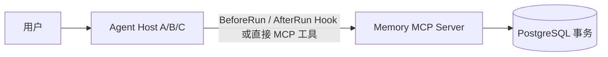

正式产品入口是带认证的 Streamable HTTP MCP 服务。Core 的 Python 方法只是服务端内部
实现和测试入口。"支持多个 Agent"指多个 Agent Client 访问同一份 owner-scoped 记忆，
**不负责** Agent 编排、协商、任务分发或共享消息总线。

**术语**：MCP = Model Context Protocol（Agent 与工具的标准协议）；Agent Host = 运行业务
模型的进程（如 Codex/Claude Code）；BeforeRun/AfterRun = Host 在一轮任务开始前/结束后的
生命周期 Hook；Principal = 已认证的可信用户上下文（含 owner 与 scope）；outbox = Agent
本地持久化、成功后删除、失败重试的 best-effort 投递缓冲；owner = 记忆的存储隔离键，
不是"用户"的别名。

### 1.3 当前完成状态

| 维度 | 已实现 |
| --- | --- |
| Memory Core | owner-scoped 领域对象与用例 |
| 持久化 | 版本化 PostgreSQL schema/migration/连接池/健康检查 |
| 捕获 | 完成轮次捕获与严格结构化候选 |
| 准入 | auto_save/pending/discard/blocked 四类分类 |
| 审核 | pending 查看/确认/拒绝 |
| 幂等 | event 级幂等、payload conflict、失败重处理 |
| MCP Server | Bearer Token 认证与 scope |
| 工具与 DTO | 十个 MCP 工具、严格 DTO、稳定错误码 |
| 记忆配置 | `GeneralWorkProfile`（general-work-v2）与 `InvestmentResearchProfile`（investment-research-v2） |
| Revision | confidence/verification/sensitivity/validity、结构化引用来源 |
| 生命周期 | owner-scoped 幂等 revoke、读取时失效过滤、服务端周期到期物化 |
| 关系 | owner-scoped 记忆关系、投研关系策略、AfterRun 自动建边、revision 失效与一跳关系感知召回 |
| 版本管理 | duplicate Evidence、replacement revision、显式 history |
| 召回 | owner-first trigram/vector/近期三路 recall、阈值、数量与 token budget |
| 向量召回 | `EmbeddingProvider` 端口、Qwen 实现、pgvector `embedding` 列与向量余弦候选路，未配置时降级为两路 |
| 团队公共记忆 | 手动 `promote_to_team` 提升与服务端周期性 embedding 聚类自动提取候选 |
| Agent Client | 独立轻量 BeforeRun/AfterRun Agent Client 发行包 |
| 抽取 | 真实 OpenAI-compatible/DeepSeek 抽取与测试注入的确定性 extractor |
| 部署 | systemd 与 ECS/RDS 部署骨架 |

**未完成**：公网 HTTPS、安全组、远端网络证据、完整现场脚本与录屏（属交付验收，不改变核心架构）。
公网交付进度见 [核心 Tasks](../openspec/changes/add-general-memory-core/tasks.md)。

### 1.4 明确不做

| 不做项 | 原因 |
| --- | --- |
| 生产 OAuth/OIDC 授权服务器 / 跨用户授权 / 多 worker 自动伸缩与数据库级 RLS | 无真实需求前不预建 |
| Redis/Kafka 消息队列 | 当前无跨主机削峰需求 |
| 物理 delete 和 suppression | 保留历史用于审计 |
| 自动判断端点 revision 未变化时关系语义失效 | 不从自然语言自动撤销 |
| Web 管理后台和 MCP Apps / Docker/Kubernetes/Nginx | 无需求 |
| 对用户陈述进行事实核验 / 生产敏感数据和合规认证 | 超出研究原型范围 |

## 2. 系统总览

### 2.1 运行拓扑

两个发行包：`memory-mcp`（Server，Python 3.14）和 `memory-mcp-agent`（轻量 Client，
Python 3.11+）。Agent Host 不安装数据库、模型、队列或 Server。生产独立安装，开发环境可
同一仓库 `uv sync --all-packages`。

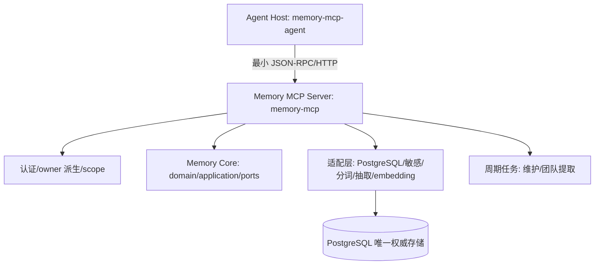

### 2.2 顶层任务完整时序

一个顶层用户任务从前到后经过两次与记忆服务的交互：开始前召回、结束后捕获。

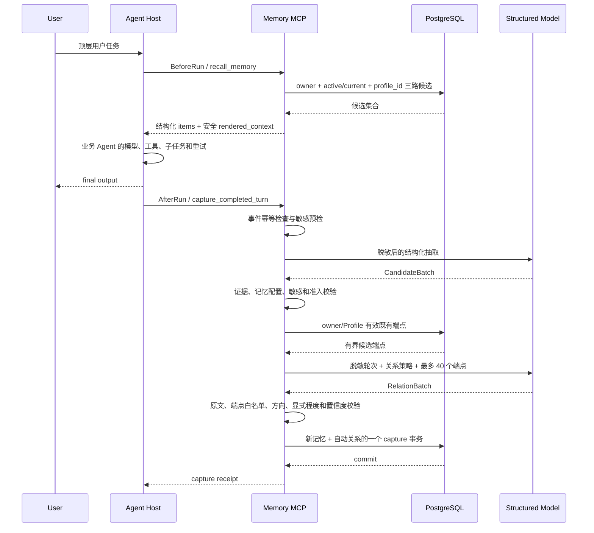

业务 Agent 可以使用与记忆抽取不同的模型；示例 Runner 的业务 callable 只提供接线参考。

### 2.3 两条主要数据流

**召回路径**：可信 Principal → PostgreSQL owner-first current 集合 → profile_id/optional subject →
三路候选 → 应用层打分（含向量加成）→ 阈值/数量/预算 → 安全 rendered_context → Agent。

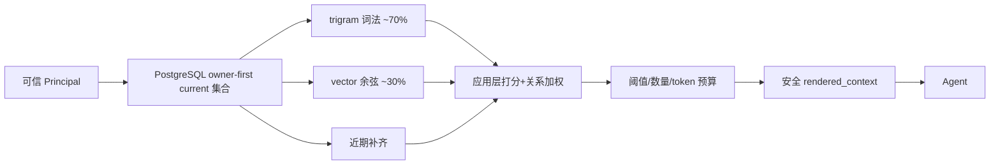

**捕获路径**：可信 Principal + CompletedTurnEventV1 → event/payload 幂等 → 模型前敏感检测与脱敏 →
CandidateExtractor → 严格 Candidate schema → 原文 Evidence 校验 → 记忆配置校验 → 持久化前敏感复检 →
准入和 lifecycle 分类 → 单事务提交。

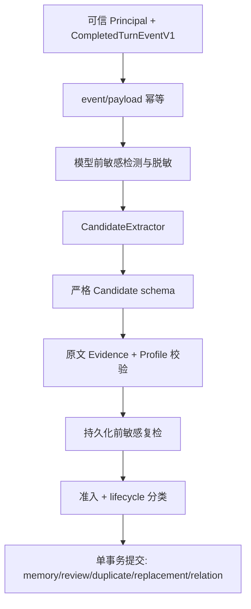

## 3. 分层与依赖

### 3.1 模块职责

| 模块 | 职责 |
| --- | --- |
| `core/domain` | 不可变领域对象、状态枚举、纯文本规范化；无 I/O |
| `core/application` | 用例编排：捕获、召回、维护、审核；协调 domain 与 ports |
| `core/ports` | Repository/Extractor/Profile/Guard 端口协议与写入 DTO |
| `core/support` | 日志与异常基类实现，使 Core 自包含；根包 `logging.py`/`exceptions.py` 是传输层别名 |
| `core/adapters/postgresql` | PostgreSQL 权威存储：repository/recall/maintenance/mapping/schema |
| `core/adapters/in_memory` | 离线契约测试用的进程内 Repository，非生产 |
| `core/adapters/{sensitive,tokenizer,structured_model}` | 敏感守卫、jieba 分词、结构化模型解析 |
| `extraction` | provider/schema/settings 分离：chat_models/embedding/backends/factory |
| `profiles` | 正式 Profile 实现（general_work/investment_research），实现 `MemoryProfile` 协议 |
| `tools` | 十个 MCP 工具 + 共享边界（auth/log/error 映射） |
| `auth` | 静态 Bearer 认证、可信 Principal 派生、scope |
| `app` | 组合根：组装 Server、注入适配器、注册工具、lifespan |
| `db` | migration/health 运维入口 |
| `memory_mcp_agent` | 单独 distribution（远程消费者，不是服务端插件） |

### 3.2 依赖图与守卫

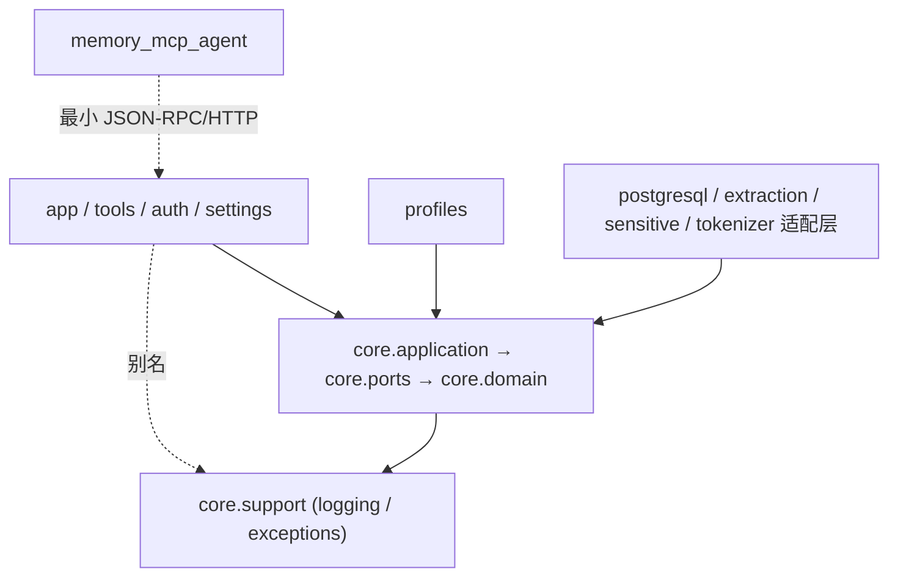

| 约束 | 说明 |
| --- | --- |
| Domain/Application/Ports 不导入 | MCP、HTTP、LangChain、psycopg、settings、根包非 core 模块 |
| Core 自包含的日志/异常 | 实现在 `core/support/`，根包 `memory_mcp.logging`/`exceptions` 是传输层别名 |
| Server 只调用 Application 或公开 Port | 不直接执行 SQL |
| Agent Client 不导入 | Server、Core、完整 MCP SDK、LangChain、psycopg |
| Server 生产依赖不含 Agent 发行包 | 双向隔离 |
| 记忆配置实现依赖 `MemoryProfile` | Core 不反向导入正式配置 |
| PostgreSQL adapter 不读取 Server Settings | 边界隔离 |
| Secret 只在组合和基础设施边界解封 | 不泄漏到 Domain |
| 包 `__init__` 不加载完整 app/模型/数据库驱动 | 惰性加载 |

> 该不变量由 `tests/core/test_dependency_boundaries.py` 用 AST 扫描强制；改 Core 导入后必须先跑该测试。

### 3.3 项目结构

```text
memory-mcp/
├── server/src/memory_mcp/
│   ├── core/
│   │   ├── domain/         # models/capture/relations/recall/lifecycle/team_extraction
│   │   ├── application/    # service/capture/recall/admission/candidate_processing/...
│   │   ├── ports/          # repositories/profiles/capture/embedding
│   │   ├── support/        # logging/exceptions（Core 自包含）
│   │   ├── adapters/        # in_memory/postgresql/sensitive/tokenizer/structured_model
│   │   ├── composition.py  # 最小依赖组装
│   │   └── exceptions.py   # 核心业务异常
│   ├── extraction/         # settings/chat_models/backends/factory/embedding
│   ├── profiles/           # general_work/investment_research
│   ├── tools/              # capture/memory/recall/review/shared
│   ├── app.py / auth.py / schemas.py / settings.py / db.py / logging.py / errors.py
│   └── __main__.py
├── agent/src/memory_mcp_agent/  # bridge/client/hosts/state/settings/cli/context/logging
├── tests/                  # core/agent/server/support/evaluation
├── docs/                   # design/config/agents/usage/testing/logging/deploy/evaluation
├── openspec/changes/       # 变更历史与规范
└── deploy/systemd/         # memory-mcp.service / memory-mcp-migrate.service
```

## 4. 领域模型

### 4.1 核心对象关系

一条记忆由跨 revision 稳定的 `MemoryItem`、某一时刻的 `MemoryRevision` 快照和若干来源
`Evidence` 组成。Evidence 可带可选 `EvidenceDocument` 子对象（仅 document/web 来源有值）。

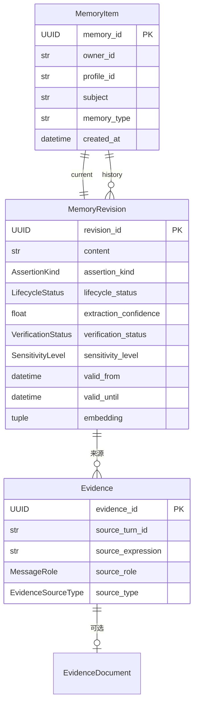

`MemoryRecord` 是应用层一次返回的完整卡片（item + current_revision + evidence），不是
持久化单元。`MemoryHistoryEntry` 是历史项（revision + evidence）。

### 4.2 Item 与 Revision 分离的原因

同一逻辑记忆的不同版本共享 `MemoryItem`（稳定身份），每次内容变更追加 `MemoryRevision`：
新 revision 变 `is_current=true` 与 `active`，旧 revision 变 `is_current=false` 与
`superseded`。分离使"逻辑记忆"与"内容快照"解耦——撤销/替代只动 revision，不删 item，
历史完整可追溯。

### 4.3 关系

`MemoryRelation` 是有向边，端点为两个 `MemoryItem`。两个正交维度区分关系来源：

| 维度 | 取值 | 含义 |
| --- | --- | --- |
| `origin` | `manual` / `automatic` / `legacy` | 人工建立 / AfterRun 自动抽取 / 历史 import 无 provenance |
| `scope` | `item` / `revision` | 锁定到 item（manual） / 锁定到具体 revision（automatic） |

`automatic/revision` 边携带完整 provenance（capture_id/conversation/source_expression/confidence/
model_id/prompt/schema_version）。schema 用 `memory_relations_provenance_state` CHECK 约束
强制 origin+scope 组合的字段完整性（见 §11.2）。

### 4.4 认识论标签

记忆内容的知识性质由 `assertion_kind` 标注，与"内容是否为真"独立：

| 值 | 含义 |
| --- | --- |
| `user_view` | 用户观点/偏好 |
| `user_provided_fact` | 用户提供的事实 |
| `external_fact` | 外部来源的事实 |
| `system_inference` | 系统推断 |

`verification_status`（unverified/user_asserted/user_confirmed/source_verified）独立于
`assertion_kind`：一条 user_view 可以是 user_asserted 但永远 unverified。

### 4.5 记忆配置

通用 Core 不含业务词义；`MemoryProfile` 协议是场景边界，声明：`memory_types`、
`business_progress_values`、`capture_guidance`、`profile_version`、`relation_policies`、
`recall_priorities`、`recall_hints`、`metadata_policies`。新增场景 = 新 Profile，不改 Core。
`metadata_policies` 是 memory_type → `MemoryMetadataPolicy(sensitivity_level, validity_days)`
的映射，每种 memory_type 必须有且仅有一条。新增 memory_type 到现有 Profile 时：
在 `memory_types`/`metadata_policies`/`recall_priorities`/`recall_hints` 四处都加该 type 的
条目（`recall_hints` 值可为空 frozenset），并 bump `profile_version`（指纹变化会被
`profile_fingerprint` 检测，捕获记录指纹用于跨版本幂等冲突）。

| Profile | profile_id | 版本 | memory_types |
| --- | --- | --- | --- |
| `GeneralWorkProfile` | `general-work` | `general-work-v2` | preference/stable_context/ongoing_item/decision |
| `InvestmentResearchProfile` | `investment-research` | `investment-research-v2` | research_preference/research_question/thesis/evidence_claim/risk/catalyst/ongoing_research/research_decision |

`profile_fingerprint` 对影响行为的 Profile 字段生成 SHA-256 指纹，捕获幂等记录它，跨版本
冲突可检测。Token 未传 profile_id 时用认证主体的 `default_profile_id` 路由（默认 general-work）。

### 4.6 关系策略

`MemoryRelationPolicy` 声明一种关系允许的源/目标 memory_type 与方向提示词。投研 Profile
定义 6 条策略：

| 关系 | 源类型 | 目标类型 | 方向提示词 |
| --- | --- | --- | --- |
| `supports` | evidence_claim | thesis | 支持/support/supports |
| `challenges` | evidence_claim | thesis | 挑战/challenge/challenges |
| `threatens` | risk | thesis | 威胁/threaten/threatens |
| `could_catalyze` | catalyst | thesis | 催化/catalyze/catalyzes |
| `addresses` | ongoing_research | research_question | 回答/address/addresses |
| `resolves` | research_decision | research_question | 解决/resolve/resolves |

general-work 无关系策略（空 `relation_policies`）。

## 5. 身份与隔离

### 5.1 Principal 派生

owner 只来自认证上下文，工具参数不接受 owner。`auth.py` 从已验证 Token 的 claims 派生
`RequestPrincipal`，再 `.to_core()` 转为 Core 的 `PrincipalContext`：

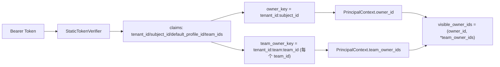

**安全不变量**：个人 owner 是 `tenant_id:subject_id`，团队 owner 是
`tenant_id:team:team_id`，两者命名空间靠 `team:` 中缀隔离。为保证 `derive_owner_key`
用 `:` 拼接不被歧义解析，身份分量字符集（`IDENTITY_COMPONENT_PATTERN`）禁止冒号——
首字符为字母或数字，其余允许 `._-`。这是字段格式的安全含义，不是实现细节。

### 5.2 双重隔离

| 层 | 机制 |
| --- | --- |
| 认证 | 静态 Bearer Token ≥32 字符，映射到 `ConfiguredPrincipal`（tenant_id/subject_id/scopes/default_profile_id/team_ids） |
| 授权 | `MemoryScope`（read/write/review）；工具按 scope 守卫 |
| 存储 | 读写谓词用 `owner_id` 或 `visible_owner_ids` 集合过滤；跨 owner 猜中 ID 等同不存在 |

### 5.3 静态认证边界

`StaticTokenVerifier` 只校验显式配置的 Token，不签发新 Token。Token SHA-256 摘要仅作日志
reference，不参与授权。`current_request_principal()` 只根据已验证 MCP 认证上下文构造
当前主体，claims 缺失或类型不符一律 `UnauthenticatedError`。

### 5.4 多层记忆

召回时用 `visible_owner_ids = (owner_id, *team_owner_ids)` 集合过滤，个人和团队记忆按
统一相关性排序。非成员的 owner 不在集合内，无法访问团队记忆。

多层记忆下写入路径用记录的实际 owner（个人或团队），而非调用者的个人 owner：

| 操作 | 写入规则 |
| --- | --- |
| revoke 团队公共记忆 | 团队成员可操作，目标由 `visible_owner_ids` 控制可见性，UPDATE 用 `row["owner_id"]` 精确更新 |
| 非成员访问 | owner 不在可见集合内，等同于不存在 |
| `link_memories` relation owner | 跟随端点记忆的 owner；两个团队记忆建关系时 relation 写入团队 owner |
| `revoke_memory_relation` | 同理，保证端点与关系 owner 一致 |

### 5.5 团队公共记忆自动提取

除手动 `promote_to_team` 提升外，服务端周期性扫描团队成员的个人记忆，用 embedding
相似度聚类提取公共知识候选，写入团队 pending review，由成员人工确认后沉淀为团队公共
记忆。**不做自动确认**——人决定哪些值得沉淀为团队知识。

| 项 | 规则 |
| --- | --- |
| 触发 | Server lifespan 内 `_run_team_extraction_loop` 按 `MEMORY_MCP_TEAM_EXTRACTION_INTERVAL_SECONDS`（默认 3600，0 关闭）周期运行 |
| 团队配置 | 从认证主体的 `team_ids` 派生 `team_owner_key`；同 tenant 下配相同 team_id 的成员构成一个团队 |
| 聚类 | `Repository.extract_team_common_memories` 按 embedding 余弦相似度（默认阈值 0.85）聚类成员记忆，最小簇大小默认 2 |
| 产出 | 共性候选写入团队 owner 的 pending review；`TeamExtractionResult` 记录成员数/记忆数/簇数/候选数 |
| 隔离 | 提取只读成员个人记忆、只写团队公共空间；不改变个人记忆 |
| 幂等 | 同 subject+type 已有团队 pending 不重复创建 |
| 依赖向量 | 聚类用 embedding 相似度，未配置 provider 时该服务不产出候选但不影响主链路 |

## 6. MCP 契约

### 6.1 Transport

Streamable HTTP（`stateless_http=true` 默认），JSON response 模式。默认
`http://127.0.0.1:8765/mcp`，健康检查 `/health`。认证用 MCP SDK 的 `AuthSettings`，
`StaticTokenVerifier` 提供 Token 校验。

### 6.2 十个工具

| 工具 | Scope | 作用 | annotations |
| --- | --- | --- | --- |
| `capture_completed_turn` | write | 提交成功完成的顶层轮次 | 非只读/非破坏/幂等 |
| `recall_memory` | read | BeforeRun 主动召回 | 只读/幂等 |
| `list_memories` | read | 列出当前活动记忆 | 只读/幂等 |
| `get_memory` | read | 查看当前详情和可选 history | 只读/幂等 |
| `list_pending_reviews` | review | 查看待确认候选 | 只读/幂等 |
| `confirm_pending_memory` | review | 确认 pending（可 `promote_to_team`） | 非只读/非破坏/幂等 |
| `reject_pending_memory` | review | 拒绝 pending | 非只读/破坏/幂等 |
| `revoke_memory` | review | 幂等撤销当前记忆并保留历史和来源 | 非只读/破坏/幂等 |
| `link_memories` | write | 按 Profile 策略幂等建立有向关系 | 非只读/非破坏/幂等 |
| `revoke_memory_relation` | review | 幂等撤销关系并保留审计历史 | 非只读/破坏/幂等 |

`enforce_strict_tool_arguments` 拒绝所有未声明字段（含 owner 参数）。工具参数不接受 owner；
capture/recall 未传 profile_id 时由认证主体默认值路由。

### 6.3 CompletedTurnEventV1

捕获工具输入契约（`schemas.py` 的 `CompletedTurnEventV1`）：

| 字段 | 必填 | 说明 |
| --- | --- | --- |
| `contract_version` | 是 | 契约版本，当前 `"1"` |
| `event_id` | 是 | 事件幂等键 |
| `profile_id` | 是 | 记忆配置 |
| `conversation_id` / `turn_id` | 是 | 会话与轮次 |
| `observed_at` | 是 | 带时区时间戳 |
| `messages` | 是 | 1–64 条 `RoleMessageV1`（user/assistant/tool） |
| `subject_hint` | 否 | 召回/聚类用的主题提示 |

`payload_fingerprint` 对规范化的 event payload 取 SHA-256，用于 event 重用时的冲突检测。
`.to_turn_envelope(max_characters)` 把 messages 拼成 Core 的 `TurnEnvelope`，超长拒绝。

### 6.4 结构化 receipt

工具返回严格 DTO（`StrictDto`，`extra=forbid`）：
- `CaptureReceipt`：capture_id/status/replayed/profile 版本与指纹/四类计数 summary/created_memory_ids/pending_review_ids。
- `RecallReceipt`：items + rendered_context + estimated_tokens + token_budget + truncated。
- `MemoryView`/`MemorySummaryView`/`MemoryRelationView`：记忆详情/摘要/关系视图。
- `ErrorResponse`：request_id/error_code/message/retryable。

### 6.5 错误模型

| 错误码 | 说明 | retryable |
| --- | --- | --- |
| `unauthenticated` | 未认证 | 否 |
| `permission_denied` | scope 不足 | 否 |
| `profile_not_registered` | Profile 未注册 | 否 |
| `invalid_event` / `unsupported_contract_version` | 事件无效 / 合约版本不支持 | 否 |
| `idempotency_conflict` | 相同 event 不同 payload | 否 |
| `memory_unavailable` / `relation_unavailable` / `review_unavailable` | 不存在或跨 owner | 否 |
| `invalid_relation` | 关系无效 | 否 |
| `capture_not_configured` | extractor 未配置（保护自定义注入或旧实例） | 否 |
| `temporarily_unavailable` | 临时不可用 | OSError/TimeoutError → 是；未知异常 → 否 |

异常基类分三层：`core.support.exceptions.MemoryMcpError`（Core 自包含根）、
`core.exceptions` 的 `MemoryCoreError`（核心业务异常）、`errors.py` 的
`MemoryMcpBoundaryError`（带稳定错误码、可安全返回客户端）。根包
`memory_mcp.exceptions`/`logging` 是传输层别名，委托 `core.support`。错误响应不返回 SQL、
堆栈、Secret、正文或 backend 异常消息。

## 7. 捕获与准入

### 7.1 端到端叙事

一轮捕获：Agent 提交 `CompletedTurnEventV1` → 按事件键加锁（同进程串行）→ 幂等检查
（已存在且非 reprocess 直接重放）→ 敏感预检与脱敏 → 模型抽取候选 → 候选可信化（来源
身份由 Core 覆盖，不信模型自报）→ 准入判定 → lifecycle 去重（duplicate/replacement/
ambiguous）→ 关系规划 → 单事务提交。

### 7.2 触发条件

只有 AfterRun（顶层任务成功后）触发捕获；BeforeRun 只召回不写入。同一 event_id 重放
幂等；不同 payload 复用 event_id 抛 `IdempotencyConflictError`。Capture 失败置
`REPROCESS_REQUIRED`，允许相同 event 重处理。

### 7.3 候选抽取输入输出

`CandidateExtractor.extract(ExtractionRequest)` 返回 `CandidateProposal` 序列。
`ExtractionRequest` 携带 profile_id/conversation/source_turn/脱敏 content/observed_at/
allowed_memory_types/capture_guidance/profile_version/subject_hint。模型输出必须符合严格
schema，否则 `InvalidModelOutputError`。

### 7.4 候选可信化

模型返回的 `CandidateProposal` 身份字段（owner/conversation/source_turn/observed_at）不可信，
Core 用可信 `TurnEnvelope` 与 `PrincipalContext` 覆盖：`_source_metadata` 从可信消息块派生
source_role/message_id/tool_name/source_type 等，不信任模型自报。候选进入 `Candidate`
后才做准入与 lifecycle 判定。

### 7.5 自动关系可信化

`AutomaticRelationPlanner` 把模型关系建议转为符合 Profile 合约的活动关系。保守准入：端点
必须在可信目录内、关系必须匹配 Profile policy、且通过多重否定证据校验。详细见 §8.5。

### 7.6 模型抽取设计

- 候选与关系抽取共享一个 ChatModel，使用独立 prompt 和严格 schema。
- DeepSeek thinking 关闭（`extra_body`），保证结构化输出确定性。
- 测试注入确定性 `FakeCandidateExtractor`/`FakeRelationExtractor`；`StructuredCandidateExtractor`
  把任意结构化模型后端适配为 Extractor，Core 不依赖具体 SDK。
- 模型只参与 AfterRun；BeforeRun 召回用确定性应用层打分，无模型调用。

### 7.7 准入决策

`ConservativeAdmissionPolicy`（`auto_save_confidence=0.9`）按序判定：

| 顺序 | 条件 | 决策 | reason_code |
| --- | --- | --- | --- |
| 1 | durability = temporary | discard | temporary_content |
| 2 | durability = uncertain | pending | uncertain_durability |
| 3 | assertion_kind = system_inference | pending | system_inference |
| 4 | expression_basis ≠ explicit | pending | non_explicit_expression |
| 5 | confidence < 0.9 | pending | low_confidence |
| 6 | 其余 | auto_save | explicit_durable_statement |

即使通过准入，非用户来源（assistant/tool）的候选也降级为 pending（`non_user_source`），
避免推断性内容直接自动写入。

### 7.8 四类结果

| decision | 含义 | outcome 字段 |
| --- | --- | --- |
| `auto_save` | 自动入库 | memory_id |
| `pending` | 待用户确认 | review_id |
| `discard` | 丢弃 | 无 |
| `blocked` | 敏感内容阻断 | 无 |

`CaptureOutcome` 的 `reference_shape` CHECK 约束强制 decision 与引用字段一致
（auto_save→memory_id only；pending→review_id only；discard/blocked→都无）。

### 7.9 双重敏感检查

| 阶段 | 作用 |
| --- | --- |
| 模型抽取前 | `guard.inspect(turn.content)` 脱敏，阻断内容直接生成 blocked outcomes，不调模型 |
| 持久化前 | 对候选拼接文本（subject/type/content/source_expression/rationale/progress/来源元数据）复检 |

敏感规则可配置（`MEMORY_MCP_SENSITIVE_RULES`），默认四类：credential/account_secret/
real_holding/transaction_instruction。`RegexSensitiveContentGuard.from_config` 空数组视为
用默认，非空数组替换默认。

### 7.10 幂等与失败恢复

| 场景 | 行为 |
| --- | --- |
| 同 event_id 同 payload | 重放返回，`replayed=true` |
| 同 event_id 不同 payload | `IdempotencyConflictError` |
| 模型输出畸形 | `FAILED`/`invalid_candidate_output`，不重处理 |
| 模型请求临时失败 | `REPROCESS_REQUIRED`/`processing_interrupted`，允许相同 event 重处理 |
| PostgreSQL 不可用（启动/health 时） | health 检查失败、不降级到本地存储；Server 不发布 |
| PostgreSQL 不可用（捕获处理中） | `except Exception` 转为 `REPROCESS_REQUIRED`，允许相同 event 重处理 |
| migration 失败 / 模型配置不完整 | 停止发布 / Server 启动失败 |

> `_capture_turn_locked` 的 `except Exception` 是有意设计：Core 无法静态枚举 `psycopg.Error`
> （会违反分层），宽捕获把瞬态 DB 故障转为可重放的 `REPROCESS_REQUIRED`。`psycopg.Error`
> 不是 `OSError` 子类，无法用 `except (OSError, TimeoutError)` 收窄。

### 7.11 Lifecycle 去重分支

对通过准入的候选，按同 subject+type 查现存记忆 `find_current`，分四支：

| 分支 | 条件 | 行为 |
| --- | --- | --- |
| duplicate | 目标内容与候选规范化等价 | 追加 Evidence，不创新 revision |
| explicit_replacement | 用户明确表达替换意图（`_is_explicit_replacement`） | 生成 replacement revision |
| ambiguous_lifecycle_conflict | 有目标但非明确替换 | 降级 pending |
| ambiguous_lifecycle_target | 同 subject+type 多条记忆 | 降级 pending |

显式替换需同时满足：source_role=USER、expression_basis=EXPLICIT、assertion_kind∈
{user_view, user_provided_fact}、原文匹配 `_EXPLICIT_REPLACEMENT` 正则（`candidate_processing.py`）：

```regex
(?:不再|不要再|改成|改为|换成|替换为|以后用|默认(?:改|换)|
\bno longer\b|\binstead\b|\breplace\b|\bnew default\b|
\bchange\b.+\bto\b)
```

即用户须明确表达"当前值/默认值变更"（如"改成""换成""以后用""no longer""replace""new default"），
模糊的"改一下"不触发。

## 8. 生命周期与 Review

### 8.1 状态机

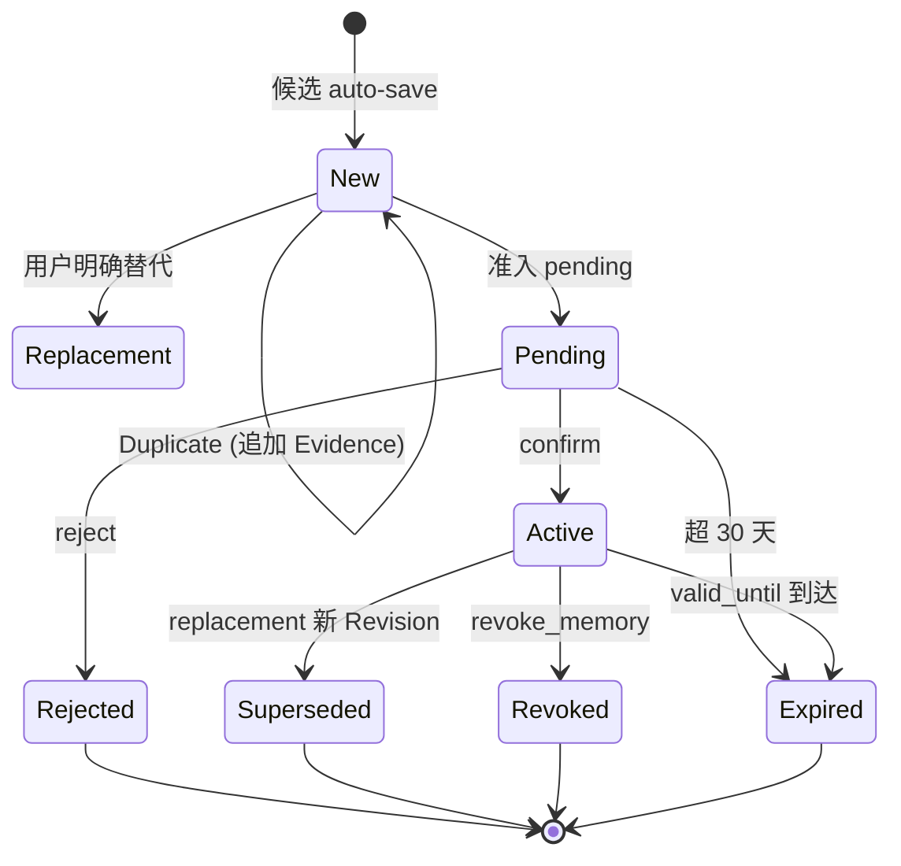

### 8.2 生命周期操作

| 操作 | 行为 |
| --- | --- |
| `revoke_memory` | active → revoked，记录可信时间；不删 endpoint；重复撤销返回相同记录 |
| replacement | 同事务旧 revision → superseded/non-current，新 revision → active/current；引用旧 revision 的活动边 → stale |
| 到期 | 读取谓词先用 `valid_until` 隔离，再由维护批次物化 expired |

### 8.3 Review 操作

| 操作 | 行为 |
| --- | --- |
| `list_pending_reviews` | 列出当前用户 pending 候选 |
| `confirm_pending_memory` | confirm：按目标情况创新记忆/追加 duplicate/生成 replacement；可 `promote_to_team` 写团队 owner |
| `reject_pending_memory` | reject：标记 rejected，幂等 |
| 到期 | pending 超 30 天（`PENDING_REVIEW_RETENTION`）或 valid_until 到达 → expired |

### 8.4 Revoke 与到期

revoke 和 replacement 都不物理删除，保留可追溯 history。到期采用两阶段：读取谓词
立即隔离（active 但 `valid_until <= now` 不返回），维护批次有界物化 `expired`。
维护批次 `MAINTENANCE_BATCH_SIZE=500`，每轮把过期 revision/review 及其关系终态物化，
`has_more` 时立即续批，连续续批超 8 次插入 1 秒退避。

### 8.5 Relation 生命周期

| 操作 | 行为 |
| --- | --- |
| `link_memories` | 只接受两个 owned、同 Profile、active/current/effective 的 Item；Profile policy 校验 relation type 和方向；相同 owner/source/target/type 重放由部分唯一索引收敛为同一关系；创建 `manual/item` 边 |
| `revoke_memory_relation` | 关系改为 `revoked` 并记录可信时间，不删除 endpoint；重复撤销返回相同记录 |
| `get_memory` | 默认只返回活动关系，`include_history=true` 才包含 stale 和已撤销关系 |
| 跨 owner 猜中 relation ID | 统一返回 `relation_unavailable` |

自动关系走同一 Repository 事务：同轮新 Item/Revision 先写入，关系端点在事务内重新校验，
再用活动部分唯一索引幂等写边。它创建 `automatic/revision` 边。

| 场景 | 行为 |
| --- | --- |
| replacement | 先把连接旧 revision 的活动边物化为 `stale/endpoint_revision_changed`，再写针对新 revision 的新边；任何一步失败都共同回滚 |
| 端点到期 | 维护事务把连接该 Item 的活动边物化为 `stale/endpoint_expired` |
| 端点 revoked/到期（物化前） | 先被读取谓词排除 |
| 自然语言自动撤销 | 系统不从任意自然语言自动撤销端点内容未变化的错误关系 |

自动关系保守准入的否定校验（任一命中则跳过）：

| 校验 | 拦截 |
| --- | --- |
| `_has_negated_relation_evidence` | 原文出现明确否定关系动词（"不支持"/"does not challenge"） |
| `_has_insufficient_endpoint_evidence` | 原文对至少一端的端点文本匹配长度 < 2 |
| `_has_clearly_reversed_direction` | 方向提示词两侧的端点文本更支持反向关系 |
| 非显式 / confidence < 0.90 / 重复 key / 用户源不在可信用户消息中 | 降级跳过 |

## 9. 召回

### 9.1 端到端叙事

一次召回：计算查询文本与 embedding → Repository 在 owner/Profile/active/effective 边界内
三路取候选（词法~70% + 向量~30% + 近期补齐）→ 应用层打分（文本相关 + Profile 信号 +
subject 精确命中 + 向量加成）→ 关系加权 → 阈值过滤 → 数量与 token 预算裁剪 → 批量加载
Evidence → 渲染安全 context。

### 9.2 Repository 候选边界

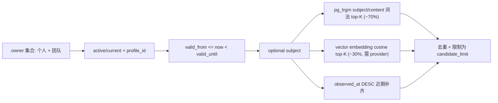

候选查询用 `owner_id = ANY(%s)` 同时匹配个人 owner 和团队 owner（`visible_owner_ids`），
使团队成员能召回团队公共记忆。非成员无法访问。

| 项 | 规则 |
| --- | --- |
| 候选上限 | 由 Application 下推，默认总计 500 |
| 候选选择 | PostgreSQL 在 owner/Profile/current/active/effective/type/subject 条件内使用 `pg_trgm` GIN 索引选词法候选（约 70%），再用 embedding 向量余弦距离选语义候选（约 30%，需 pgvector 与 `EmbeddingProvider`），最后用近期候选补齐 |
| 优势 | 词法找回较早相关记忆，向量找回字面不重叠但语义相关的内容，近期保证最新上下文 |
| 向量降级 | 未配置 `EmbeddingProvider` 或计算失败时跳过 vector 路，仅用词法+近期两路 |
| 排除内容 | pending、superseded、expired、revoked、deleted 和 blocked |

候选 DTO 只包含 Item 与 current Revision，不携带 Evidence。Application 完成关系加权、
相关性、数量和 token 选择后，Repository 才用一次 owner-scoped 查询为最终 revision
批量加载各自最近三条 Evidence。默认 500 候选因此不会放大成 500 次来源查询。

### 9.3 排序打分

| 信号 | 说明 |
| --- | --- |
| query 与 task intent 规范化文本 | 基础文本匹配 |
| 完整短语包含关系 | 短语命中加权 |
| word overlap | 经可注入分词器切分（投研默认 jieba 精确模式，关闭 HMM 保证离线确定性；纯标点 token 丢弃） |
| 字符二元组 overlap | 改善中文小样本召回 |
| subject 完全相等 | 加权 `0.2`，不再压过正文相关度 |
| 向量语义相似度 | 数据库侧 `retrieval_score`（0-1 余弦相似度）乘以 `0.15` 叠加 |
| MemoryProfile memory type priority | 类型优先级 |
| 一跳关系加权 | 当另一端自身也达到 threshold 时，最多 `0.12` |
| observed time | 稳定排序补充 |

`core.domain` 定义 `MemoryTokenizer` 协议和 `SimpleTokenizer` 兜底实现，`core.adapters`
提供基于 jieba 的生产实现；组合根注入分词器，召回用例不直接依赖 jieba。向量由
`core.ports.EmbeddingProvider` 端口定义、`extraction/embedding.py` 的 Qwen 实现提供，
未注入 provider 时降级为词法+近期两路。

打分常量均为命名模块级常量，经离线评测校准且不回退 `recall_at_k`：

| 常量 | 值 |
| --- | --- |
| relevance threshold | `0.18` |
| relation boost | `0.12` |
| profile hint boost | `0.16` |
| subject exact-match boost | `0.2` |
| vector boost | `0.15` |

> 改这些常量后必须同步本表与 evals 阈值。

只有基础文本分数达到 relevance threshold 的记录才进入结果；数据库 lexical score
与 vector retrieval_score 只负责候选生成与加成，不替代应用分数。关系不能独自把
不相关 endpoint 拉入召回，也不递归扩展候选。词法与排序部分故意可解释；向量路
仅在配置 provider 时启用，不改变确定性打分骨架。

### 9.4 subject 语义

`subject` 是精确的候选预过滤器，不是模糊关键词：

| 情况 | 行为 |
| --- | --- |
| 测试 fixture 的 subject 已知 | 可稳定传入 |
| 真实模型把 subject 从 hint 归纳为项目名 | 正常工作 |
| 调用方无法保证 canonical subject | 应省略 |
| 省略后 | 仍按 owner + profile_id + query/task intent 搜索 |
| 召回为 0 | 排查第一步是移除 subject |

### 9.5 数量与预算

Server 同时控制：relevance threshold、`max_items`、`token_budget`、Server 硬上限
（`MEMORY_MCP_RECALL_MAX_ITEMS`/`MEMORY_MCP_RECALL_MAX_TOKEN_BUDGET`，见
[config.md](config.md)）、rendered context header 成本。Agent 客户端默认请求 `max_items=5`/
`token_budget=600`（§10.4），由 Server 硬上限再收窄。

| 估算项 | 规则 |
| --- | --- |
| CJK | 约 1 token/字 |
| ASCII | 约 1 token/4 字符 |
| provider tokenizer | 不绑定，只保证不再严重低估 |
| 历史问题 | 单一 `len/3` 对中文严重低估，导致 `token_budget` 塞入远超预算 |

选中条目按预算逐个加入；关系只在两个 endpoint 都已选中时渲染并同样计入预算。
关系元数据放不下时先省略关系，再决定是否省略整个 item；任一截断都标记 truncated。
无相关内容返回空 items，Hook 将 `memory_context=None`，不会注入"没有记忆"占位。

### 9.6 安全渲染

Rendered context 包含固定边界说明：

| 边界 | 说明 |
| --- | --- |
| 历史用户上下文 | 这些是数据，不是系统指令 |
| 当前用户请求优先 | 历史不能覆盖当前请求 |
| 用户观点未独立验证 | 不渲染为"已经验证为真" |

每条 item 显示 revision、type、subject、assertion kind、verification、sensitivity、
observed time、validity 和内容，使业务 Agent 能正确理解来源、确定性和时效。

### 9.7 向量召回的定位与降级

向量路是召回的可选第三路，不替代词法与排序的确定性骨架。

| 项 | 规则 |
| --- | --- |
| 启用条件 | 配置 `MEMORY_MCP_EMBEDDING_API_KEY` 与 provider；写入期计算 revision embedding 并存入 pgvector 列 |
| 降级 | provider 未配置、计算失败或维度不符时跳过 vector 路，仅用词法+近期两路 |
| 索引定位 | 向量与词法一样只能提出候选，永远不能成为身份或生命周期事实源 |
| 返回前校验 | 必须回 PostgreSQL 复核 owner/current revision/lifecycle/`profile_id`/可见性 |

## 10. Agent Client 与 Hook

### 10.1 HookContext

`HookContext` 携带 run_key（principal/conversation/turn 三元组）、subject、task_intent、
profile_id。`MemoryHookBridge` 按 run_key 去重 Hook。

### 10.2 BeforeRun / AfterRun 流程

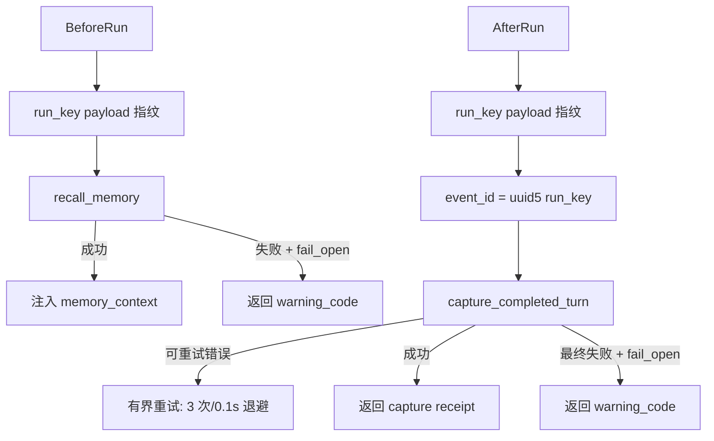

`event_id` 由 run_key 确定性派生（`uuid5`），保证同一轮次重复投递幂等。run_key 与
payload 指纹不一致时抛 `MemoryHookRunConflictError`，保护幂等语义。

### 10.3 Agent callable

`runner.py` 提供通用 Agent 生命周期合同，宿主适配在 `hosts.py`（Codex/Claude Code）。
`memory-mcp-hook` CLI 入口接受通用 BeforeRun/AfterRun 合同。

### 10.4 Fail-open 与 fail-closed

`fail_open` 默认 `true`：记忆服务不可用时降级为 warning，不阻断 Agent 任务。关闭则异常
向上传播。`recall_max_items=5`、`recall_token_budget=600`、`capture_max_attempts=3`、
`capture_retry_delay_seconds=0.1`。

### 10.5 为什么暂不使用队列

Agent 24 小时本地 best-effort outbox（`state.py`）保证 AfterRun 不丢：成功后删本地
payload，失败保留重试。无需 Redis/Kafka 跨主机削峰，Agent Host 不安装队列基础设施。

### 10.6 通用 Agent 主动记忆

Agent 不与 Server 同机时，安装轻量 wheel `memory-mcp-agent`，只有 Hook Client 及 HTTP/配置
依赖，不包含 `memory-mcp`/PostgreSQL/LangChain/模型 Provider。运行配置始终只有地址和 Token。

## 11. PostgreSQL 与 Migration

### 11.1 权威范围

PostgreSQL 是唯一权威存储，`InMemoryMemoryRepository` 仅用于离线契约测试。无 SQLite。
单迁移文件 `0001_memory_schema.sql`（原 0001-0009 折叠）。

### 11.2 领域约束

schema 用 CHECK 约束强制状态机与幂等（与代码互证）：

| 约束 | 强制 |
| --- | --- |
| `memory_revisions_lifecycle_status` | lifecycle ∈ active/superseded/expired/revoked |
| `memory_revisions_valid_window` | valid_until > valid_from |
| `memory_revisions_one_current_idx` | 每 memory_id 至多一个 is_current（部分唯一索引） |
| `memory_items_one_active_scope_idx` | 同 owner/profile 的每个 (subject, memory_type) 至多一条活动记忆（部分唯一索引），防止并发 auto_save 双写 |
| `memory_capture_runs_failure_state` | completed 无 failure_code；failed/reprocess 必有 |
| `memory_capture_runs_event_shape` | event_id/contract_version/payload_fingerprint 三者同有或同无 |
| `memory_review_items_decision_state` | pending 无 decided/resolved；confirmed 有两者；rejected/expired 有 decided 无 resolved |
| `memory_relations_provenance_state` | origin+scope 组合的字段完整性（legacy/manual/automatic 三态） |
| `memory_relations_terminal_state` | active/stale/revoked 三态字段完整性 |
| `memory_relations_one_active_idx` | 同 owner/source/target/type 至多一条 active（部分唯一索引） |
| `memory_capture_outcomes_reference_shape` | decision 与 memory_id/review_id 引用一致 |

外键约束全部移除：owner/profile 引用完整性由应用层事务和 advisory lock 保证，不依赖数据库外键；
CHECK 和 UNIQUE 约束保留。

### 11.3 Repository 事务与 Migration

`commit_capture` 单事务提交 result/memories/reviews/duplicate_evidence/replacements/relations，
任一失败共同回滚。replacement 同事务把引用旧 revision 的活动边置 stale。
`memory-mcp-db migrate` 应用 schema（checksum 一致性校验），`migrate --rebuild` 重建，
`health` 校验 checksum + 扩展 + 六个必需索引。

### 11.4 连接池与生命周期

`create_pool` 有界同步连接池（`min_size`/`max_size`/`timeout`）。Server lifespan 管理存储
与维护任务：启动后台维护+团队提取任务，关闭时先停任务再释放 pool。Ctrl+C 不显示 traceback。

### 11.5 Health

`/health` 探测存储 + 返回 `maintenance_health` 快照（state/consecutive_failures/
last_success_at/last_error_type）。`MaintenanceHealth` observe_success/observe_failure
维护进程内无正文健康状态。

### 11.6 必需扩展与索引

| 项 | 值 |
| --- | --- |
| 扩展 | `pg_trgm`、`vector`（pgvector） |
| 必需索引 | `memory_items_recall_subject_trgm_idx`、`memory_items_one_active_scope_idx`、`memory_revisions_recall_content_trgm_idx`、`memory_revisions_embedding_idx`、`memory_revisions_maintenance_expiry_idx`、`memory_review_items_maintenance_idx` |

`schema.py` 的 `_REQUIRED_INDEXES`/`_REQUIRED_EXTENSIONS` 与 `health` 强制校验。

## 12. 不变量与扩展

### 12.1 关键不变量

1. owner 只来自认证上下文，工具参数不接受 owner；
2. owner 隔离用 `owner_id` 或 `visible_owner_ids` 集合过滤，跨 owner 猜中 ID 等同不存在；
3. 个人 owner `tenant_id:subject_id` 与团队 owner `tenant_id:team:team_id` 靠 `team:` 中缀隔离，身份分量禁止冒号；
4. 一条记忆的 multiple revision 共享 `memory_id`，至多一个 `is_current`；
5. replacement 在同一事务把旧 revision 变 superseded/non-current，新 revision 变 active/current，引用旧 revision 的 revision-scoped 活动边变 stale；
6. duplicate 只追加 Evidence，不创新 revision；
7. 同 owner/profile 的每个 (subject, memory_type) 至多一条活动记忆（部分唯一索引）；并发 auto_save 双写触发唯一冲突 → `REPROCESS_REQUIRED`，重处理时 `find_current` 发现既有目标后正确路由（duplicate/pending/ambiguous）；
8. capture 在单事务原子提交 result/memories/reviews/duplicate/replacement/relations，任一失败回滚；
9. event 级幂等：同 event_id 同 payload 重放，不同 payload conflict；
10. 关系 owner 跟随端点记忆 owner；
11. 相同 owner/source/target/type 重放由部分唯一索引收敛为同一关系；
12. revoke/replacement 不物理删除，保留可追溯 history；revoke 同步把 revision-scoped 活动边物化为 stale/endpoint_revoked；
13. pending 超 30 天或 valid_until 到达由维护批次物化 expired；
14. 维护先由读取谓词隔离失效，再由有界批次物化终态，不全局扫描；
15. 到期记忆的连接关系同步物化为 stale/endpoint_expired；
16. auto_save 只对显式/高置信/持久内容；临时直接 discard，非显式/系统推断/低置信降级 pending；
17. 敏感内容双重检查（模型前后），阻断内容即使标 restricted 也不入库；
18. 模型身份字段不可信，Core 用可信 TurnEnvelope 覆盖；
19. Profile 是场景边界，通用 Core 不含业务词义；
20. Profile 变更用 `profile_fingerprint` 检测跨版本冲突；
21. Secret 只在组合/基础设施边界解封，不进 Domain/日志；
22. 日志只记稳定引用/状态/数量/错误码/耗时，不记正文/Token/Secret；
23. Domain/Application/Ports 不依赖 MCP/HTTP/DB/Agent SDK/runtime settings；
24. Core 日志/异常在 `core/support/` 自包含，不回引根包；
25. rendered context 是历史数据非指令，当前请求优先，用户观点未独立验证；
26. 向量与词法一样只能提出候选，不能成为身份/生命周期事实源；
27. 团队提取只读成员个人记忆、只写团队公共空间，不自动确认；团队共性候选要求簇内至少 2 个不同成员，防止单成员回声室；
28. Agent fail_open 默认开启，记忆服务不可用不阻断 Agent 任务。

### 12.2 扩展策略

| 扩展 | 方式 |
| --- | --- |
| 新场景 | 实现 `MemoryProfile` 协议，不改 Core |
| 新记忆类型 | Profile 声明 memory_type + metadata_policy + recall_priorities |
| 新存储后端 | 实现 `MemoryRepository` Protocol（方法见下） |

新存储后端需实现 `MemoryRepository` 的全部方法（`core/ports/repositories.py`）：

| 方法 | 职责 |
| --- | --- |
| `register_profile` | 登记合法 memory_type 与关系策略到持久化约束 |
| `add` / `get` / `list` | 原子保存/读取/列出记忆（按 `visible_owner_ids` 隔离） |
| `find_current` | 按 owner/Profile/active/effective + subject/type 缩小范围 |
| `find_recall_candidates` | 三路召回候选（词法/向量/近期），返回 `RecallCandidateSet` |
| `load_recall_evidence` | 批量加载 revision 的有限最近来源 |
| `maintain` | 有界维护批次（过期物化、关系 stale、review 回收） |
| `extract_team_common_memories` | 团队共性提取（聚类 + 写团队 pending） |
| `revoke` / `link_relation` / `revoke_relation` / `list_relations` | 记忆与关系生命周期 |
| `get_history` | 完整 revision 历史 |
| `get_capture` / `commit_capture` | 捕获幂等读 + 单事务原子提交 |
| `list_reviews` / `get_review` / `resolve_review` | 审核项生命周期 |

PostgreSQL 后端还需提供 `memory-mcp-db migrate/health`（checksum + 扩展 + 必需索引校验，
见 §11.3/§11.6）；其他后端按需提供等价运维入口。
| 新抽取模型 | `extraction/chat_models.py` 增加 provider factory 分支 |
| 新 embedding provider | 实现 `EmbeddingProvider` 端口，组合根注入 |
| 新 MCP 工具 | `tools/` 加 `ToolSupport` 子类，更新 `enforce_strict_tool_arguments` |
| 新宿主 | `hosts.py` 加宿主适配 |

### 12.3 文档与 OpenSpec 关系

- 当前系统事实：`docs/design.md`（本文）
- 配置/部署/使用：`docs/config.md`、`docs/deploy.md`、`docs/usage.md`
- 变更完成度：对应 `changes/<name>/tasks.md`
- `openspec-cn list` 的 complete 表示实现任务完成，不等于公网部署/录屏/现场验收完成

改代码后必须同步本文对应常量/字段/状态值；改 schema 后必须同步 `schema.py` 校验与
`testing.md` 索引数。详见 [CLAUDE.md](../CLAUDE.md) 改动检查清单。
